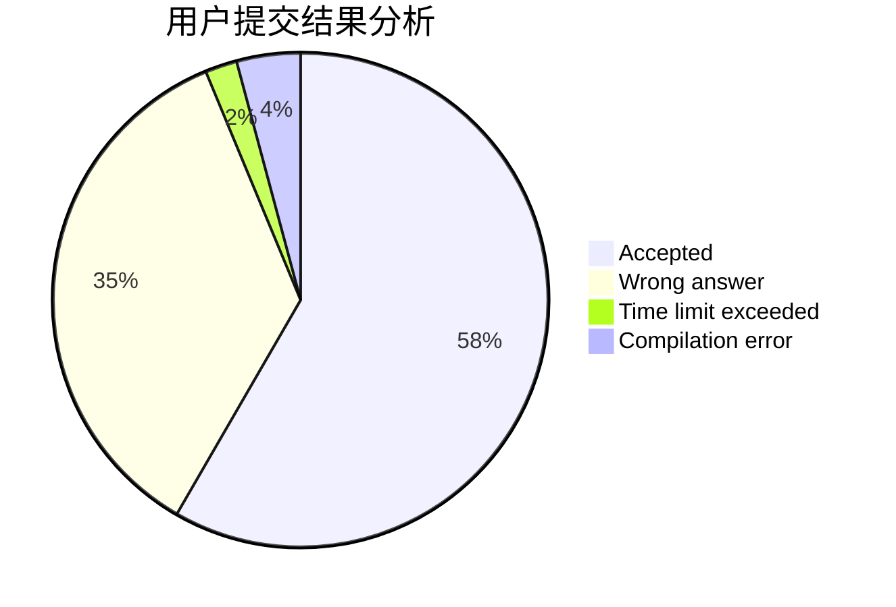
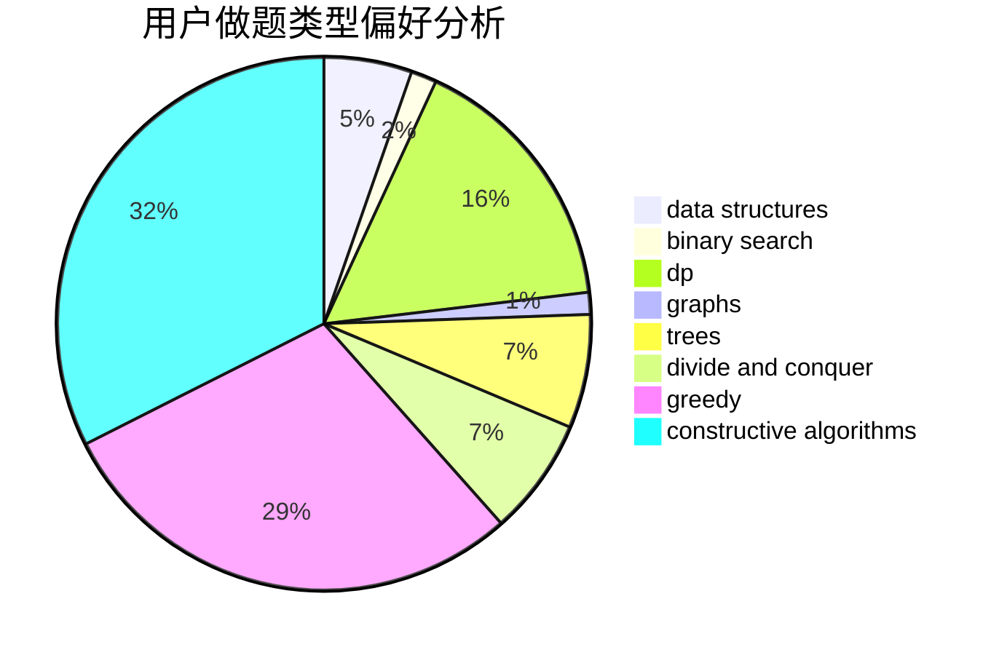
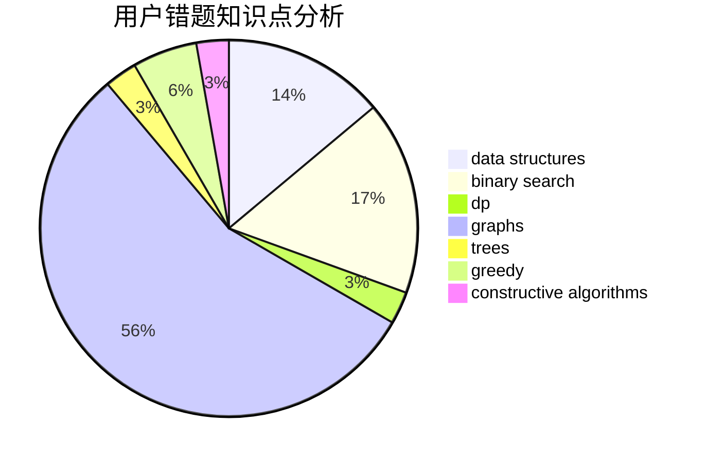

# Kirito_Rivaille
<!-- tabs:start -->
#### **用户提交结果分析**

#### **用户做题类型偏好分析**

#### **用户错题知识点分析**

<!-- tabs:end -->
# 推荐题目
[Traffic Lights](http://codeforces.com/problemset/problem/29/B)		implementation		  
[Double Cola](http://codeforces.com/problemset/problem/82/A)		implementation,
                        math		  
[Bear and Up-Down](http://codeforces.com/problemset/problem/653/C)		brute force,
                        implementation		  
[Chores](http://codeforces.com/problemset/problem/873/A)		implementation		  
[Mike and Frog](http://codeforces.com/problemset/problem/547/A)		brute force,
                        greedy,
                        implementation,
                        math		  
[Gravity Flip](http://codeforces.com/problemset/problem/405/A)		greedy,
                        implementation,
                        sortings		  
[Arson In Berland Forest](https://codeforces.com/contest/1261/problem/C)		binary search,
                        graphs,
                        graphs,
                        shortest paths		  
[Time to Raid Cowavans](http://codeforces.com/problemset/problem/103/D)		brute force,
                        data structures,
                        sortings		  
[SmartGarden](http://codeforces.com/problemset/problem/1250/M)		constructive algorithms,
                        divide and conquer		  
[Chloe and pleasant prizes](http://codeforces.com/problemset/problem/743/D)		dfs and similar,
                        dp,
                        graphs,
                        trees		  
<!-- tabs:start -->
#### **data structures**
[Time to Raid Cowavans](http://codeforces.com/problemset/problem/103/D)		brute force,
                        data structures,
                        sortings		  
[Chat Order](http://codeforces.com/problemset/problem/637/B)		*special problem,
                        binary search,
                        constructive algorithms,
                        data structures,
                        sortings		  
[Cookies](http://codeforces.com/problemset/problem/1099/F)		binary search,
                        data structures,
                        dfs and similar,
                        dp,
                        games,
                        trees		  
[Build a Contest](http://codeforces.com/problemset/problem/1100/B)		data structures,
                        implementation		  
[Iahub and Xors](http://codeforces.com/problemset/problem/341/D)		data structures		  
[Count The Rectangles](http://codeforces.com/problemset/problem/1194/E)		bitmasks,
                        brute force,
                        data structures,
                        geometry,
                        sortings		  
[Reading Books (easy version)](http://codeforces.com/problemset/problem/1374/E1)		data structures,
                        greedy,
                        sortings		  
[Three strings](http://codeforces.com/problemset/problem/452/E)		data structures,
                        dsu,
                        string suffix structures,
                        strings		  
[Choosing The Commander](http://codeforces.com/problemset/problem/817/E)		bitmasks,
                        data structures,
                        trees		  
[Maximum width](http://codeforces.com/problemset/problem/1492/C)		binary search,
                        data structures,
                        dp,
                        greedy,
                        two pointers		  
#### **binary search**
[Arson In Berland Forest](https://codeforces.com/contest/1261/problem/C)		binary search,
                        graphs,
                        graphs,
                        shortest paths		  
[Chat Order](http://codeforces.com/problemset/problem/637/B)		*special problem,
                        binary search,
                        constructive algorithms,
                        data structures,
                        sortings		  
[Cookies](http://codeforces.com/problemset/problem/1099/F)		binary search,
                        data structures,
                        dfs and similar,
                        dp,
                        games,
                        trees		  
[Biathlon](http://codeforces.com/problemset/problem/84/C)		binary search,
                        implementation		  
[Dubious Cyrpto](http://codeforces.com/problemset/problem/1379/B)		binary search,
                        brute force,
                        math,
                        number theory		  
[Maximum width](http://codeforces.com/problemset/problem/1492/C)		binary search,
                        data structures,
                        dp,
                        greedy,
                        two pointers		  
[Pairs](http://codeforces.com/problemset/problem/1463/D)		binary search,
                        constructive algorithms,
                        greedy,
                        two pointers		  
[Old Floppy Drive](http://codeforces.com/problemset/problem/1490/G)		binary search,
                        data structures,
                        math		  
[Odd Mineral Resource](http://codeforces.com/problemset/problem/1479/D)		binary search,
                        bitmasks,
                        brute force,
                        data structures,
                        probabilities,
                        trees		  
[Complicated Computations](http://codeforces.com/problemset/problem/1436/E)		binary search,
                        data structures,
                        two pointers		  
#### **dp**
[Chloe and pleasant prizes](http://codeforces.com/problemset/problem/743/D)		dfs and similar,
                        dp,
                        graphs,
                        trees		  
[Cow and Message](http://codeforces.com/problemset/problem/1307/C)		brute force,
                        dp,
                        math,
                        strings		  
[Cookies](http://codeforces.com/problemset/problem/1099/F)		binary search,
                        data structures,
                        dfs and similar,
                        dp,
                        games,
                        trees		  
[Bracket Substring](http://codeforces.com/problemset/problem/1015/F)		dp,
                        strings		  
[Winter Is Coming](http://codeforces.com/problemset/problem/747/D)		dp,
                        greedy,
                        sortings		  
[Kingdom and its Cities](http://codeforces.com/problemset/problem/613/D)		dfs and similar,
                        divide and conquer,
                        dp,
                        graphs,
                        sortings,
                        trees		  
[Maximum width](http://codeforces.com/problemset/problem/1492/C)		binary search,
                        data structures,
                        dp,
                        greedy,
                        two pointers		  
[Bouncing Ball](https://codeforces.com/contest/1457/problem/C)		brute force,
                        dp,
                        implementation		  
[Pekora and Trampoline](http://codeforces.com/problemset/problem/1491/C)		brute force,
                        data structures,
                        dp,
                        greedy,
                        implementation		  
[Chef Monocarp](http://codeforces.com/problemset/problem/1437/C)		dp,
                        flows,
                        graph matchings,
                        greedy,
                        math,
                        sortings		  
#### **graph**
[Arson In Berland Forest](https://codeforces.com/contest/1261/problem/C)		binary search,
                        graphs,
                        graphs,
                        shortest paths		  
[Chloe and pleasant prizes](http://codeforces.com/problemset/problem/743/D)		dfs and similar,
                        dp,
                        graphs,
                        trees		  
[Edge Deletion](http://codeforces.com/problemset/problem/1076/D)		graphs,
                        greedy,
                        shortest paths		  
[Kingdom and its Cities](http://codeforces.com/problemset/problem/613/D)		dfs and similar,
                        divide and conquer,
                        dp,
                        graphs,
                        sortings,
                        trees		  
[GCD and MST](http://codeforces.com/problemset/problem/1513/D)		constructive algorithms,
                        dsu,
                        graphs,
                        greedy,
                        number theory,
                        sortings		  
[Minimum Ties](http://codeforces.com/problemset/problem/1487/C)		brute force,
                        constructive algorithms,
                        dfs and similar,
                        graphs,
                        greedy,
                        implementation,
                        math		  
[Chef Monocarp](http://codeforces.com/problemset/problem/1437/C)		dp,
                        flows,
                        graph matchings,
                        greedy,
                        math,
                        sortings		  
[Strange Housing](http://codeforces.com/problemset/problem/1470/D)		constructive algorithms,
                        dfs and similar,
                        graph matchings,
                        graphs,
                        greedy		  
[Longest Simple Cycle](http://codeforces.com/problemset/problem/1476/C)		dp,
                        graphs,
                        greedy		  
[Shortest and Longest LIS](http://codeforces.com/problemset/problem/1304/D)		constructive algorithms,
                        graphs,
                        greedy,
                        two pointers		  
#### **trees**
[Chloe and pleasant prizes](http://codeforces.com/problemset/problem/743/D)		dfs and similar,
                        dp,
                        graphs,
                        trees		  
[Cookies](http://codeforces.com/problemset/problem/1099/F)		binary search,
                        data structures,
                        dfs and similar,
                        dp,
                        games,
                        trees		  
[Distance Matching](http://codeforces.com/problemset/problem/1396/E)		constructive algorithms,
                        dfs and similar,
                        trees		  
[Kingdom and its Cities](http://codeforces.com/problemset/problem/613/D)		dfs and similar,
                        divide and conquer,
                        dp,
                        graphs,
                        sortings,
                        trees		  
[Choosing The Commander](http://codeforces.com/problemset/problem/817/E)		bitmasks,
                        data structures,
                        trees		  
[Odd Mineral Resource](http://codeforces.com/problemset/problem/1479/D)		binary search,
                        bitmasks,
                        brute force,
                        data structures,
                        probabilities,
                        trees		  
[Yet Another Card Deck](http://codeforces.com/problemset/problem/1511/C)		brute force,
                        data structures,
                        implementation,
                        trees		  
[Diameter Cuts](http://codeforces.com/problemset/problem/1499/F)		combinatorics,
                        dfs and similar,
                        dp,
                        trees		  
[Fib-tree](http://codeforces.com/problemset/problem/1491/E)		brute force,
                        dfs and similar,
                        divide and conquer,
                        number theory,
                        trees		  
[13th Labour of Heracles](http://codeforces.com/problemset/problem/1466/D)		data structures,
                        greedy,
                        sortings,
                        trees		  
#### **divide and conquer**
[SmartGarden](http://codeforces.com/problemset/problem/1250/M)		constructive algorithms,
                        divide and conquer		  
[Kingdom and its Cities](http://codeforces.com/problemset/problem/613/D)		dfs and similar,
                        divide and conquer,
                        dp,
                        graphs,
                        sortings,
                        trees		  
[Divide and Summarize](http://codeforces.com/problemset/problem/1461/D)		binary search,
                        brute force,
                        data structures,
                        divide and conquer,
                        implementation,
                        sortings		  
[Song of the Sirens](http://codeforces.com/problemset/problem/1466/G)		combinatorics,
                        divide and conquer,
                        hashing,
                        math,
                        string suffix structures,
                        strings		  
[Permutation Transformation](http://codeforces.com/problemset/problem/1490/D)		dfs and similar,
                        divide and conquer,
                        implementation		  
[Skyline Photo](https://codeforces.com/contest/1483/problem/C)		data structures,
                        divide and conquer,
                        dp		  
[Fib-tree](http://codeforces.com/problemset/problem/1491/E)		brute force,
                        dfs and similar,
                        divide and conquer,
                        number theory,
                        trees		  
[Sum of Prefix Sums](http://codeforces.com/problemset/problem/1303/G)		data structures,
                        divide and conquer,
                        geometry,
                        trees		  
[Dogeforces](http://codeforces.com/problemset/problem/1494/D)		constructive algorithms,
                        data structures,
                        dfs and similar,
                        divide and conquer,
                        dsu,
                        greedy,
                        sortings,
                        trees		  
[Logistical Questions](http://codeforces.com/problemset/problem/566/C)		dfs and similar,
                        divide and conquer,
                        trees		  
#### **greedy**
[Mike and Frog](http://codeforces.com/problemset/problem/547/A)		brute force,
                        greedy,
                        implementation,
                        math		  
[Gravity Flip](http://codeforces.com/problemset/problem/405/A)		greedy,
                        implementation,
                        sortings		  
[Edge Deletion](http://codeforces.com/problemset/problem/1076/D)		graphs,
                        greedy,
                        shortest paths		  
[Winter Is Coming](http://codeforces.com/problemset/problem/747/D)		dp,
                        greedy,
                        sortings		  
[Basic Diplomacy](https://codeforces.com/contest/1484/problem/C)		brute force,
                        constructive algorithms,
                        greedy,
                        implementation		  
[Reading Books (easy version)](http://codeforces.com/problemset/problem/1374/E1)		data structures,
                        greedy,
                        sortings		  
[Dreamoon Likes Coloring](http://codeforces.com/problemset/problem/1329/A)		constructive algorithms,
                        greedy,
                        implementation,
                        math		  
[GCD and MST](http://codeforces.com/problemset/problem/1513/D)		constructive algorithms,
                        dsu,
                        graphs,
                        greedy,
                        number theory,
                        sortings		  
[Maximum width](http://codeforces.com/problemset/problem/1492/C)		binary search,
                        data structures,
                        dp,
                        greedy,
                        two pointers		  
[Diamond Miner](https://codeforces.com/contest/1496/problem/C)		geometry,
                        greedy,
                        math,
                        sortings		  
#### **constructive algorithms**
[SmartGarden](http://codeforces.com/problemset/problem/1250/M)		constructive algorithms,
                        divide and conquer		  
[Chat Order](http://codeforces.com/problemset/problem/637/B)		*special problem,
                        binary search,
                        constructive algorithms,
                        data structures,
                        sortings		  
[Distance Matching](http://codeforces.com/problemset/problem/1396/E)		constructive algorithms,
                        dfs and similar,
                        trees		  
[Basic Diplomacy](https://codeforces.com/contest/1484/problem/C)		brute force,
                        constructive algorithms,
                        greedy,
                        implementation		  
[Dreamoon Likes Coloring](http://codeforces.com/problemset/problem/1329/A)		constructive algorithms,
                        greedy,
                        implementation,
                        math		  
[GCD and MST](http://codeforces.com/problemset/problem/1513/D)		constructive algorithms,
                        dsu,
                        graphs,
                        greedy,
                        number theory,
                        sortings		  
[Anti-knapsack](http://codeforces.com/problemset/problem/1493/A)		constructive algorithms,
                        greedy		  
[Pairs](http://codeforces.com/problemset/problem/1463/D)		binary search,
                        constructive algorithms,
                        greedy,
                        two pointers		  
[XOR-gun](https://codeforces.com/contest/1456/problem/B)		bitmasks,
                        brute force,
                        constructive algorithms		  
[Genius's Gambit](http://codeforces.com/problemset/problem/1492/D)		bitmasks,
                        constructive algorithms,
                        greedy,
                        math		  
#### **sortings**
[Gravity Flip](http://codeforces.com/problemset/problem/405/A)		greedy,
                        implementation,
                        sortings		  
[Time to Raid Cowavans](http://codeforces.com/problemset/problem/103/D)		brute force,
                        data structures,
                        sortings		  
[Chat Order](http://codeforces.com/problemset/problem/637/B)		*special problem,
                        binary search,
                        constructive algorithms,
                        data structures,
                        sortings		  
[Winter Is Coming](http://codeforces.com/problemset/problem/747/D)		dp,
                        greedy,
                        sortings		  
[Count The Rectangles](http://codeforces.com/problemset/problem/1194/E)		bitmasks,
                        brute force,
                        data structures,
                        geometry,
                        sortings		  
[Reading Books (easy version)](http://codeforces.com/problemset/problem/1374/E1)		data structures,
                        greedy,
                        sortings		  
[Kingdom and its Cities](http://codeforces.com/problemset/problem/613/D)		dfs and similar,
                        divide and conquer,
                        dp,
                        graphs,
                        sortings,
                        trees		  
[GCD and MST](http://codeforces.com/problemset/problem/1513/D)		constructive algorithms,
                        dsu,
                        graphs,
                        greedy,
                        number theory,
                        sortings		  
[Diamond Miner](https://codeforces.com/contest/1496/problem/C)		geometry,
                        greedy,
                        math,
                        sortings		  
[Meximization](http://codeforces.com/problemset/problem/1497/A)		brute force,
                        data structures,
                        greedy,
                        sortings		  
<!-- tabs:end -->
