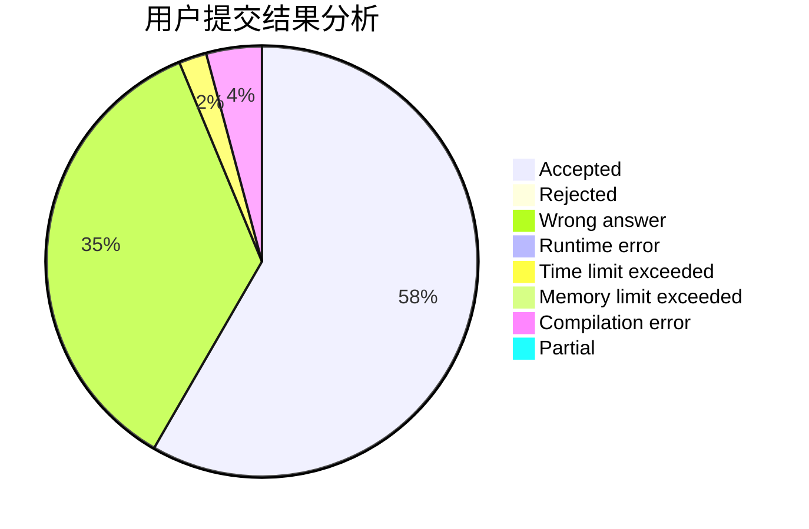
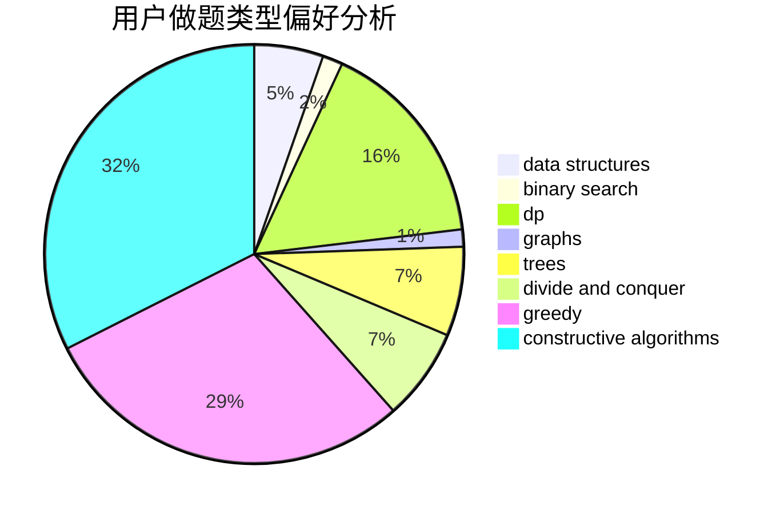
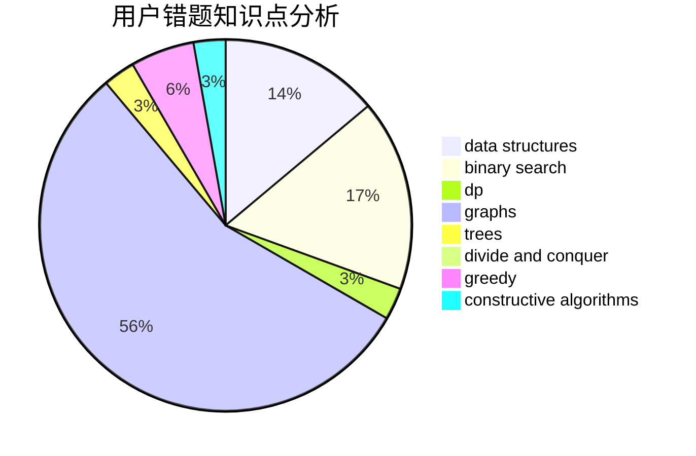

# Kirito_Rivaille
<!-- tabs:start -->
#### **用户提交结果分析**

#### **用户做题类型偏好分析**

#### **用户错题知识点分析**

<!-- tabs:end -->
# 推荐题目
[Traffic Lights](http://codeforces.com/problemset/problem/29/B)		implementation		  
[Double Cola](http://codeforces.com/problemset/problem/82/A)		implementation,
                        math		  
[Bear and Up-Down](http://codeforces.com/problemset/problem/653/C)		brute force,
                        implementation		  
[Chores](http://codeforces.com/problemset/problem/873/A)		implementation		  
[Mike and Frog](http://codeforces.com/problemset/problem/547/A)		brute force,
                        greedy,
                        implementation,
                        math		  
[Gravity Flip](http://codeforces.com/problemset/problem/405/A)		greedy,
                        implementation,
                        sortings		  
[Arson In Berland Forest](https://codeforces.com/contest/1261/problem/C)		binary search,
                        graphs,
                        graphs,
                        shortest paths		  
[Time to Raid Cowavans](http://codeforces.com/problemset/problem/103/D)		brute force,
                        data structures,
                        sortings		  
[SmartGarden](http://codeforces.com/problemset/problem/1250/M)		constructive algorithms,
                        divide and conquer		  
[Chloe and pleasant prizes](http://codeforces.com/problemset/problem/743/D)		dfs and similar,
                        dp,
                        graphs,
                        trees		  
<!-- tabs:start -->
#### **data structures**
[Traffic Lights](http://codeforces.com/problemset/problem/103/D)		brute force,
                        data structures,
                        sortings		  
[Double Cola](http://codeforces.com/problemset/problem/637/B)		*special problem,
                        binary search,
                        constructive algorithms,
                        data structures,
                        sortings		  
[Bear and Up-Down](http://codeforces.com/problemset/problem/1099/F)		binary search,
                        data structures,
                        dfs and similar,
                        dp,
                        games,
                        trees		  
[Chores](http://codeforces.com/problemset/problem/1100/B)		data structures,
                        implementation		  
[Mike and Frog](http://codeforces.com/problemset/problem/341/D)		data structures		  
[Gravity Flip](http://codeforces.com/problemset/problem/1194/E)		bitmasks,
                        brute force,
                        data structures,
                        geometry,
                        sortings		  
[Arson In Berland Forest](http://codeforces.com/problemset/problem/1374/E1)		data structures,
                        greedy,
                        sortings		  
[Time to Raid Cowavans](http://codeforces.com/problemset/problem/452/E)		data structures,
                        dsu,
                        string suffix structures,
                        strings		  
[SmartGarden](http://codeforces.com/problemset/problem/817/E)		bitmasks,
                        data structures,
                        trees		  
[Chloe and pleasant prizes](http://codeforces.com/problemset/problem/1492/C)		binary search,
                        data structures,
                        dp,
                        greedy,
                        two pointers		  
#### **binary search**
[Traffic Lights](https://codeforces.com/contest/1261/problem/C)		binary search,
                        graphs,
                        graphs,
                        shortest paths		  
[Double Cola](http://codeforces.com/problemset/problem/637/B)		*special problem,
                        binary search,
                        constructive algorithms,
                        data structures,
                        sortings		  
[Bear and Up-Down](http://codeforces.com/problemset/problem/1099/F)		binary search,
                        data structures,
                        dfs and similar,
                        dp,
                        games,
                        trees		  
[Chores](http://codeforces.com/problemset/problem/84/C)		binary search,
                        implementation		  
[Mike and Frog](http://codeforces.com/problemset/problem/1379/B)		binary search,
                        brute force,
                        math,
                        number theory		  
[Gravity Flip](http://codeforces.com/problemset/problem/1492/C)		binary search,
                        data structures,
                        dp,
                        greedy,
                        two pointers		  
[Arson In Berland Forest](http://codeforces.com/problemset/problem/1463/D)		binary search,
                        constructive algorithms,
                        greedy,
                        two pointers		  
[Time to Raid Cowavans](http://codeforces.com/problemset/problem/1490/G)		binary search,
                        data structures,
                        math		  
[SmartGarden](http://codeforces.com/problemset/problem/1479/D)		binary search,
                        bitmasks,
                        brute force,
                        data structures,
                        probabilities,
                        trees		  
[Chloe and pleasant prizes](http://codeforces.com/problemset/problem/1436/E)		binary search,
                        data structures,
                        two pointers		  
#### **dp**
[Traffic Lights](http://codeforces.com/problemset/problem/743/D)		dfs and similar,
                        dp,
                        graphs,
                        trees		  
[Double Cola](http://codeforces.com/problemset/problem/1307/C)		brute force,
                        dp,
                        math,
                        strings		  
[Bear and Up-Down](http://codeforces.com/problemset/problem/1099/F)		binary search,
                        data structures,
                        dfs and similar,
                        dp,
                        games,
                        trees		  
[Chores](http://codeforces.com/problemset/problem/1015/F)		dp,
                        strings		  
[Mike and Frog](http://codeforces.com/problemset/problem/747/D)		dp,
                        greedy,
                        sortings		  
[Gravity Flip](http://codeforces.com/problemset/problem/613/D)		dfs and similar,
                        divide and conquer,
                        dp,
                        graphs,
                        sortings,
                        trees		  
[Arson In Berland Forest](http://codeforces.com/problemset/problem/1492/C)		binary search,
                        data structures,
                        dp,
                        greedy,
                        two pointers		  
[Time to Raid Cowavans](https://codeforces.com/contest/1457/problem/C)		brute force,
                        dp,
                        implementation		  
[SmartGarden](http://codeforces.com/problemset/problem/1491/C)		brute force,
                        data structures,
                        dp,
                        greedy,
                        implementation		  
[Chloe and pleasant prizes](http://codeforces.com/problemset/problem/1437/C)		dp,
                        flows,
                        graph matchings,
                        greedy,
                        math,
                        sortings		  
#### **graph**
[Traffic Lights](https://codeforces.com/contest/1261/problem/C)		binary search,
                        graphs,
                        graphs,
                        shortest paths		  
[Double Cola](http://codeforces.com/problemset/problem/743/D)		dfs and similar,
                        dp,
                        graphs,
                        trees		  
[Bear and Up-Down](http://codeforces.com/problemset/problem/1076/D)		graphs,
                        greedy,
                        shortest paths		  
[Chores](http://codeforces.com/problemset/problem/613/D)		dfs and similar,
                        divide and conquer,
                        dp,
                        graphs,
                        sortings,
                        trees		  
[Mike and Frog](http://codeforces.com/problemset/problem/1513/D)		constructive algorithms,
                        dsu,
                        graphs,
                        greedy,
                        number theory,
                        sortings		  
[Gravity Flip](http://codeforces.com/problemset/problem/1487/C)		brute force,
                        constructive algorithms,
                        dfs and similar,
                        graphs,
                        greedy,
                        implementation,
                        math		  
[Arson In Berland Forest](http://codeforces.com/problemset/problem/1437/C)		dp,
                        flows,
                        graph matchings,
                        greedy,
                        math,
                        sortings		  
[Time to Raid Cowavans](http://codeforces.com/problemset/problem/1470/D)		constructive algorithms,
                        dfs and similar,
                        graph matchings,
                        graphs,
                        greedy		  
[SmartGarden](http://codeforces.com/problemset/problem/1476/C)		dp,
                        graphs,
                        greedy		  
[Chloe and pleasant prizes](http://codeforces.com/problemset/problem/1304/D)		constructive algorithms,
                        graphs,
                        greedy,
                        two pointers		  
#### **trees**
[Traffic Lights](http://codeforces.com/problemset/problem/743/D)		dfs and similar,
                        dp,
                        graphs,
                        trees		  
[Double Cola](http://codeforces.com/problemset/problem/1099/F)		binary search,
                        data structures,
                        dfs and similar,
                        dp,
                        games,
                        trees		  
[Bear and Up-Down](http://codeforces.com/problemset/problem/1396/E)		constructive algorithms,
                        dfs and similar,
                        trees		  
[Chores](http://codeforces.com/problemset/problem/613/D)		dfs and similar,
                        divide and conquer,
                        dp,
                        graphs,
                        sortings,
                        trees		  
[Mike and Frog](http://codeforces.com/problemset/problem/817/E)		bitmasks,
                        data structures,
                        trees		  
[Gravity Flip](http://codeforces.com/problemset/problem/1479/D)		binary search,
                        bitmasks,
                        brute force,
                        data structures,
                        probabilities,
                        trees		  
[Arson In Berland Forest](http://codeforces.com/problemset/problem/1511/C)		brute force,
                        data structures,
                        implementation,
                        trees		  
[Time to Raid Cowavans](http://codeforces.com/problemset/problem/1499/F)		combinatorics,
                        dfs and similar,
                        dp,
                        trees		  
[SmartGarden](http://codeforces.com/problemset/problem/1491/E)		brute force,
                        dfs and similar,
                        divide and conquer,
                        number theory,
                        trees		  
[Chloe and pleasant prizes](http://codeforces.com/problemset/problem/1466/D)		data structures,
                        greedy,
                        sortings,
                        trees		  
#### **divide and conquer**
[Traffic Lights](http://codeforces.com/problemset/problem/1250/M)		constructive algorithms,
                        divide and conquer		  
[Double Cola](http://codeforces.com/problemset/problem/613/D)		dfs and similar,
                        divide and conquer,
                        dp,
                        graphs,
                        sortings,
                        trees		  
[Bear and Up-Down](http://codeforces.com/problemset/problem/1461/D)		binary search,
                        brute force,
                        data structures,
                        divide and conquer,
                        implementation,
                        sortings		  
[Chores](http://codeforces.com/problemset/problem/1466/G)		combinatorics,
                        divide and conquer,
                        hashing,
                        math,
                        string suffix structures,
                        strings		  
[Mike and Frog](http://codeforces.com/problemset/problem/1490/D)		dfs and similar,
                        divide and conquer,
                        implementation		  
[Gravity Flip](https://codeforces.com/contest/1483/problem/C)		data structures,
                        divide and conquer,
                        dp		  
[Arson In Berland Forest](http://codeforces.com/problemset/problem/1491/E)		brute force,
                        dfs and similar,
                        divide and conquer,
                        number theory,
                        trees		  
[Time to Raid Cowavans](http://codeforces.com/problemset/problem/1303/G)		data structures,
                        divide and conquer,
                        geometry,
                        trees		  
[SmartGarden](http://codeforces.com/problemset/problem/1494/D)		constructive algorithms,
                        data structures,
                        dfs and similar,
                        divide and conquer,
                        dsu,
                        greedy,
                        sortings,
                        trees		  
[Chloe and pleasant prizes](http://codeforces.com/problemset/problem/1482/E)		data structures,
                        divide and conquer,
                        dp		  
#### **greedy**
[Traffic Lights](http://codeforces.com/problemset/problem/547/A)		brute force,
                        greedy,
                        implementation,
                        math		  
[Double Cola](http://codeforces.com/problemset/problem/405/A)		greedy,
                        implementation,
                        sortings		  
[Bear and Up-Down](http://codeforces.com/problemset/problem/1076/D)		graphs,
                        greedy,
                        shortest paths		  
[Chores](http://codeforces.com/problemset/problem/747/D)		dp,
                        greedy,
                        sortings		  
[Mike and Frog](https://codeforces.com/contest/1484/problem/C)		brute force,
                        constructive algorithms,
                        greedy,
                        implementation		  
[Gravity Flip](http://codeforces.com/problemset/problem/1374/E1)		data structures,
                        greedy,
                        sortings		  
[Arson In Berland Forest](http://codeforces.com/problemset/problem/1329/A)		constructive algorithms,
                        greedy,
                        implementation,
                        math		  
[Time to Raid Cowavans](http://codeforces.com/problemset/problem/1513/D)		constructive algorithms,
                        dsu,
                        graphs,
                        greedy,
                        number theory,
                        sortings		  
[SmartGarden](http://codeforces.com/problemset/problem/1492/C)		binary search,
                        data structures,
                        dp,
                        greedy,
                        two pointers		  
[Chloe and pleasant prizes](https://codeforces.com/contest/1496/problem/C)		geometry,
                        greedy,
                        math,
                        sortings		  
#### **constructive algorithms**
[Traffic Lights](http://codeforces.com/problemset/problem/1250/M)		constructive algorithms,
                        divide and conquer		  
[Double Cola](http://codeforces.com/problemset/problem/637/B)		*special problem,
                        binary search,
                        constructive algorithms,
                        data structures,
                        sortings		  
[Bear and Up-Down](http://codeforces.com/problemset/problem/1396/E)		constructive algorithms,
                        dfs and similar,
                        trees		  
[Chores](https://codeforces.com/contest/1484/problem/C)		brute force,
                        constructive algorithms,
                        greedy,
                        implementation		  
[Mike and Frog](http://codeforces.com/problemset/problem/1329/A)		constructive algorithms,
                        greedy,
                        implementation,
                        math		  
[Gravity Flip](http://codeforces.com/problemset/problem/1513/D)		constructive algorithms,
                        dsu,
                        graphs,
                        greedy,
                        number theory,
                        sortings		  
[Arson In Berland Forest](http://codeforces.com/problemset/problem/1493/A)		constructive algorithms,
                        greedy		  
[Time to Raid Cowavans](http://codeforces.com/problemset/problem/1463/D)		binary search,
                        constructive algorithms,
                        greedy,
                        two pointers		  
[SmartGarden](https://codeforces.com/contest/1456/problem/B)		bitmasks,
                        brute force,
                        constructive algorithms		  
[Chloe and pleasant prizes](http://codeforces.com/problemset/problem/1492/D)		bitmasks,
                        constructive algorithms,
                        greedy,
                        math		  
#### **sortings**
[Traffic Lights](http://codeforces.com/problemset/problem/405/A)		greedy,
                        implementation,
                        sortings		  
[Double Cola](http://codeforces.com/problemset/problem/103/D)		brute force,
                        data structures,
                        sortings		  
[Bear and Up-Down](http://codeforces.com/problemset/problem/637/B)		*special problem,
                        binary search,
                        constructive algorithms,
                        data structures,
                        sortings		  
[Chores](http://codeforces.com/problemset/problem/747/D)		dp,
                        greedy,
                        sortings		  
[Mike and Frog](http://codeforces.com/problemset/problem/1194/E)		bitmasks,
                        brute force,
                        data structures,
                        geometry,
                        sortings		  
[Gravity Flip](http://codeforces.com/problemset/problem/1374/E1)		data structures,
                        greedy,
                        sortings		  
[Arson In Berland Forest](http://codeforces.com/problemset/problem/613/D)		dfs and similar,
                        divide and conquer,
                        dp,
                        graphs,
                        sortings,
                        trees		  
[Time to Raid Cowavans](http://codeforces.com/problemset/problem/1513/D)		constructive algorithms,
                        dsu,
                        graphs,
                        greedy,
                        number theory,
                        sortings		  
[SmartGarden](https://codeforces.com/contest/1496/problem/C)		geometry,
                        greedy,
                        math,
                        sortings		  
[Chloe and pleasant prizes](http://codeforces.com/problemset/problem/1495/A)		geometry,
                        greedy,
                        math,
                        sortings		  
<!-- tabs:end -->
