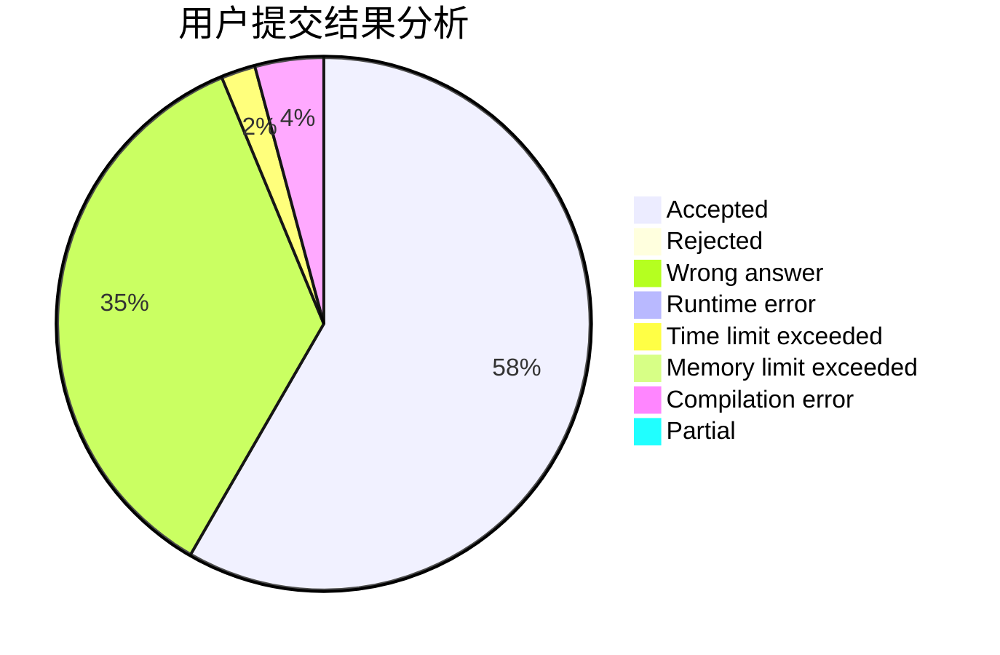
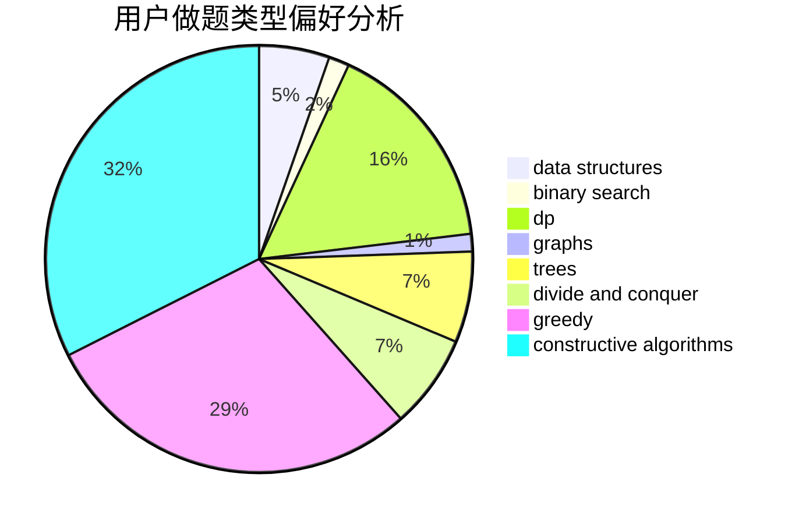
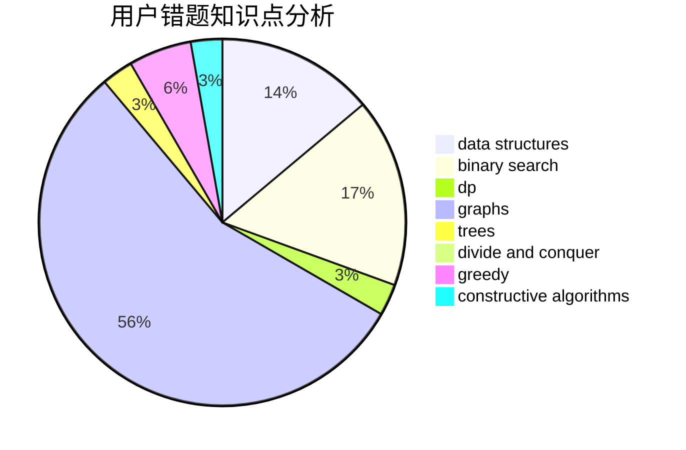

# Kirito_Rivaille

<!-- tabs:start -->

#### **用户提交结果分析**

#### **用户做题类型偏好分析**

#### **用户错题知识点分析**

<!-- tabs:end -->
# 推荐题目
[653C](https://codeforces.com/contest/653/problem/C)		brute force,
                        implementation		  
[873A](https://codeforces.com/contest/873/problem/A)		implementation		  
[29B](https://codeforces.com/contest/29/problem/B)		implementation		  
[547A](https://codeforces.com/contest/547/problem/A)		brute force,
                        greedy,
                        implementation,
                        math		  
[103D](https://codeforces.com/contest/103/problem/D)		brute force,
                        data structures,
                        sortings		  
[747D](https://codeforces.com/contest/747/problem/D)		dp,
                        greedy,
                        sortings		  
[405A](https://codeforces.com/contest/405/problem/A)		greedy,
                        implementation,
                        sortings		  
[1100B](https://codeforces.com/contest/1100/problem/B)		data structures,
                        implementation		  
[341D](https://codeforces.com/contest/341/problem/D)		data structures		  
[82A](https://codeforces.com/contest/82/problem/A)		implementation,
                        math		  
