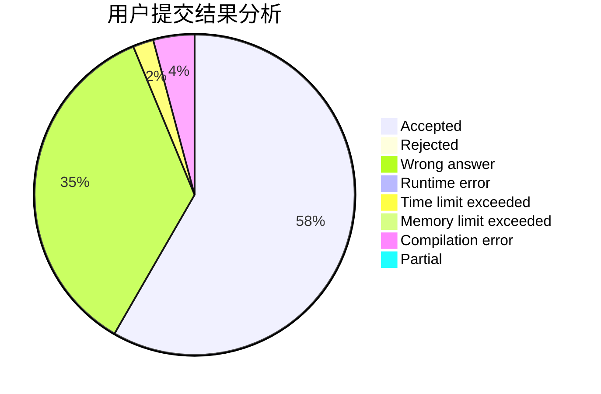
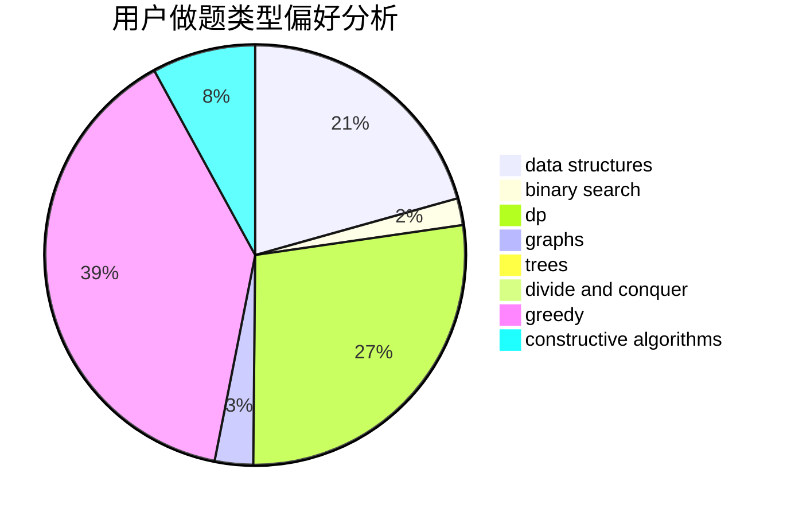
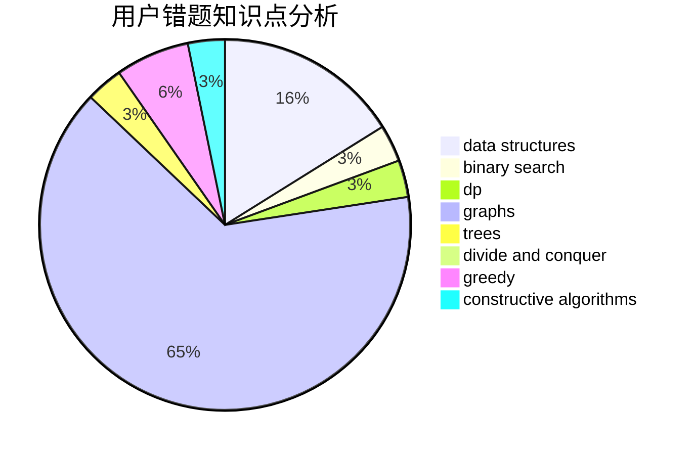

# Kirito_Rivaille

<!-- tabs:start -->

#### **用户提交结果分析**

#### **用户做题类型偏好分析**

#### **用户错题知识点分析**

<!-- tabs:end -->
# 推荐题目
[677C](https://codeforces.com/contest/677/problem/C)		bitmasks,
                        combinatorics,
                        implementation,
                        strings		  
[893F](https://codeforces.com/contest/893/problem/F)		data structures,
                        trees		  
[317A](https://codeforces.com/contest/317/problem/A)		brute force		  
[571C](https://codeforces.com/contest/571/problem/C)		constructive algorithms,
                        dfs and similar,
                        graphs,
                        greedy		  
[1040B](https://codeforces.com/contest/1040/problem/B)		dp,
                        greedy,
                        math		  
[767A](https://codeforces.com/contest/767/problem/A)		data structures,
                        implementation		  
[434A](https://codeforces.com/contest/434/problem/A)		dsu,graphs,sortings,trees		  
[1100E](https://codeforces.com/contest/1100/problem/E)		binary search,
                        dfs and similar,
                        graphs		  
[369A](https://codeforces.com/contest/369/problem/A)		greedy,
                        implementation		  
[847F](https://codeforces.com/contest/847/problem/F)		greedy,
                        sortings		  
