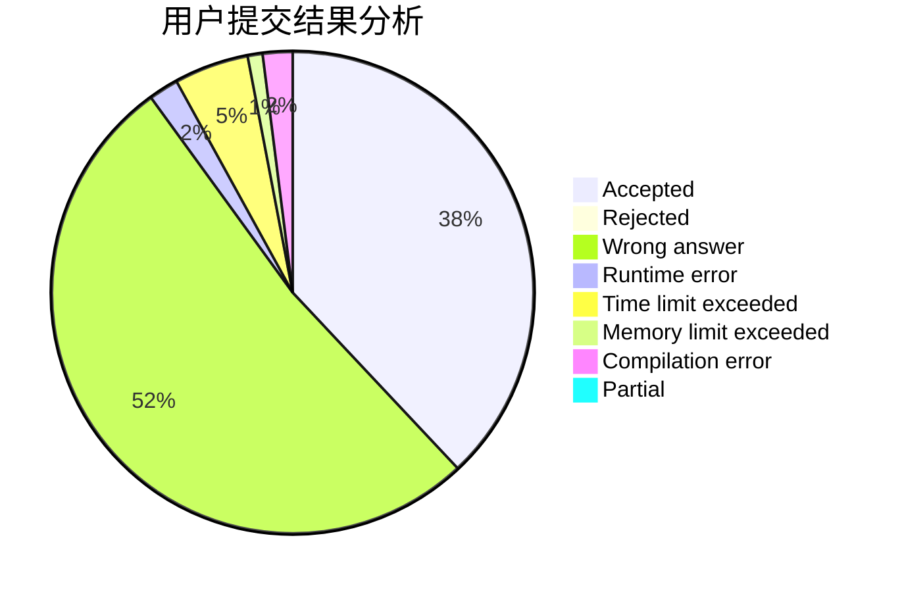
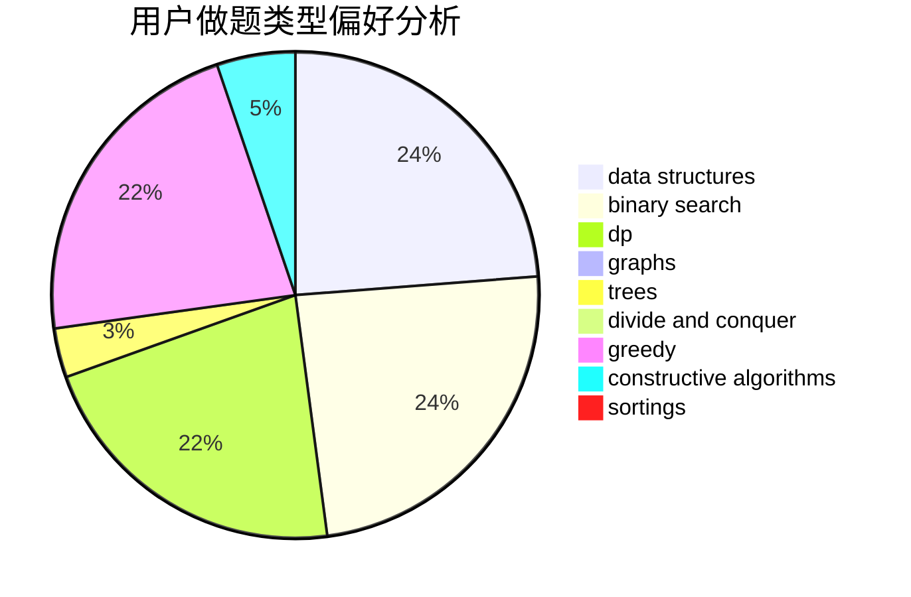
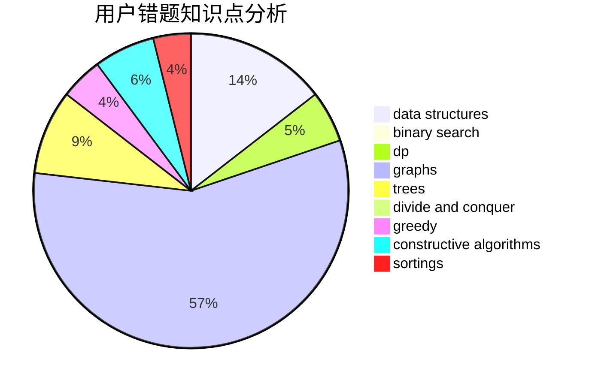

# Kloze
<!-- tabs:start -->
#### **用户提交结果分析**

#### **用户做题类型偏好分析**

#### **用户错题知识点分析**

<!-- tabs:end -->
# 推荐题目
[416D](http://codeforces.com/problemset/problem/416/D)		greedy,
                        implementation,
                        math		  
[1333E](http://codeforces.com/problemset/problem/1333/E)		brute force,
                        constructive algorithms		  
[1378A2](https://codeforces.com/contest/1378/problem/A2)		nan		  
[1044B](http://codeforces.com/problemset/problem/1044/B)		dfs and similar,
                        interactive,
                        trees		  
[79D](http://codeforces.com/problemset/problem/79/D)		bitmasks,
                        dp,
                        shortest paths		  
[216B](http://codeforces.com/problemset/problem/216/B)		dfs and similar,
                        implementation		  
[1062E](http://codeforces.com/problemset/problem/1062/E)		binary search,
                        data structures,
                        dfs and similar,
                        greedy,
                        trees		  
[178F1](http://codeforces.com/problemset/problem/178/F1)		nan		  
[812C](http://codeforces.com/problemset/problem/812/C)		binary search,
                        sortings		  
[1100B](http://codeforces.com/problemset/problem/1100/B)		data structures,
                        implementation		  
<!-- tabs:start -->
#### **data structures**
[1062E](http://codeforces.com/problemset/problem/1062/E)		binary search,
                        data structures,
                        dfs and similar,
                        greedy,
                        trees		  
[1100B](http://codeforces.com/problemset/problem/1100/B)		data structures,
                        implementation		  
[474F](http://codeforces.com/problemset/problem/474/F)		data structures,
                        math,
                        number theory		  
[173E](http://codeforces.com/problemset/problem/173/E)		data structures,
                        sortings		  
[916D](http://codeforces.com/problemset/problem/916/D)		data structures,
                        interactive,
                        trees		  
[811E](http://codeforces.com/problemset/problem/811/E)		data structures,
                        dsu,
                        graphs		  
[1508C](http://codeforces.com/problemset/problem/1508/C)		data structures,
                        dfs and similar,
                        dsu,
                        graphs,
                        greedy,
                        math		  
[1194E](http://codeforces.com/problemset/problem/1194/E)		bitmasks,
                        brute force,
                        data structures,
                        geometry,
                        sortings		  
[1492C](http://codeforces.com/problemset/problem/1492/C)		binary search,
                        data structures,
                        dp,
                        greedy,
                        two pointers		  
[1490G](http://codeforces.com/problemset/problem/1490/G)		binary search,
                        data structures,
                        math		  
#### **binary search**
[1062E](http://codeforces.com/problemset/problem/1062/E)		binary search,
                        data structures,
                        dfs and similar,
                        greedy,
                        trees		  
[812C](http://codeforces.com/problemset/problem/812/C)		binary search,
                        sortings		  
[1435C](https://codeforces.com/contest/1435/problem/C)		binary search,
                        brute force,
                        dp,
                        implementation,
                        sortings,
                        two pointers		  
[1492C](http://codeforces.com/problemset/problem/1492/C)		binary search,
                        data structures,
                        dp,
                        greedy,
                        two pointers		  
[1463D](http://codeforces.com/problemset/problem/1463/D)		binary search,
                        constructive algorithms,
                        greedy,
                        two pointers		  
[1490G](http://codeforces.com/problemset/problem/1490/G)		binary search,
                        data structures,
                        math		  
[1479D](http://codeforces.com/problemset/problem/1479/D)		binary search,
                        bitmasks,
                        brute force,
                        data structures,
                        probabilities,
                        trees		  
[1436E](http://codeforces.com/problemset/problem/1436/E)		binary search,
                        data structures,
                        two pointers		  
[1461D](http://codeforces.com/problemset/problem/1461/D)		binary search,
                        brute force,
                        data structures,
                        divide and conquer,
                        implementation,
                        sortings		  
[1493C](http://codeforces.com/problemset/problem/1493/C)		binary search,
                        brute force,
                        constructive algorithms,
                        greedy,
                        strings		  
#### **dp**
[79D](http://codeforces.com/problemset/problem/79/D)		bitmasks,
                        dp,
                        shortest paths		  
[467D](http://codeforces.com/problemset/problem/467/D)		dfs and similar,
                        dp,
                        graphs,
                        hashing,
                        strings		  
[1261D1](https://codeforces.com/contest/1261/problem/D1)		dp		  
[1425B](http://codeforces.com/problemset/problem/1425/B)		divide and conquer,
                        dp		  
[294B](http://codeforces.com/problemset/problem/294/B)		dp,
                        greedy		  
[107D](http://codeforces.com/problemset/problem/107/D)		dp,
                        graphs,
                        matrices		  
[1435C](https://codeforces.com/contest/1435/problem/C)		binary search,
                        brute force,
                        dp,
                        implementation,
                        sortings,
                        two pointers		  
[1510D](http://codeforces.com/problemset/problem/1510/D)		dp,
                        math,
                        number theory		  
[1344C](http://codeforces.com/problemset/problem/1344/C)		dfs and similar,
                        dp,
                        graphs,
                        math		  
[1492C](http://codeforces.com/problemset/problem/1492/C)		binary search,
                        data structures,
                        dp,
                        greedy,
                        two pointers		  
#### **graph**
[467D](http://codeforces.com/problemset/problem/467/D)		dfs and similar,
                        dp,
                        graphs,
                        hashing,
                        strings		  
[107D](http://codeforces.com/problemset/problem/107/D)		dp,
                        graphs,
                        matrices		  
[811E](http://codeforces.com/problemset/problem/811/E)		data structures,
                        dsu,
                        graphs		  
[1508C](http://codeforces.com/problemset/problem/1508/C)		data structures,
                        dfs and similar,
                        dsu,
                        graphs,
                        greedy,
                        math		  
[1344C](http://codeforces.com/problemset/problem/1344/C)		dfs and similar,
                        dp,
                        graphs,
                        math		  
[1487C](http://codeforces.com/problemset/problem/1487/C)		brute force,
                        constructive algorithms,
                        dfs and similar,
                        graphs,
                        greedy,
                        implementation,
                        math		  
[1437C](http://codeforces.com/problemset/problem/1437/C)		dp,
                        flows,
                        graph matchings,
                        greedy,
                        math,
                        sortings		  
[1470D](http://codeforces.com/problemset/problem/1470/D)		constructive algorithms,
                        dfs and similar,
                        graph matchings,
                        graphs,
                        greedy		  
[1476C](http://codeforces.com/problemset/problem/1476/C)		dp,
                        graphs,
                        greedy		  
[1304D](http://codeforces.com/problemset/problem/1304/D)		constructive algorithms,
                        graphs,
                        greedy,
                        two pointers		  
#### **trees**
[1044B](http://codeforces.com/problemset/problem/1044/B)		dfs and similar,
                        interactive,
                        trees		  
[1062E](http://codeforces.com/problemset/problem/1062/E)		binary search,
                        data structures,
                        dfs and similar,
                        greedy,
                        trees		  
[916D](http://codeforces.com/problemset/problem/916/D)		data structures,
                        interactive,
                        trees		  
[526G](http://codeforces.com/problemset/problem/526/G)		greedy,
                        trees		  
[1479D](http://codeforces.com/problemset/problem/1479/D)		binary search,
                        bitmasks,
                        brute force,
                        data structures,
                        probabilities,
                        trees		  
[1511C](http://codeforces.com/problemset/problem/1511/C)		brute force,
                        data structures,
                        implementation,
                        trees		  
[1499F](http://codeforces.com/problemset/problem/1499/F)		combinatorics,
                        dfs and similar,
                        dp,
                        trees		  
[1491E](http://codeforces.com/problemset/problem/1491/E)		brute force,
                        dfs and similar,
                        divide and conquer,
                        number theory,
                        trees		  
[1466D](http://codeforces.com/problemset/problem/1466/D)		data structures,
                        greedy,
                        sortings,
                        trees		  
[1495D](http://codeforces.com/problemset/problem/1495/D)		combinatorics,
                        dfs and similar,
                        graphs,
                        math,
                        shortest paths,
                        trees		  
#### **divide and conquer**
[1425B](http://codeforces.com/problemset/problem/1425/B)		divide and conquer,
                        dp		  
[1461D](http://codeforces.com/problemset/problem/1461/D)		binary search,
                        brute force,
                        data structures,
                        divide and conquer,
                        implementation,
                        sortings		  
[1466G](http://codeforces.com/problemset/problem/1466/G)		combinatorics,
                        divide and conquer,
                        hashing,
                        math,
                        string suffix structures,
                        strings		  
[1490D](http://codeforces.com/problemset/problem/1490/D)		dfs and similar,
                        divide and conquer,
                        implementation		  
[1483C](https://codeforces.com/contest/1483/problem/C)		data structures,
                        divide and conquer,
                        dp		  
[1491E](http://codeforces.com/problemset/problem/1491/E)		brute force,
                        dfs and similar,
                        divide and conquer,
                        number theory,
                        trees		  
[1303G](http://codeforces.com/problemset/problem/1303/G)		data structures,
                        divide and conquer,
                        geometry,
                        trees		  
[1494D](http://codeforces.com/problemset/problem/1494/D)		constructive algorithms,
                        data structures,
                        dfs and similar,
                        divide and conquer,
                        dsu,
                        greedy,
                        sortings,
                        trees		  
[1482E](http://codeforces.com/problemset/problem/1482/E)		data structures,
                        divide and conquer,
                        dp		  
[566C](http://codeforces.com/problemset/problem/566/C)		dfs and similar,
                        divide and conquer,
                        trees		  
#### **greedy**
[416D](http://codeforces.com/problemset/problem/416/D)		greedy,
                        implementation,
                        math		  
[1062E](http://codeforces.com/problemset/problem/1062/E)		binary search,
                        data structures,
                        dfs and similar,
                        greedy,
                        trees		  
[294B](http://codeforces.com/problemset/problem/294/B)		dp,
                        greedy		  
[1417B](http://codeforces.com/problemset/problem/1417/B)		greedy,
                        math,
                        sortings		  
[1508C](http://codeforces.com/problemset/problem/1508/C)		data structures,
                        dfs and similar,
                        dsu,
                        graphs,
                        greedy,
                        math		  
[1231C](http://codeforces.com/problemset/problem/1231/C)		greedy		  
[1252H](http://codeforces.com/problemset/problem/1252/H)		greedy,
                        implementation		  
[526G](http://codeforces.com/problemset/problem/526/G)		greedy,
                        trees		  
[1467A](http://codeforces.com/problemset/problem/1467/A)		constructive algorithms,
                        greedy,
                        math		  
[1492C](http://codeforces.com/problemset/problem/1492/C)		binary search,
                        data structures,
                        dp,
                        greedy,
                        two pointers		  
#### **constructive algorithms**
[1333E](http://codeforces.com/problemset/problem/1333/E)		brute force,
                        constructive algorithms		  
[940C](http://codeforces.com/problemset/problem/940/C)		constructive algorithms,
                        implementation,
                        strings		  
[1467A](http://codeforces.com/problemset/problem/1467/A)		constructive algorithms,
                        greedy,
                        math		  
[1493A](http://codeforces.com/problemset/problem/1493/A)		constructive algorithms,
                        greedy		  
[1463D](http://codeforces.com/problemset/problem/1463/D)		binary search,
                        constructive algorithms,
                        greedy,
                        two pointers		  
[1456B](https://codeforces.com/contest/1456/problem/B)		bitmasks,
                        brute force,
                        constructive algorithms		  
[1492D](http://codeforces.com/problemset/problem/1492/D)		bitmasks,
                        constructive algorithms,
                        greedy,
                        math		  
[1504D](https://codeforces.com/contest/1504/problem/D)		constructive algorithms,
                        games,
                        interactive		  
[1483A](https://codeforces.com/contest/1483/problem/A)		brute force,
                        constructive algorithms,
                        greedy,
                        implementation		  
[1457D](https://codeforces.com/contest/1457/problem/D)		bitmasks,
                        brute force,
                        constructive algorithms		  
#### **sortings**
[812C](http://codeforces.com/problemset/problem/812/C)		binary search,
                        sortings		  
[173E](http://codeforces.com/problemset/problem/173/E)		data structures,
                        sortings		  
[1417B](http://codeforces.com/problemset/problem/1417/B)		greedy,
                        math,
                        sortings		  
[1284E](http://codeforces.com/problemset/problem/1284/E)		combinatorics,
                        geometry,
                        math,
                        sortings		  
[1435C](https://codeforces.com/contest/1435/problem/C)		binary search,
                        brute force,
                        dp,
                        implementation,
                        sortings,
                        two pointers		  
[1194E](http://codeforces.com/problemset/problem/1194/E)		bitmasks,
                        brute force,
                        data structures,
                        geometry,
                        sortings		  
[1496C](https://codeforces.com/contest/1496/problem/C)		geometry,
                        greedy,
                        math,
                        sortings		  
[1495A](http://codeforces.com/problemset/problem/1495/A)		geometry,
                        greedy,
                        math,
                        sortings		  
[1497A](http://codeforces.com/problemset/problem/1497/A)		brute force,
                        data structures,
                        greedy,
                        sortings		  
[1427A](http://codeforces.com/problemset/problem/1427/A)		math,
                        sortings		  
<!-- tabs:end -->
