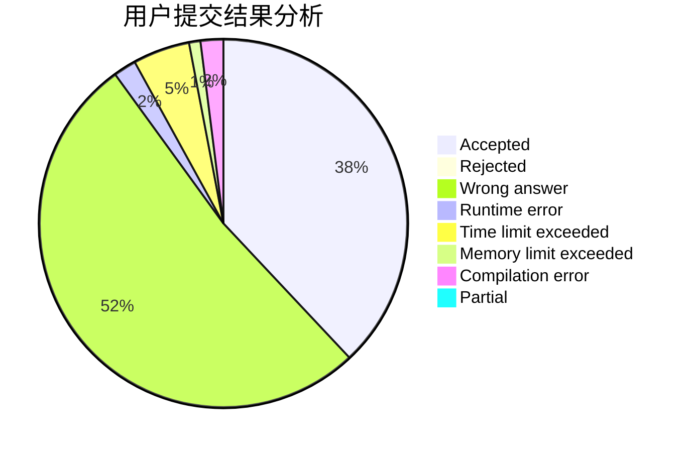
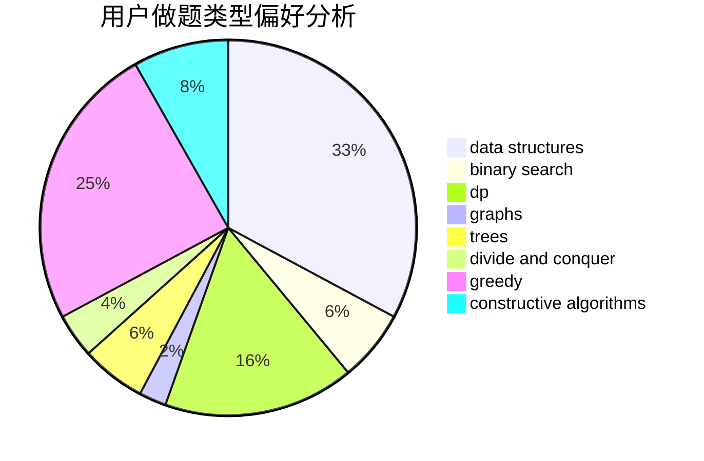
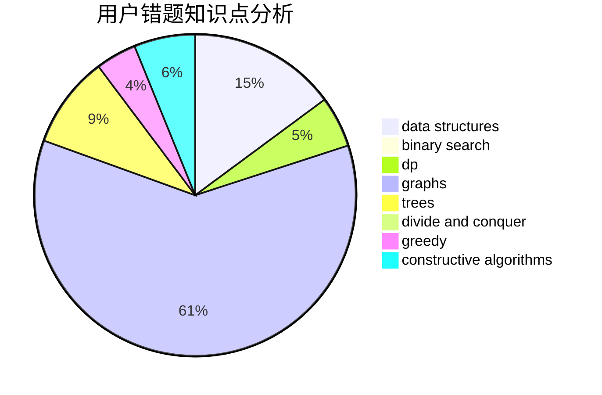

# Kloze

<!-- tabs:start -->

#### **用户提交结果分析**

#### **用户做题类型偏好分析**

#### **用户错题知识点分析**

<!-- tabs:end -->
# 推荐题目
[441D](https://codeforces.com/contest/441/problem/D)		constructive algorithms,
                        dsu,
                        graphs,
                        implementation,
                        math,
                        string suffix structures		  
[1340D](https://codeforces.com/contest/1340/problem/D)		constructive algorithms,
                        dfs and similar,
                        graphs,
                        trees		  
[1045C](https://codeforces.com/contest/1045/problem/C)		dfs and similar,
                        graphs,
                        trees		  
[1063B](https://codeforces.com/contest/1063/problem/B)		graphs,
                        shortest paths		  
[1387A](https://codeforces.com/contest/1387/problem/A)		*special problem,
                        binary search,
                        dfs and similar,
                        dp,
                        math,
                        ternary search		  
[1100E](https://codeforces.com/contest/1100/problem/E)		binary search,
                        dfs and similar,
                        graphs		  
[30C](https://codeforces.com/contest/30/problem/C)		dp,
                        probabilities		  
[551A](https://codeforces.com/contest/551/problem/A)		brute force,
                        implementation,
                        sortings		  
[493E](https://codeforces.com/contest/493/problem/E)		math		  
[204D](https://codeforces.com/contest/204/problem/D)		dp		  
