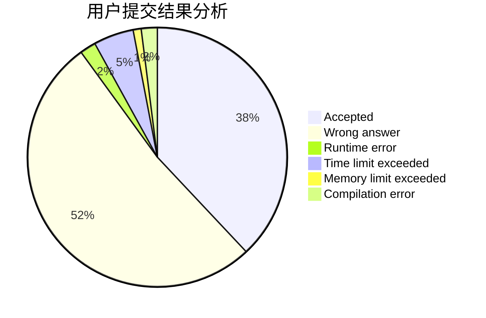
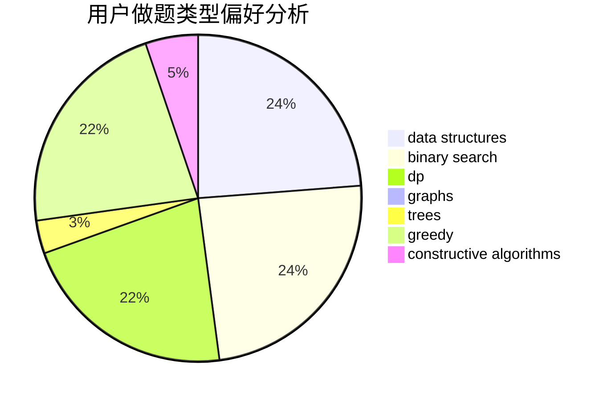
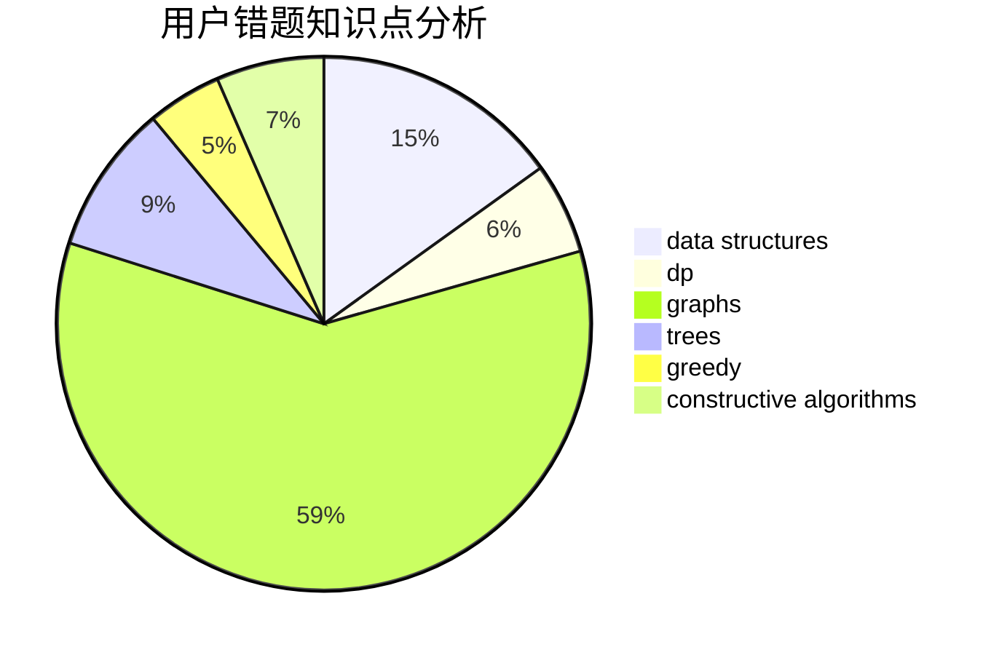

# Kloze
<!-- tabs:start -->
#### **用户提交结果分析**

#### **用户做题类型偏好分析**

#### **用户错题知识点分析**

<!-- tabs:end -->
# 推荐题目
[Population Size](http://codeforces.com/problemset/problem/416/D)		greedy,
                        implementation,
                        math		  
[Road to 1600](http://codeforces.com/problemset/problem/1333/E)		brute force,
                        constructive algorithms		  
[Huawei Graph Mining Challenge](https://codeforces.com/contest/1378/problem/A2)		nan		  
[Intersecting Subtrees](http://codeforces.com/problemset/problem/1044/B)		dfs and similar,
                        interactive,
                        trees		  
[Password](http://codeforces.com/problemset/problem/79/D)		bitmasks,
                        dp,
                        shortest paths		  
[Forming Teams](http://codeforces.com/problemset/problem/216/B)		dfs and similar,
                        implementation		  
[Company](http://codeforces.com/problemset/problem/1062/E)		binary search,
                        data structures,
                        dfs and similar,
                        greedy,
                        trees		  
[Representative Sampling](http://codeforces.com/problemset/problem/178/F1)		nan		  
[Sagheer and Nubian Market](http://codeforces.com/problemset/problem/812/C)		binary search,
                        sortings		  
[Build a Contest](http://codeforces.com/problemset/problem/1100/B)		data structures,
                        implementation		  
<!-- tabs:start -->
#### **data structures**
[Company](http://codeforces.com/problemset/problem/1062/E)		binary search,
                        data structures,
                        dfs and similar,
                        greedy,
                        trees		  
[Build a Contest](http://codeforces.com/problemset/problem/1100/B)		data structures,
                        implementation		  
[Ant colony](http://codeforces.com/problemset/problem/474/F)		data structures,
                        math,
                        number theory		  
[Camping Groups](http://codeforces.com/problemset/problem/173/E)		data structures,
                        sortings		  
[Jamie and To-do List](http://codeforces.com/problemset/problem/916/D)		data structures,
                        interactive,
                        trees		  
[Vladik and Entertaining Flags](http://codeforces.com/problemset/problem/811/E)		data structures,
                        dsu,
                        graphs		  
[Complete the MST](http://codeforces.com/problemset/problem/1508/C)		data structures,
                        dfs and similar,
                        dsu,
                        graphs,
                        greedy,
                        math		  
[Count The Rectangles](http://codeforces.com/problemset/problem/1194/E)		bitmasks,
                        brute force,
                        data structures,
                        geometry,
                        sortings		  
[Maximum width](http://codeforces.com/problemset/problem/1492/C)		binary search,
                        data structures,
                        dp,
                        greedy,
                        two pointers		  
[Old Floppy Drive](http://codeforces.com/problemset/problem/1490/G)		binary search,
                        data structures,
                        math		  
#### **binary search**
[Company](http://codeforces.com/problemset/problem/1062/E)		binary search,
                        data structures,
                        dfs and similar,
                        greedy,
                        trees		  
[Sagheer and Nubian Market](http://codeforces.com/problemset/problem/812/C)		binary search,
                        sortings		  
[Perform Easily](https://codeforces.com/contest/1435/problem/C)		binary search,
                        brute force,
                        dp,
                        implementation,
                        sortings,
                        two pointers		  
[Maximum width](http://codeforces.com/problemset/problem/1492/C)		binary search,
                        data structures,
                        dp,
                        greedy,
                        two pointers		  
[Pairs](http://codeforces.com/problemset/problem/1463/D)		binary search,
                        constructive algorithms,
                        greedy,
                        two pointers		  
[Old Floppy Drive](http://codeforces.com/problemset/problem/1490/G)		binary search,
                        data structures,
                        math		  
[Odd Mineral Resource](http://codeforces.com/problemset/problem/1479/D)		binary search,
                        bitmasks,
                        brute force,
                        data structures,
                        probabilities,
                        trees		  
[Complicated Computations](http://codeforces.com/problemset/problem/1436/E)		binary search,
                        data structures,
                        two pointers		  
[Divide and Summarize](http://codeforces.com/problemset/problem/1461/D)		binary search,
                        brute force,
                        data structures,
                        divide and conquer,
                        implementation,
                        sortings		  
[K-beautiful Strings](http://codeforces.com/problemset/problem/1493/C)		binary search,
                        brute force,
                        constructive algorithms,
                        greedy,
                        strings		  
#### **dp**
[Password](http://codeforces.com/problemset/problem/79/D)		bitmasks,
                        dp,
                        shortest paths		  
[Fedor and Essay](http://codeforces.com/problemset/problem/467/D)		dfs and similar,
                        dp,
                        graphs,
                        hashing,
                        strings		  
[Wrong Answer on test 233 (Easy Version)](https://codeforces.com/contest/1261/problem/D1)		dp		  
[Blue and Red of Our Faculty!](http://codeforces.com/problemset/problem/1425/B)		divide and conquer,
                        dp		  
[Shaass and Bookshelf](http://codeforces.com/problemset/problem/294/B)		dp,
                        greedy		  
[Crime Management](http://codeforces.com/problemset/problem/107/D)		dp,
                        graphs,
                        matrices		  
[Perform Easily](https://codeforces.com/contest/1435/problem/C)		binary search,
                        brute force,
                        dp,
                        implementation,
                        sortings,
                        two pointers		  
[Digits](http://codeforces.com/problemset/problem/1510/D)		dp,
                        math,
                        number theory		  
[Quantifier Question](http://codeforces.com/problemset/problem/1344/C)		dfs and similar,
                        dp,
                        graphs,
                        math		  
[Maximum width](http://codeforces.com/problemset/problem/1492/C)		binary search,
                        data structures,
                        dp,
                        greedy,
                        two pointers		  
#### **graph**
[Fedor and Essay](http://codeforces.com/problemset/problem/467/D)		dfs and similar,
                        dp,
                        graphs,
                        hashing,
                        strings		  
[Crime Management](http://codeforces.com/problemset/problem/107/D)		dp,
                        graphs,
                        matrices		  
[Vladik and Entertaining Flags](http://codeforces.com/problemset/problem/811/E)		data structures,
                        dsu,
                        graphs		  
[Complete the MST](http://codeforces.com/problemset/problem/1508/C)		data structures,
                        dfs and similar,
                        dsu,
                        graphs,
                        greedy,
                        math		  
[Quantifier Question](http://codeforces.com/problemset/problem/1344/C)		dfs and similar,
                        dp,
                        graphs,
                        math		  
[Minimum Ties](http://codeforces.com/problemset/problem/1487/C)		brute force,
                        constructive algorithms,
                        dfs and similar,
                        graphs,
                        greedy,
                        implementation,
                        math		  
[Chef Monocarp](http://codeforces.com/problemset/problem/1437/C)		dp,
                        flows,
                        graph matchings,
                        greedy,
                        math,
                        sortings		  
[Strange Housing](http://codeforces.com/problemset/problem/1470/D)		constructive algorithms,
                        dfs and similar,
                        graph matchings,
                        graphs,
                        greedy		  
[Longest Simple Cycle](http://codeforces.com/problemset/problem/1476/C)		dp,
                        graphs,
                        greedy		  
[Shortest and Longest LIS](http://codeforces.com/problemset/problem/1304/D)		constructive algorithms,
                        graphs,
                        greedy,
                        two pointers		  
#### **trees**
[Intersecting Subtrees](http://codeforces.com/problemset/problem/1044/B)		dfs and similar,
                        interactive,
                        trees		  
[Company](http://codeforces.com/problemset/problem/1062/E)		binary search,
                        data structures,
                        dfs and similar,
                        greedy,
                        trees		  
[Jamie and To-do List](http://codeforces.com/problemset/problem/916/D)		data structures,
                        interactive,
                        trees		  
[Spiders Evil Plan](http://codeforces.com/problemset/problem/526/G)		greedy,
                        trees		  
[Odd Mineral Resource](http://codeforces.com/problemset/problem/1479/D)		binary search,
                        bitmasks,
                        brute force,
                        data structures,
                        probabilities,
                        trees		  
[Yet Another Card Deck](http://codeforces.com/problemset/problem/1511/C)		brute force,
                        data structures,
                        implementation,
                        trees		  
[Diameter Cuts](http://codeforces.com/problemset/problem/1499/F)		combinatorics,
                        dfs and similar,
                        dp,
                        trees		  
[Fib-tree](http://codeforces.com/problemset/problem/1491/E)		brute force,
                        dfs and similar,
                        divide and conquer,
                        number theory,
                        trees		  
[13th Labour of Heracles](http://codeforces.com/problemset/problem/1466/D)		data structures,
                        greedy,
                        sortings,
                        trees		  
[BFS Trees](http://codeforces.com/problemset/problem/1495/D)		combinatorics,
                        dfs and similar,
                        graphs,
                        math,
                        shortest paths,
                        trees		  
#### **divide and conquer**
[Blue and Red of Our Faculty!](http://codeforces.com/problemset/problem/1425/B)		divide and conquer,
                        dp		  
[Divide and Summarize](http://codeforces.com/problemset/problem/1461/D)		binary search,
                        brute force,
                        data structures,
                        divide and conquer,
                        implementation,
                        sortings		  
[Song of the Sirens](http://codeforces.com/problemset/problem/1466/G)		combinatorics,
                        divide and conquer,
                        hashing,
                        math,
                        string suffix structures,
                        strings		  
[Permutation Transformation](http://codeforces.com/problemset/problem/1490/D)		dfs and similar,
                        divide and conquer,
                        implementation		  
[Skyline Photo](https://codeforces.com/contest/1483/problem/C)		data structures,
                        divide and conquer,
                        dp		  
[Fib-tree](http://codeforces.com/problemset/problem/1491/E)		brute force,
                        dfs and similar,
                        divide and conquer,
                        number theory,
                        trees		  
[Sum of Prefix Sums](http://codeforces.com/problemset/problem/1303/G)		data structures,
                        divide and conquer,
                        geometry,
                        trees		  
[Dogeforces](http://codeforces.com/problemset/problem/1494/D)		constructive algorithms,
                        data structures,
                        dfs and similar,
                        divide and conquer,
                        dsu,
                        greedy,
                        sortings,
                        trees		  
[Logistical Questions](http://codeforces.com/problemset/problem/566/C)		dfs and similar,
                        divide and conquer,
                        trees		  
[Fruit Sequences](http://codeforces.com/problemset/problem/1428/F)		binary search,
                        data structures,
                        divide and conquer,
                        dp,
                        two pointers		  
#### **greedy**
[Population Size](http://codeforces.com/problemset/problem/416/D)		greedy,
                        implementation,
                        math		  
[Company](http://codeforces.com/problemset/problem/1062/E)		binary search,
                        data structures,
                        dfs and similar,
                        greedy,
                        trees		  
[Shaass and Bookshelf](http://codeforces.com/problemset/problem/294/B)		dp,
                        greedy		  
[Two Arrays](http://codeforces.com/problemset/problem/1417/B)		greedy,
                        math,
                        sortings		  
[Complete the MST](http://codeforces.com/problemset/problem/1508/C)		data structures,
                        dfs and similar,
                        dsu,
                        graphs,
                        greedy,
                        math		  
[Increasing Matrix](http://codeforces.com/problemset/problem/1231/C)		greedy		  
[Twin Buildings](http://codeforces.com/problemset/problem/1252/H)		greedy,
                        implementation		  
[Spiders Evil Plan](http://codeforces.com/problemset/problem/526/G)		greedy,
                        trees		  
[Wizard of Orz](http://codeforces.com/problemset/problem/1467/A)		constructive algorithms,
                        greedy,
                        math		  
[Maximum width](http://codeforces.com/problemset/problem/1492/C)		binary search,
                        data structures,
                        dp,
                        greedy,
                        two pointers		  
#### **constructive algorithms**
[Road to 1600](http://codeforces.com/problemset/problem/1333/E)		brute force,
                        constructive algorithms		  
[Phone Numbers](http://codeforces.com/problemset/problem/940/C)		constructive algorithms,
                        implementation,
                        strings		  
[Wizard of Orz](http://codeforces.com/problemset/problem/1467/A)		constructive algorithms,
                        greedy,
                        math		  
[Anti-knapsack](http://codeforces.com/problemset/problem/1493/A)		constructive algorithms,
                        greedy		  
[Pairs](http://codeforces.com/problemset/problem/1463/D)		binary search,
                        constructive algorithms,
                        greedy,
                        two pointers		  
[XOR-gun](https://codeforces.com/contest/1456/problem/B)		bitmasks,
                        brute force,
                        constructive algorithms		  
[Genius's Gambit](http://codeforces.com/problemset/problem/1492/D)		bitmasks,
                        constructive algorithms,
                        greedy,
                        math		  
[3-Coloring](https://codeforces.com/contest/1504/problem/D)		constructive algorithms,
                        games,
                        interactive		  
[Basic Diplomacy](https://codeforces.com/contest/1483/problem/A)		brute force,
                        constructive algorithms,
                        greedy,
                        implementation		  
[Array and Peaks](http://codeforces.com/problemset/problem/1513/A)		constructive algorithms,
                        implementation		  
#### **sortings**
[Sagheer and Nubian Market](http://codeforces.com/problemset/problem/812/C)		binary search,
                        sortings		  
[Camping Groups](http://codeforces.com/problemset/problem/173/E)		data structures,
                        sortings		  
[Two Arrays](http://codeforces.com/problemset/problem/1417/B)		greedy,
                        math,
                        sortings		  
[New Year and Castle Construction](http://codeforces.com/problemset/problem/1284/E)		combinatorics,
                        geometry,
                        math,
                        sortings		  
[Perform Easily](https://codeforces.com/contest/1435/problem/C)		binary search,
                        brute force,
                        dp,
                        implementation,
                        sortings,
                        two pointers		  
[Count The Rectangles](http://codeforces.com/problemset/problem/1194/E)		bitmasks,
                        brute force,
                        data structures,
                        geometry,
                        sortings		  
[Diamond Miner](https://codeforces.com/contest/1496/problem/C)		geometry,
                        greedy,
                        math,
                        sortings		  
[Meximization](http://codeforces.com/problemset/problem/1497/A)		brute force,
                        data structures,
                        greedy,
                        sortings		  
[Avoiding Zero](http://codeforces.com/problemset/problem/1427/A)		math,
                        sortings		  
[Divide and Summarize](http://codeforces.com/problemset/problem/1461/D)		binary search,
                        brute force,
                        data structures,
                        divide and conquer,
                        implementation,
                        sortings		  
<!-- tabs:end -->
