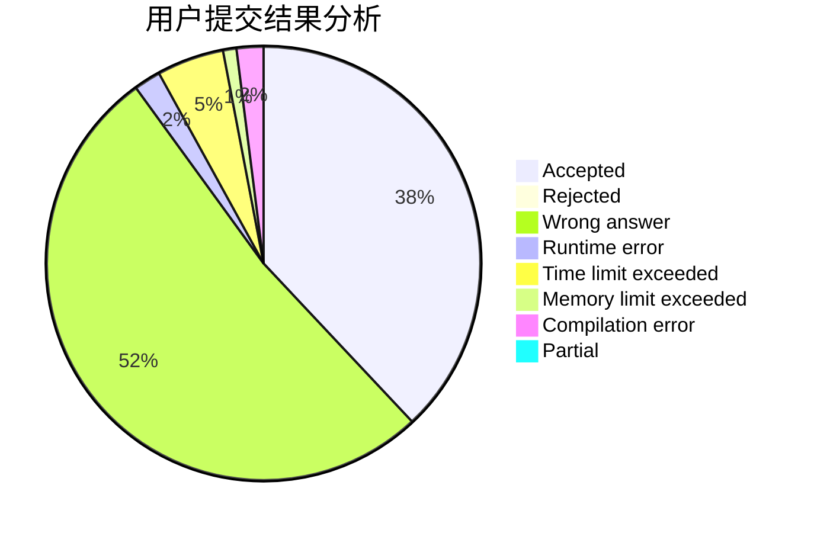
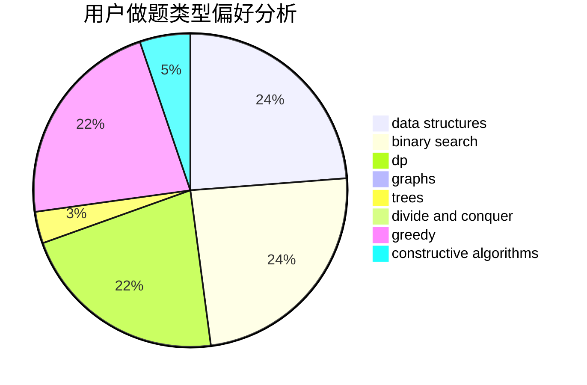
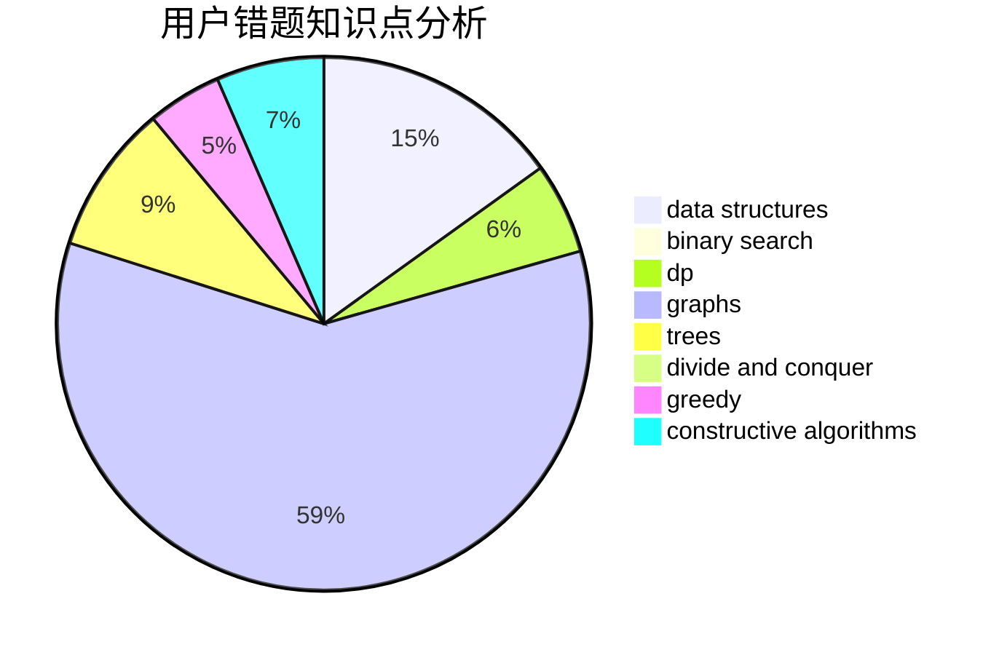

# Kloze

<!-- tabs:start -->

#### **用户提交结果分析**

#### **用户做题类型偏好分析**

#### **用户错题知识点分析**

<!-- tabs:end -->
# 推荐题目
[416D](https://codeforces.com/contest/416/problem/D)		greedy,
                        implementation,
                        math		  
[1333E](https://codeforces.com/contest/1333/problem/E)		brute force,
                        constructive algorithms		  
[1044B](https://codeforces.com/contest/1044/problem/B)		dfs and similar,
                        interactive,
                        trees		  
[1062E](https://codeforces.com/contest/1062/problem/E)		binary search,
                        data structures,
                        dfs and similar,
                        greedy,
                        trees		  
[1378A2](https://codeforces.com/contest/1378A/problem/2)		dsu,graphs,sortings,trees		  
[1100B](https://codeforces.com/contest/1100/problem/B)		data structures,
                        implementation		  
[294B](https://codeforces.com/contest/294/problem/B)		dp,
                        greedy		  
[526G](https://codeforces.com/contest/526/problem/G)		greedy,
                        trees		  
[474F](https://codeforces.com/contest/474/problem/F)		data structures,
                        math,
                        number theory		  
[178F1](https://codeforces.com/contest/178F/problem/1)		nan		  
