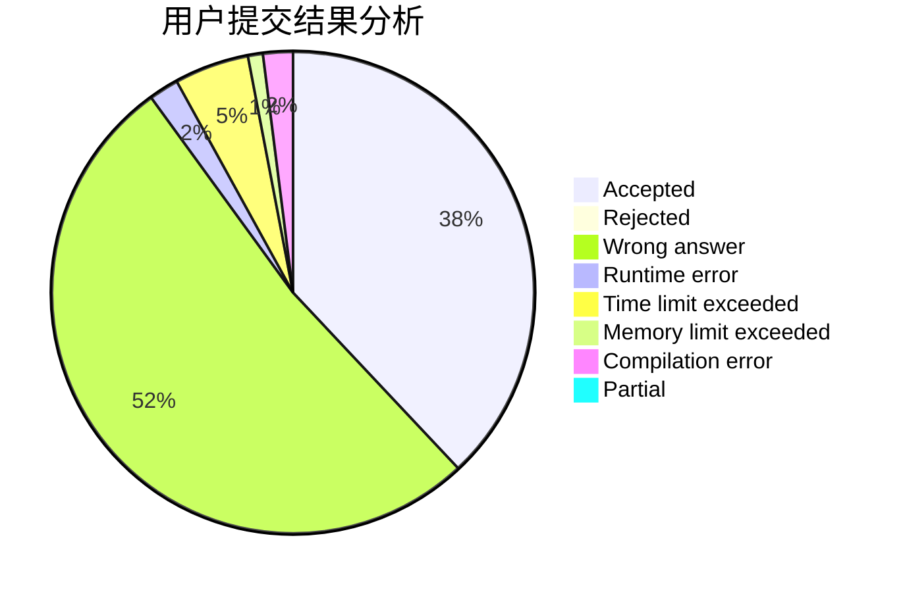
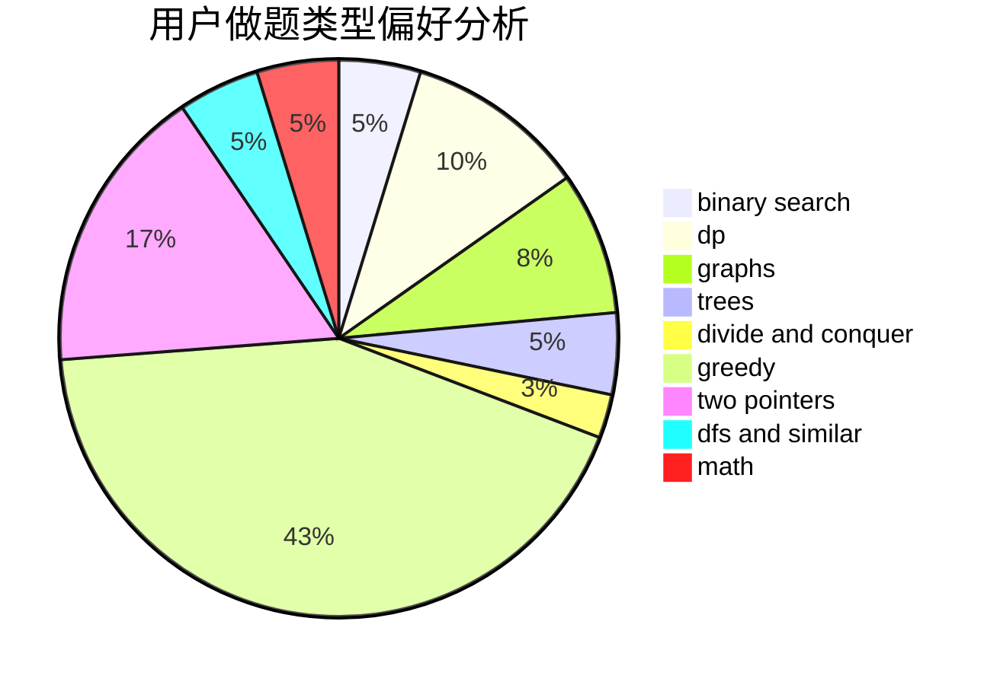

# Kloze

<!-- tabs:start -->

#### **用户提交结果分析**

#### **用户做题类型偏好分析**

<!-- tabs:end -->
# 推荐题目
[441D](https://codeforces.com/contest/441/problem/D)
[1340D](https://codeforces.com/contest/1340/problem/D)
[1045C](https://codeforces.com/contest/1045/problem/C)
[1063B](https://codeforces.com/contest/1063/problem/B)
[1387A](https://codeforces.com/contest/1387/problem/A)
[1100E](https://codeforces.com/contest/1100/problem/E)
[30C](https://codeforces.com/contest/30/problem/C)
[551A](https://codeforces.com/contest/551/problem/A)
[493E](https://codeforces.com/contest/493/problem/E)
[204D](https://codeforces.com/contest/204/problem/D)
