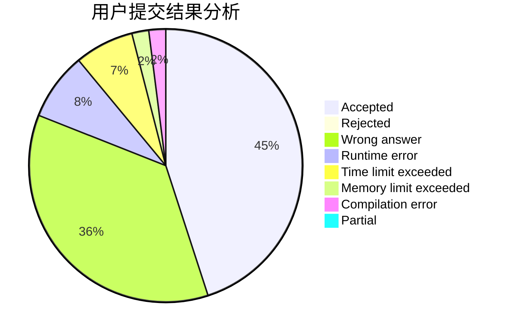
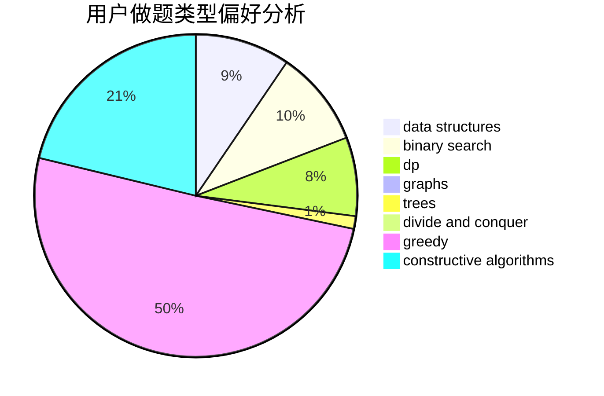
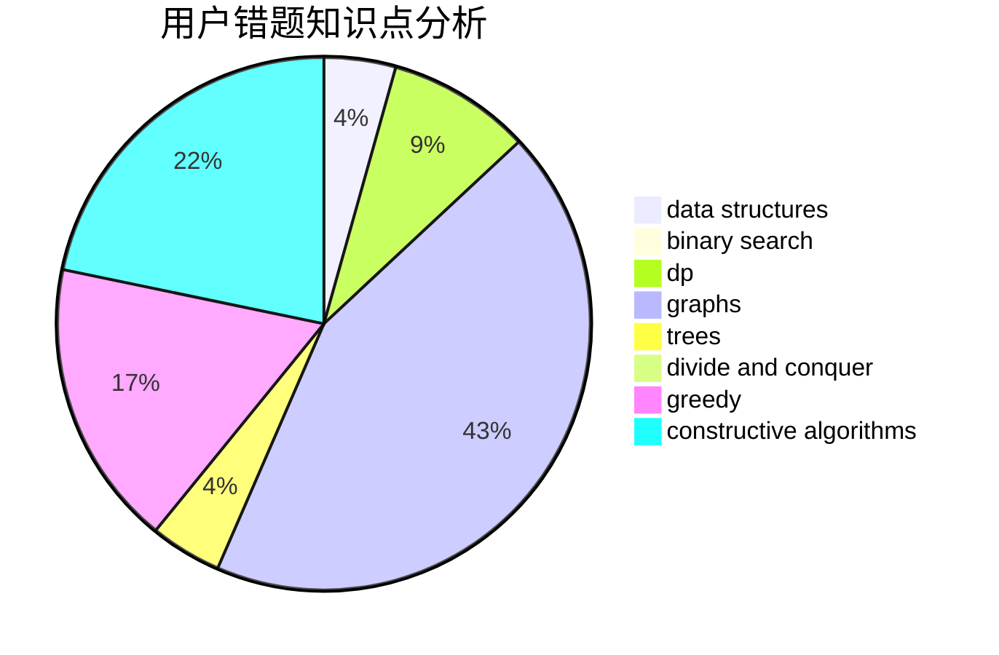

# Knight_F

<!-- tabs:start -->

#### **用户提交结果分析**

#### **用户做题类型偏好分析**

#### **用户错题知识点分析**

<!-- tabs:end -->
# 推荐题目
[940D](https://codeforces.com/contest/940/problem/D)		binary search,
                        implementation		  
[1404A](https://codeforces.com/contest/1404/problem/A)		implementation,
                        strings		  
[825E](https://codeforces.com/contest/825/problem/E)		data structures,
                        dfs and similar,
                        graphs,
                        greedy		  
[327D](https://codeforces.com/contest/327/problem/D)		constructive algorithms,
                        dfs and similar,
                        graphs		  
[1328F](https://codeforces.com/contest/1328/problem/F)		greedy		  
[197D](https://codeforces.com/contest/197/problem/D)		dsu,graphs,sortings,trees		  
[4A](https://codeforces.com/contest/4/problem/A)		brute force,
                        math		  
[666A](https://codeforces.com/contest/666/problem/A)		dp,
                        implementation,
                        strings		  
[313E](https://codeforces.com/contest/313/problem/E)		constructive algorithms,
                        data structures,
                        dsu,
                        greedy		  
[328A](https://codeforces.com/contest/328/problem/A)		implementation		  
