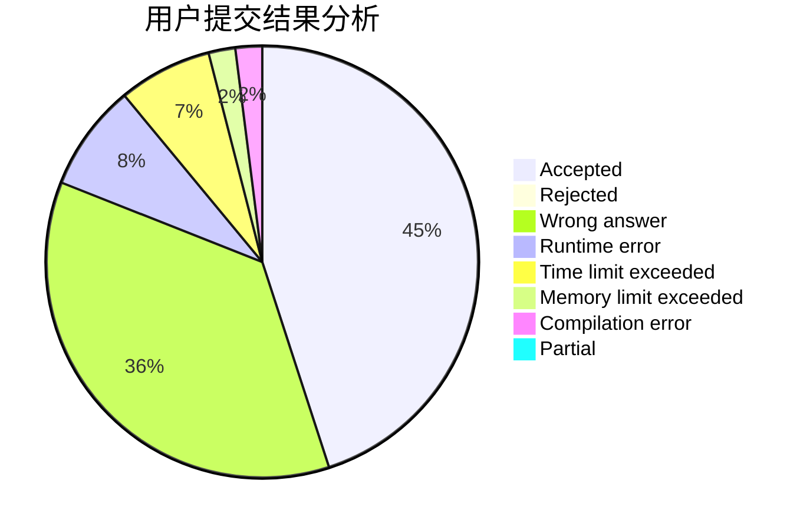
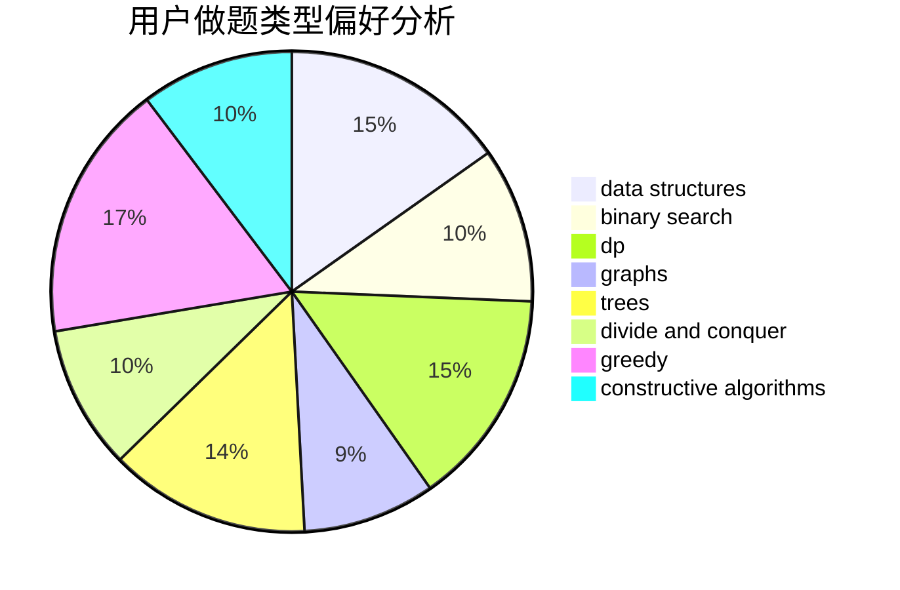
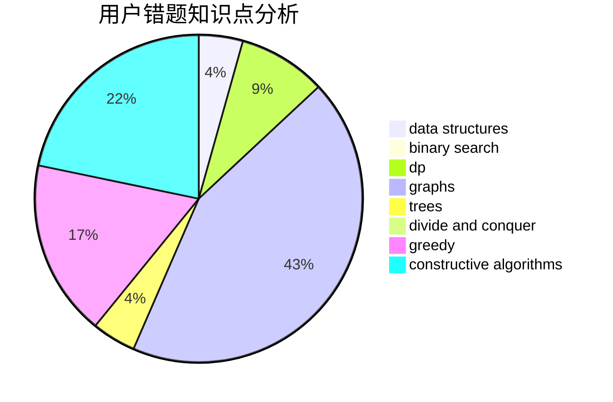

# Knight_F

<!-- tabs:start -->

#### **用户提交结果分析**

#### **用户做题类型偏好分析**

#### **用户错题知识点分析**

<!-- tabs:end -->
# 推荐题目
[962A](https://codeforces.com/contest/962/problem/A)		implementation		  
[1415C](https://codeforces.com/contest/1415/problem/C)		brute force,
                        dp,
                        implementation		  
[845A](https://codeforces.com/contest/845/problem/A)		implementation,
                        sortings		  
[356C](https://codeforces.com/contest/356/problem/C)		combinatorics,
                        constructive algorithms,
                        greedy,
                        implementation		  
[13352](https://codeforces.com/contest/1335/problem/2)		dsu,graphs,sortings,trees		  
[219C](https://codeforces.com/contest/219/problem/C)		brute force,
                        dp,
                        greedy		  
[520A](https://codeforces.com/contest/520/problem/A)		implementation,
                        strings		  
[687A](https://codeforces.com/contest/687/problem/A)		dfs and similar,
                        graphs		  
[338D](https://codeforces.com/contest/338/problem/D)		chinese remainder theorem,
                        math,
                        number theory		  
[356D](https://codeforces.com/contest/356/problem/D)		bitmasks,
                        constructive algorithms,
                        dp,
                        greedy		  
