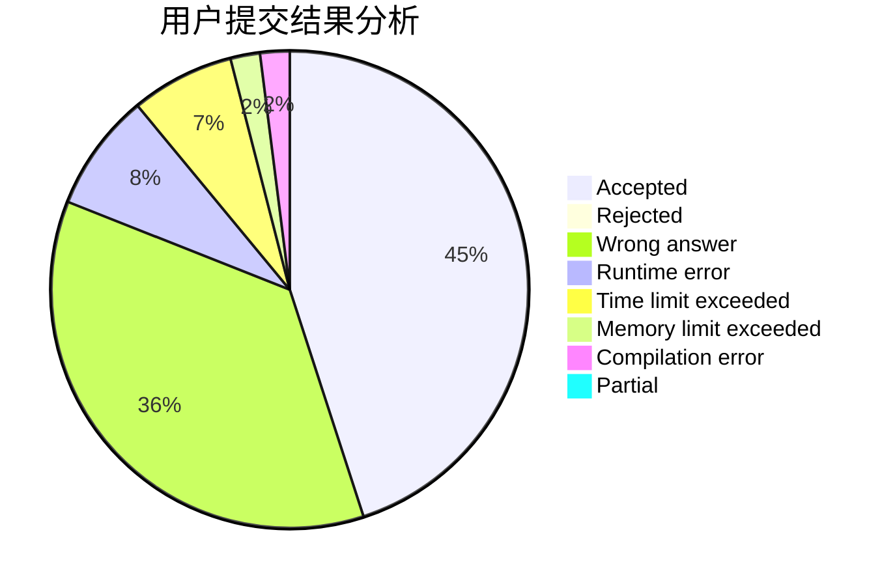
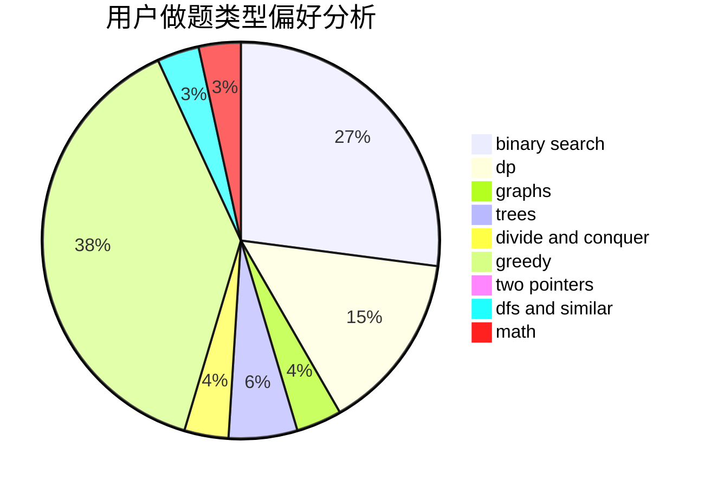

# Knight_F

<!-- tabs:start -->

#### **用户提交结果分析**

#### **用户做题类型偏好分析**

<!-- tabs:end -->
# 推荐题目
[962A](https://codeforces.com/contest/962/problem/A)
[1415C](https://codeforces.com/contest/1415/problem/C)
[845A](https://codeforces.com/contest/845/problem/A)
[356C](https://codeforces.com/contest/356/problem/C)
[13352](https://codeforces.com/contest/1335/problem/2)
[219C](https://codeforces.com/contest/219/problem/C)
[520A](https://codeforces.com/contest/520/problem/A)
[687A](https://codeforces.com/contest/687/problem/A)
[338D](https://codeforces.com/contest/338/problem/D)
[356D](https://codeforces.com/contest/356/problem/D)
