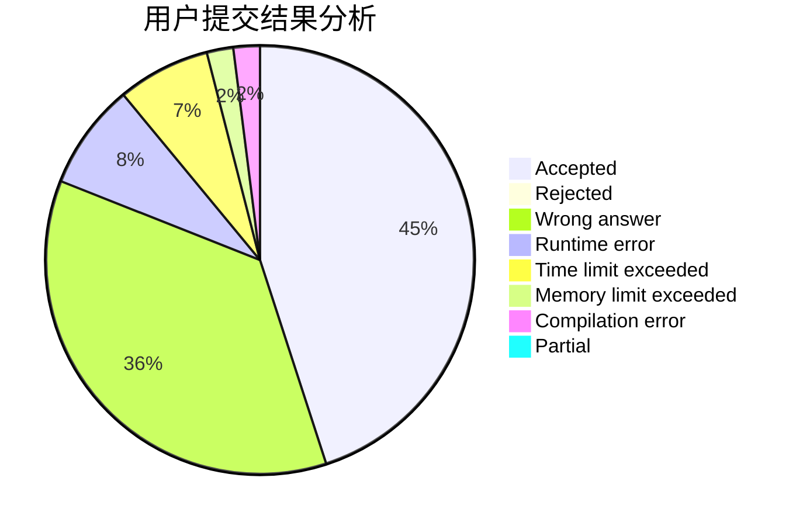
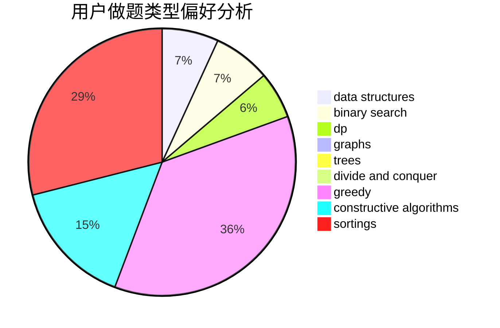
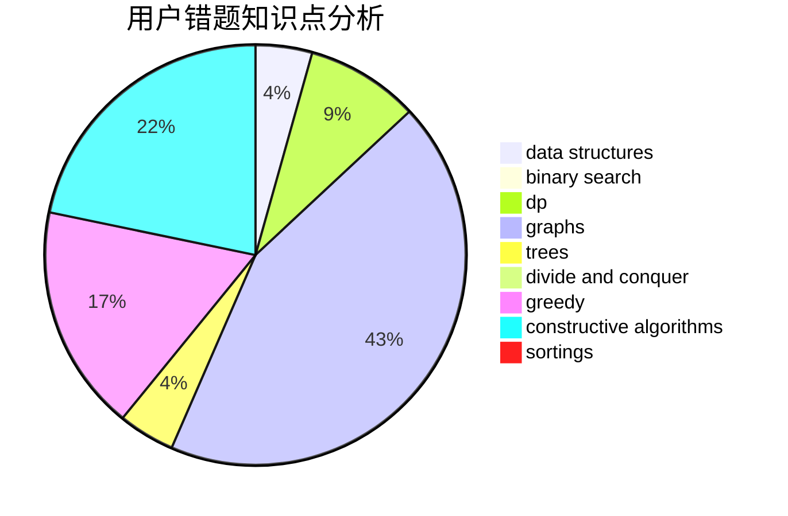

# Knight_F
<!-- tabs:start -->
#### **用户提交结果分析**

#### **用户做题类型偏好分析**

#### **用户错题知识点分析**

<!-- tabs:end -->
# 推荐题目
[1404A](http://codeforces.com/problemset/problem/1404/A)		implementation,
                        strings		  
[1311B](http://codeforces.com/problemset/problem/1311/B)		dfs and similar,
                        sortings		  
[1241A](https://codeforces.com/contest/1241/problem/A)		math		  
[1343E](http://codeforces.com/problemset/problem/1343/E)		brute force,
                        graphs,
                        greedy,
                        shortest paths,
                        sortings		  
[1328F](http://codeforces.com/problemset/problem/1328/F)		greedy		  
[260A](http://codeforces.com/problemset/problem/260/A)		implementation,
                        math		  
[940D](http://codeforces.com/problemset/problem/940/D)		binary search,
                        implementation		  
[789C](https://codeforces.com/contest/789/problem/C)		dp,
                        two pointers		  
[327D](http://codeforces.com/problemset/problem/327/D)		constructive algorithms,
                        dfs and similar,
                        graphs		  
[197D](https://codeforces.com/contest/197/problem/D)		dfs and similar,
                        graphs		  
<!-- tabs:start -->
#### **data structures**
[313E](http://codeforces.com/problemset/problem/313/E)		constructive algorithms,
                        data structures,
                        dsu,
                        greedy		  
[875E](http://codeforces.com/problemset/problem/875/E)		binary search,
                        data structures,
                        dp		  
[825E](http://codeforces.com/problemset/problem/825/E)		data structures,
                        dfs and similar,
                        graphs,
                        greedy		  
[1286D](http://codeforces.com/problemset/problem/1286/D)		data structures,
                        math,
                        matrices,
                        probabilities		  
[813F](http://codeforces.com/problemset/problem/813/F)		data structures,
                        dsu,
                        graphs		  
[1190D](http://codeforces.com/problemset/problem/1190/D)		data structures,
                        divide and conquer,
                        sortings,
                        two pointers		  
[1093G](http://codeforces.com/problemset/problem/1093/G)		bitmasks,
                        data structures		  
[817E](http://codeforces.com/problemset/problem/817/E)		bitmasks,
                        data structures,
                        trees		  
[1492C](http://codeforces.com/problemset/problem/1492/C)		binary search,
                        data structures,
                        dp,
                        greedy,
                        two pointers		  
[1490G](http://codeforces.com/problemset/problem/1490/G)		binary search,
                        data structures,
                        math		  
#### **binary search**
[940D](http://codeforces.com/problemset/problem/940/D)		binary search,
                        implementation		  
[875E](http://codeforces.com/problemset/problem/875/E)		binary search,
                        data structures,
                        dp		  
[1081E](http://codeforces.com/problemset/problem/1081/E)		binary search,
                        constructive algorithms,
                        greedy,
                        math,
                        number theory		  
[1360H](http://codeforces.com/problemset/problem/1360/H)		binary search,
                        bitmasks,
                        brute force,
                        constructive algorithms		  
[1492C](http://codeforces.com/problemset/problem/1492/C)		binary search,
                        data structures,
                        dp,
                        greedy,
                        two pointers		  
[1463D](http://codeforces.com/problemset/problem/1463/D)		binary search,
                        constructive algorithms,
                        greedy,
                        two pointers		  
[1490G](http://codeforces.com/problemset/problem/1490/G)		binary search,
                        data structures,
                        math		  
[1479D](http://codeforces.com/problemset/problem/1479/D)		binary search,
                        bitmasks,
                        brute force,
                        data structures,
                        probabilities,
                        trees		  
[1436E](http://codeforces.com/problemset/problem/1436/E)		binary search,
                        data structures,
                        two pointers		  
[1461D](http://codeforces.com/problemset/problem/1461/D)		binary search,
                        brute force,
                        data structures,
                        divide and conquer,
                        implementation,
                        sortings		  
#### **dp**
[789C](https://codeforces.com/contest/789/problem/C)		dp,
                        two pointers		  
[666A](http://codeforces.com/problemset/problem/666/A)		dp,
                        implementation,
                        strings		  
[875E](http://codeforces.com/problemset/problem/875/E)		binary search,
                        data structures,
                        dp		  
[544C](https://codeforces.com/contest/544/problem/C)		dp		  
[1150D](https://codeforces.com/contest/1150/problem/D)		dp,
                        implementation,
                        strings		  
[86C](http://codeforces.com/problemset/problem/86/C)		dp,
                        string suffix structures,
                        trees		  
[1060E](http://codeforces.com/problemset/problem/1060/E)		dfs and similar,
                        dp,
                        trees		  
[1492C](http://codeforces.com/problemset/problem/1492/C)		binary search,
                        data structures,
                        dp,
                        greedy,
                        two pointers		  
[1457C](https://codeforces.com/contest/1457/problem/C)		brute force,
                        dp,
                        implementation		  
[1491C](http://codeforces.com/problemset/problem/1491/C)		brute force,
                        data structures,
                        dp,
                        greedy,
                        implementation		  
#### **graph**
[1343E](http://codeforces.com/problemset/problem/1343/E)		brute force,
                        graphs,
                        greedy,
                        shortest paths,
                        sortings		  
[327D](http://codeforces.com/problemset/problem/327/D)		constructive algorithms,
                        dfs and similar,
                        graphs		  
[197D](https://codeforces.com/contest/197/problem/D)		dfs and similar,
                        graphs		  
[553C](http://codeforces.com/problemset/problem/553/C)		dfs and similar,
                        dsu,
                        graphs		  
[825E](http://codeforces.com/problemset/problem/825/E)		data structures,
                        dfs and similar,
                        graphs,
                        greedy		  
[1489G](https://codeforces.com/contest/1489/problem/G)		dsu,
                        graphs,
                        greedy		  
[813F](http://codeforces.com/problemset/problem/813/F)		data structures,
                        dsu,
                        graphs		  
[118E](http://codeforces.com/problemset/problem/118/E)		dfs and similar,
                        graphs		  
[1496E](https://codeforces.com/contest/1496/problem/E)		constructive algorithms,
                        graphs		  
[1487C](http://codeforces.com/problemset/problem/1487/C)		brute force,
                        constructive algorithms,
                        dfs and similar,
                        graphs,
                        greedy,
                        implementation,
                        math		  
#### **trees**
[86C](http://codeforces.com/problemset/problem/86/C)		dp,
                        string suffix structures,
                        trees		  
[1060E](http://codeforces.com/problemset/problem/1060/E)		dfs and similar,
                        dp,
                        trees		  
[817E](http://codeforces.com/problemset/problem/817/E)		bitmasks,
                        data structures,
                        trees		  
[1479D](http://codeforces.com/problemset/problem/1479/D)		binary search,
                        bitmasks,
                        brute force,
                        data structures,
                        probabilities,
                        trees		  
[1511C](http://codeforces.com/problemset/problem/1511/C)		brute force,
                        data structures,
                        implementation,
                        trees		  
[1499F](http://codeforces.com/problemset/problem/1499/F)		combinatorics,
                        dfs and similar,
                        dp,
                        trees		  
[1491E](http://codeforces.com/problemset/problem/1491/E)		brute force,
                        dfs and similar,
                        divide and conquer,
                        number theory,
                        trees		  
[1466D](http://codeforces.com/problemset/problem/1466/D)		data structures,
                        greedy,
                        sortings,
                        trees		  
[1495D](http://codeforces.com/problemset/problem/1495/D)		combinatorics,
                        dfs and similar,
                        graphs,
                        math,
                        shortest paths,
                        trees		  
[1303G](http://codeforces.com/problemset/problem/1303/G)		data structures,
                        divide and conquer,
                        geometry,
                        trees		  
#### **divide and conquer**
[1190D](http://codeforces.com/problemset/problem/1190/D)		data structures,
                        divide and conquer,
                        sortings,
                        two pointers		  
[1461D](http://codeforces.com/problemset/problem/1461/D)		binary search,
                        brute force,
                        data structures,
                        divide and conquer,
                        implementation,
                        sortings		  
[1466G](http://codeforces.com/problemset/problem/1466/G)		combinatorics,
                        divide and conquer,
                        hashing,
                        math,
                        string suffix structures,
                        strings		  
[1490D](http://codeforces.com/problemset/problem/1490/D)		dfs and similar,
                        divide and conquer,
                        implementation		  
[1483C](https://codeforces.com/contest/1483/problem/C)		data structures,
                        divide and conquer,
                        dp		  
[1491E](http://codeforces.com/problemset/problem/1491/E)		brute force,
                        dfs and similar,
                        divide and conquer,
                        number theory,
                        trees		  
[1303G](http://codeforces.com/problemset/problem/1303/G)		data structures,
                        divide and conquer,
                        geometry,
                        trees		  
[1494D](http://codeforces.com/problemset/problem/1494/D)		constructive algorithms,
                        data structures,
                        dfs and similar,
                        divide and conquer,
                        dsu,
                        greedy,
                        sortings,
                        trees		  
[1482E](http://codeforces.com/problemset/problem/1482/E)		data structures,
                        divide and conquer,
                        dp		  
[566C](http://codeforces.com/problemset/problem/566/C)		dfs and similar,
                        divide and conquer,
                        trees		  
#### **greedy**
[1343E](http://codeforces.com/problemset/problem/1343/E)		brute force,
                        graphs,
                        greedy,
                        shortest paths,
                        sortings		  
[1328F](http://codeforces.com/problemset/problem/1328/F)		greedy		  
[1110B](http://codeforces.com/problemset/problem/1110/B)		greedy,
                        sortings		  
[779C](http://codeforces.com/problemset/problem/779/C)		constructive algorithms,
                        greedy,
                        sortings		  
[313E](http://codeforces.com/problemset/problem/313/E)		constructive algorithms,
                        data structures,
                        dsu,
                        greedy		  
[825E](http://codeforces.com/problemset/problem/825/E)		data structures,
                        dfs and similar,
                        graphs,
                        greedy		  
[1489G](https://codeforces.com/contest/1489/problem/G)		dsu,
                        graphs,
                        greedy		  
[1081E](http://codeforces.com/problemset/problem/1081/E)		binary search,
                        constructive algorithms,
                        greedy,
                        math,
                        number theory		  
[1265C](https://codeforces.com/contest/1265/problem/C)		greedy,
                        implementation		  
[1492C](http://codeforces.com/problemset/problem/1492/C)		binary search,
                        data structures,
                        dp,
                        greedy,
                        two pointers		  
#### **constructive algorithms**
[327D](http://codeforces.com/problemset/problem/327/D)		constructive algorithms,
                        dfs and similar,
                        graphs		  
[779C](http://codeforces.com/problemset/problem/779/C)		constructive algorithms,
                        greedy,
                        sortings		  
[313E](http://codeforces.com/problemset/problem/313/E)		constructive algorithms,
                        data structures,
                        dsu,
                        greedy		  
[457E](http://codeforces.com/problemset/problem/457/E)		constructive algorithms,
                        flows,
                        math		  
[1081E](http://codeforces.com/problemset/problem/1081/E)		binary search,
                        constructive algorithms,
                        greedy,
                        math,
                        number theory		  
[1360H](http://codeforces.com/problemset/problem/1360/H)		binary search,
                        bitmasks,
                        brute force,
                        constructive algorithms		  
[1496E](https://codeforces.com/contest/1496/problem/E)		constructive algorithms,
                        graphs		  
[1451E2](http://codeforces.com/problemset/problem/1451/E2)		bitmasks,
                        constructive algorithms,
                        interactive,
                        math		  
[1493A](http://codeforces.com/problemset/problem/1493/A)		constructive algorithms,
                        greedy		  
[1463D](http://codeforces.com/problemset/problem/1463/D)		binary search,
                        constructive algorithms,
                        greedy,
                        two pointers		  
#### **sortings**
[1311B](http://codeforces.com/problemset/problem/1311/B)		dfs and similar,
                        sortings		  
[1343E](http://codeforces.com/problemset/problem/1343/E)		brute force,
                        graphs,
                        greedy,
                        shortest paths,
                        sortings		  
[1110B](http://codeforces.com/problemset/problem/1110/B)		greedy,
                        sortings		  
[779C](http://codeforces.com/problemset/problem/779/C)		constructive algorithms,
                        greedy,
                        sortings		  
[937A](http://codeforces.com/problemset/problem/937/A)		implementation,
                        sortings		  
[1190D](http://codeforces.com/problemset/problem/1190/D)		data structures,
                        divide and conquer,
                        sortings,
                        two pointers		  
[1496C](https://codeforces.com/contest/1496/problem/C)		geometry,
                        greedy,
                        math,
                        sortings		  
[1495A](http://codeforces.com/problemset/problem/1495/A)		geometry,
                        greedy,
                        math,
                        sortings		  
[1497A](http://codeforces.com/problemset/problem/1497/A)		brute force,
                        data structures,
                        greedy,
                        sortings		  
[1427A](http://codeforces.com/problemset/problem/1427/A)		math,
                        sortings		  
<!-- tabs:end -->
