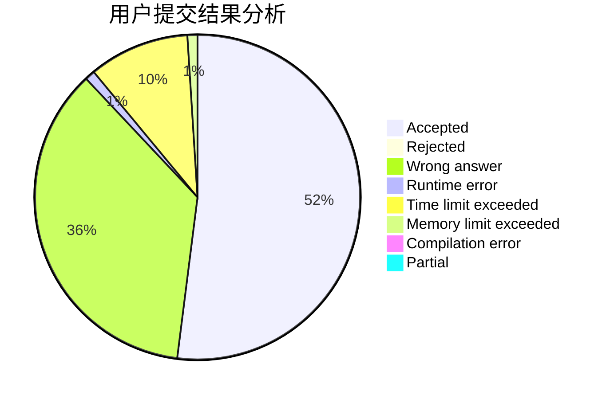
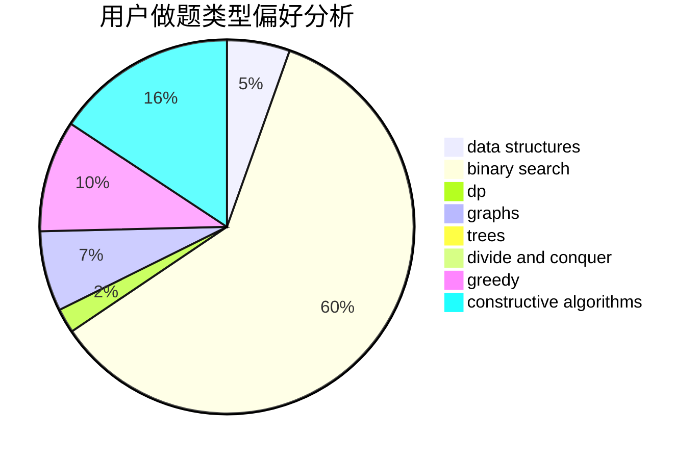
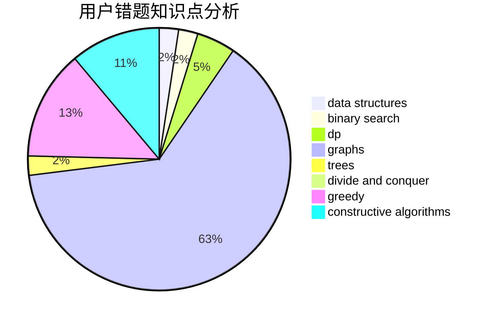

# Knowledge_Pig

<!-- tabs:start -->

#### **用户提交结果分析**

#### **用户做题类型偏好分析**

#### **用户错题知识点分析**

<!-- tabs:end -->
# 推荐题目
[1428D](https://codeforces.com/contest/1428/problem/D)		constructive algorithms,
                        greedy,
                        implementation		  
[1484F](https://codeforces.com/contest/1484/problem/F)		dsu,graphs,sortings,trees		  
[292A](https://codeforces.com/contest/292/problem/A)		implementation		  
[802N](https://codeforces.com/contest/802/problem/N)		binary search,
                        flows,
                        graphs		  
[1512C](https://codeforces.com/contest/1512/problem/C)		constructive algorithms,
                        implementation,
                        strings		  
[736B](https://codeforces.com/contest/736/problem/B)		dsu,graphs,sortings,trees		  
[417E](https://codeforces.com/contest/417/problem/E)		constructive algorithms,
                        math,
                        probabilities		  
[392A](https://codeforces.com/contest/392/problem/A)		math		  
[884D](https://codeforces.com/contest/884/problem/D)		data structures,
                        greedy		  
[377A](https://codeforces.com/contest/377/problem/A)		dfs and similar		  
