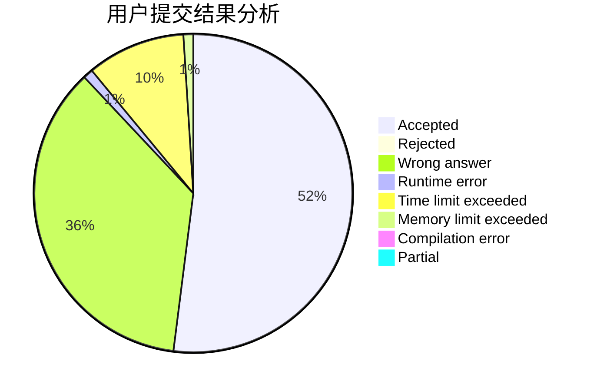
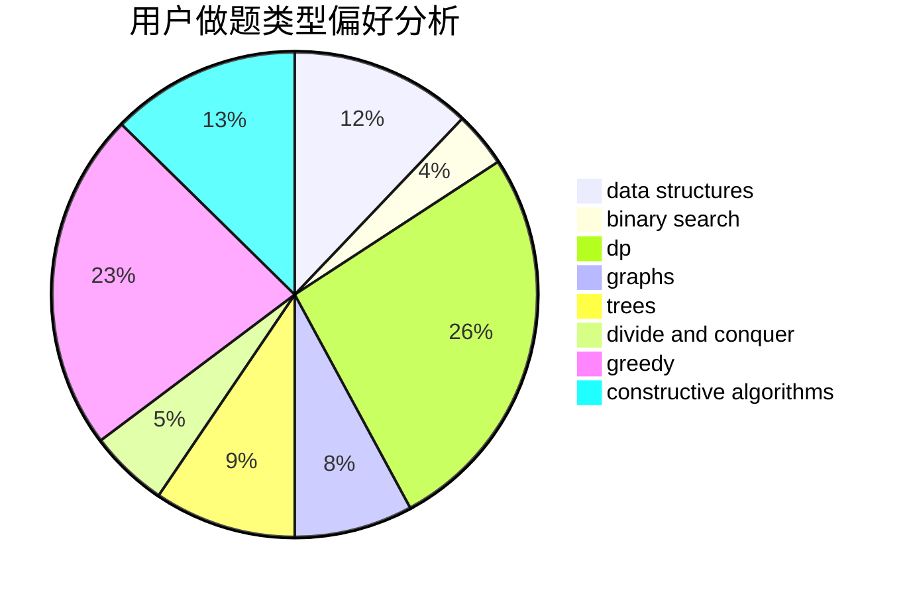
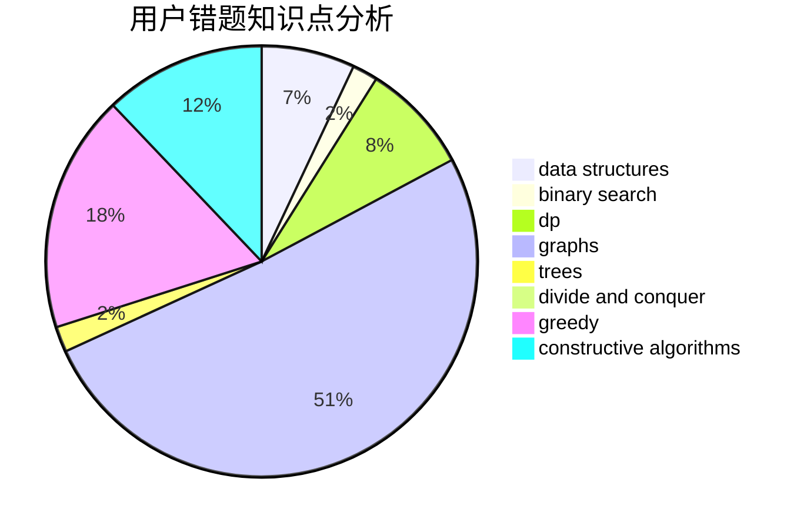

# Knowledge_Pig

<!-- tabs:start -->

#### **用户提交结果分析**

#### **用户做题类型偏好分析**

#### **用户错题知识点分析**

<!-- tabs:end -->
# 推荐题目
[1421A](https://codeforces.com/contest/1421/problem/A)		bitmasks,
                        greedy,
                        math		  
[1476B](https://codeforces.com/contest/1476/problem/B)		binary search,
                        brute force,
                        greedy,
                        math		  
[277B](https://codeforces.com/contest/277/problem/B)		constructive algorithms,
                        geometry		  
[786C](https://codeforces.com/contest/786/problem/C)		data structures,
                        divide and conquer		  
[1503C](https://codeforces.com/contest/1503/problem/C)		binary search,
                        data structures,
                        dp,
                        greedy,
                        shortest paths,
                        sortings,
                        two pointers		  
[719A](https://codeforces.com/contest/719/problem/A)		implementation		  
[388C](https://codeforces.com/contest/388/problem/C)		games,
                        greedy,
                        sortings		  
[364D](https://codeforces.com/contest/364/problem/D)		brute force,
                        math,
                        probabilities		  
[865A](https://codeforces.com/contest/865/problem/A)		constructive algorithms		  
[34C](https://codeforces.com/contest/34/problem/C)		expression parsing,
                        implementation,
                        sortings,
                        strings		  
