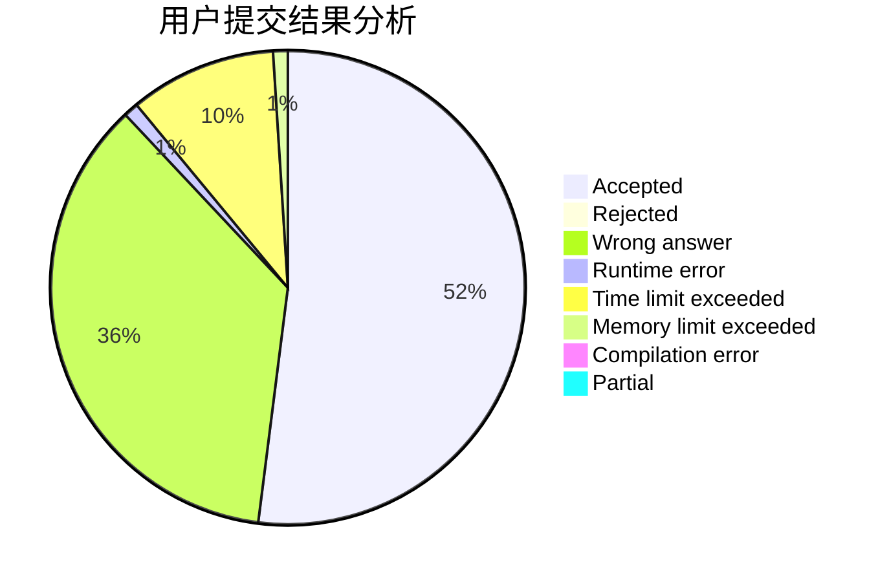
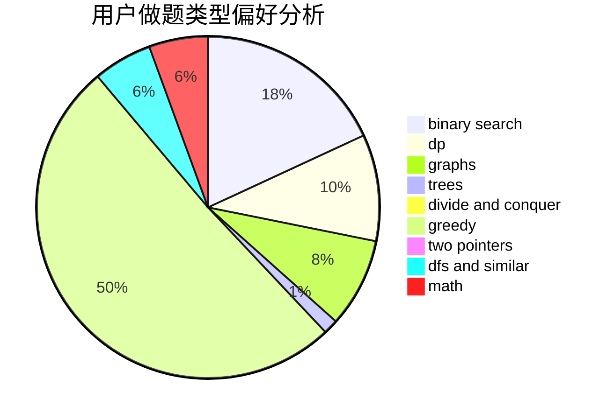

# Knowledge_Pig

<!-- tabs:start -->

#### **用户提交结果分析**

#### **用户做题类型偏好分析**

<!-- tabs:end -->
# 推荐题目
[1428D](https://codeforces.com/contest/1428/problem/D)
[1484F](https://codeforces.com/contest/1484/problem/F)
[292A](https://codeforces.com/contest/292/problem/A)
[802N](https://codeforces.com/contest/802/problem/N)
[1512C](https://codeforces.com/contest/1512/problem/C)
[736B](https://codeforces.com/contest/736/problem/B)
[417E](https://codeforces.com/contest/417/problem/E)
[392A](https://codeforces.com/contest/392/problem/A)
[884D](https://codeforces.com/contest/884/problem/D)
[377A](https://codeforces.com/contest/377/problem/A)
