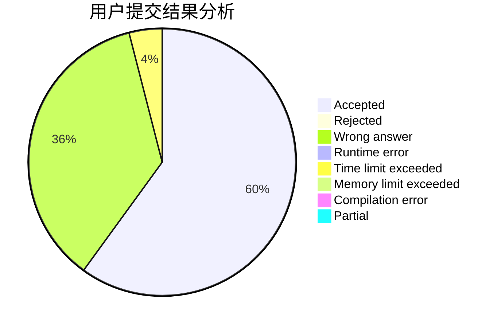
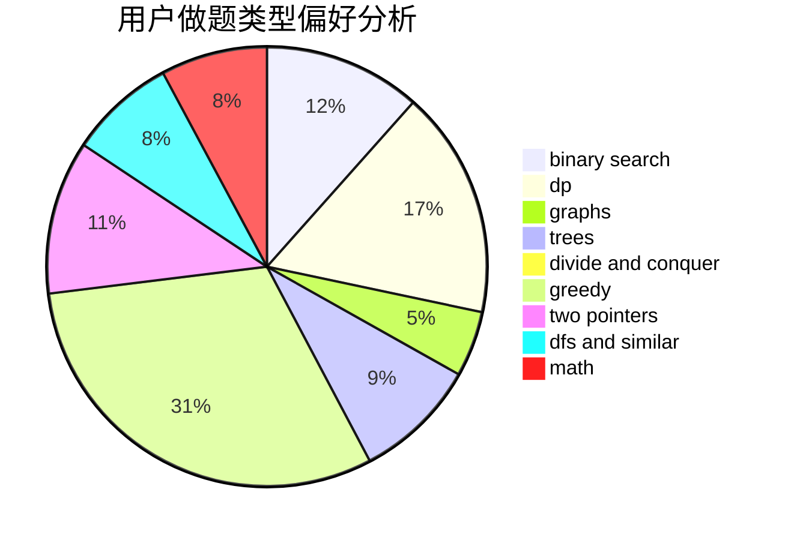

# KobeWu

<!-- tabs:start -->

#### **用户提交结果分析**

#### **用户做题类型偏好分析**

<!-- tabs:end -->
# 推荐题目
[11082](https://codeforces.com/contest/1108/problem/2)
[879A](https://codeforces.com/contest/879/problem/A)
[215E](https://codeforces.com/contest/215/problem/E)
[367C](https://codeforces.com/contest/367/problem/C)
[219D](https://codeforces.com/contest/219/problem/D)
[1085G](https://codeforces.com/contest/1085/problem/G)
[416D](https://codeforces.com/contest/416/problem/D)
[13992](https://codeforces.com/contest/1399/problem/2)
[1084B](https://codeforces.com/contest/1084/problem/B)
[369C](https://codeforces.com/contest/369/problem/C)
