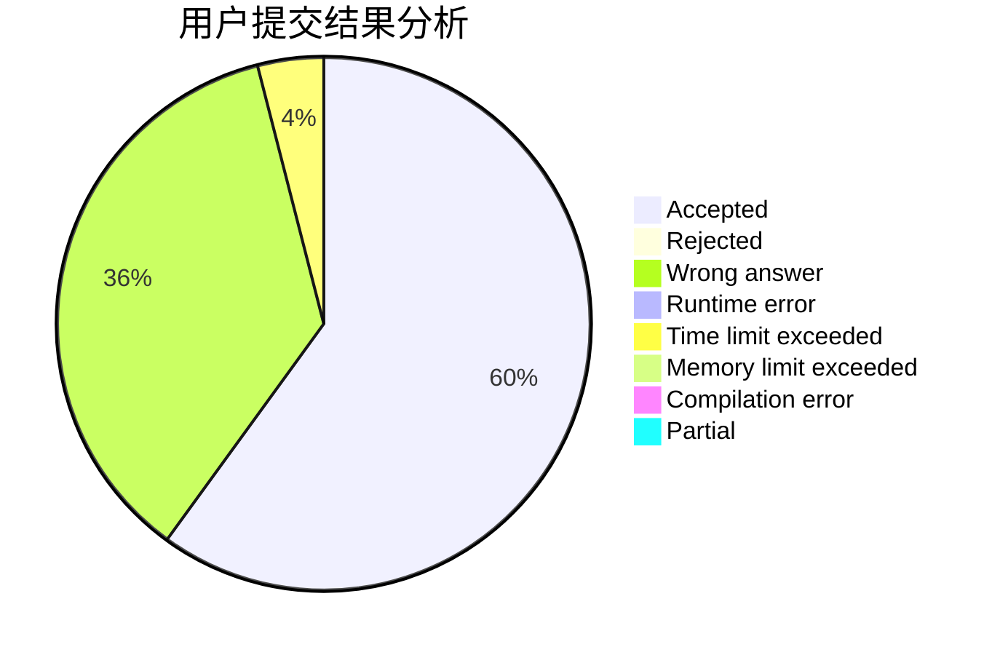
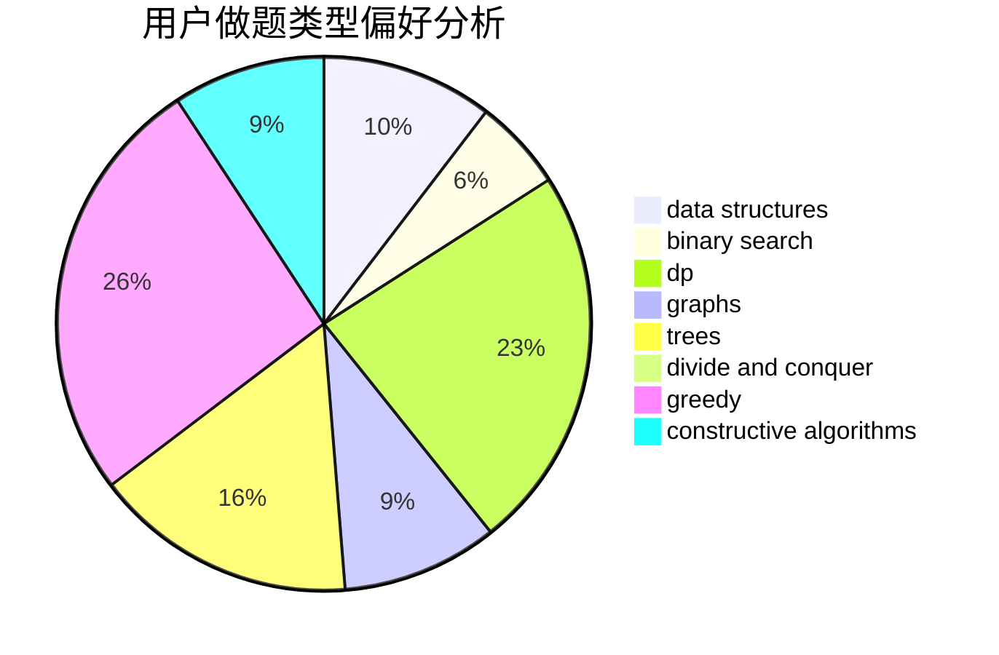
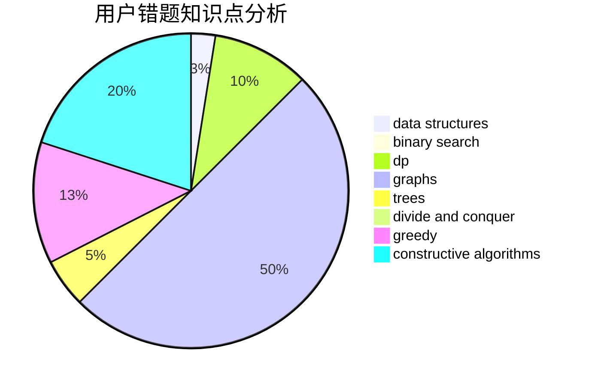

# KobeWu

<!-- tabs:start -->

#### **用户提交结果分析**

#### **用户做题类型偏好分析**

#### **用户错题知识点分析**

<!-- tabs:end -->
# 推荐题目
[11082](https://codeforces.com/contest/1108/problem/2)		dsu,graphs,sortings,trees		  
[879A](https://codeforces.com/contest/879/problem/A)		implementation		  
[215E](https://codeforces.com/contest/215/problem/E)		combinatorics,
                        dp,
                        number theory		  
[367C](https://codeforces.com/contest/367/problem/C)		graphs,
                        greedy,
                        sortings		  
[219D](https://codeforces.com/contest/219/problem/D)		dfs and similar,
                        dp,
                        graphs,
                        trees		  
[1085G](https://codeforces.com/contest/1085/problem/G)		combinatorics,
                        data structures,
                        dp		  
[416D](https://codeforces.com/contest/416/problem/D)		greedy,
                        implementation,
                        math		  
[13992](https://codeforces.com/contest/1399/problem/2)		dsu,graphs,sortings,trees		  
[1084B](https://codeforces.com/contest/1084/problem/B)		greedy,
                        implementation		  
[369C](https://codeforces.com/contest/369/problem/C)		dfs and similar,
                        graphs,
                        trees		  
