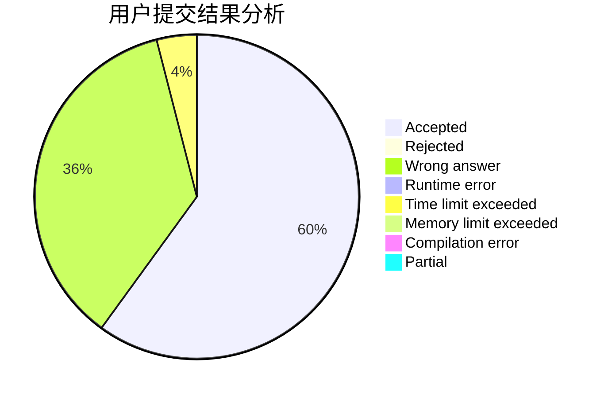
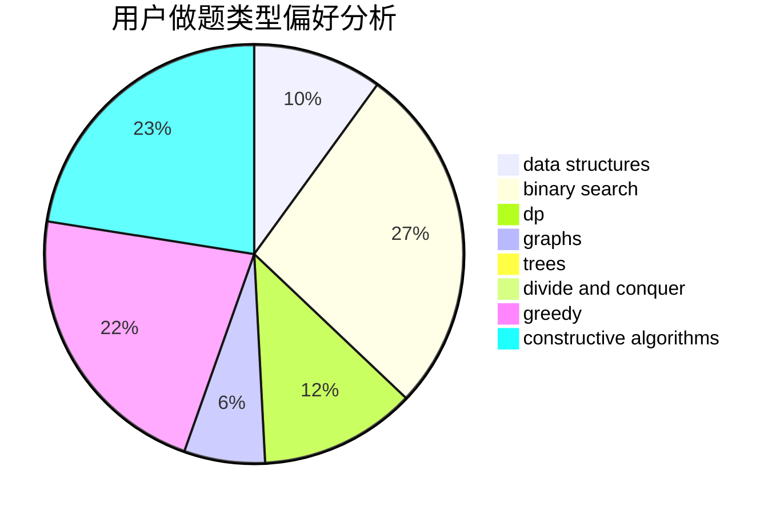
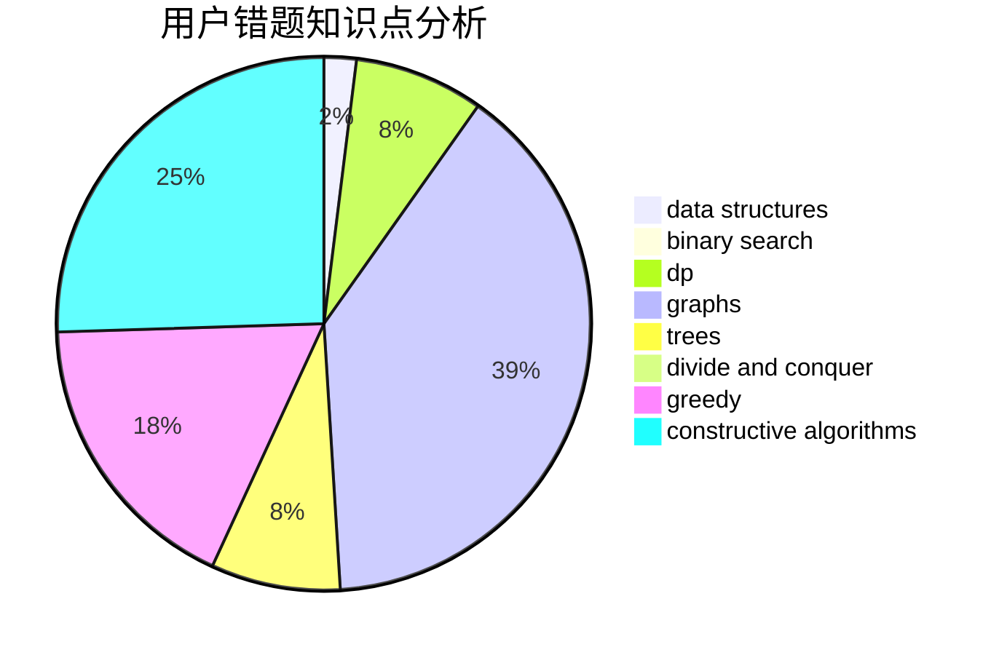

# KobeWu

<!-- tabs:start -->

#### **用户提交结果分析**

#### **用户做题类型偏好分析**

#### **用户错题知识点分析**

<!-- tabs:end -->
# 推荐题目
[1107E](https://codeforces.com/contest/1107/problem/E)		dp		  
[861A](https://codeforces.com/contest/861/problem/A)		dsu,graphs,sortings,trees		  
[190E](https://codeforces.com/contest/190/problem/E)		data structures,
                        dsu,
                        graphs,
                        hashing,
                        sortings		  
[33C](https://codeforces.com/contest/33/problem/C)		greedy		  
[198B](https://codeforces.com/contest/198/problem/B)		shortest paths		  
[1085B](https://codeforces.com/contest/1085/problem/B)		math		  
[387C](https://codeforces.com/contest/387/problem/C)		greedy,
                        implementation		  
[1389F](https://codeforces.com/contest/1389/problem/F)		data structures,
                        dp,
                        graph matchings,
                        sortings		  
[1083D](https://codeforces.com/contest/1083/problem/D)		data structures,
                        implementation		  
[342C](https://codeforces.com/contest/342/problem/C)		geometry		  
