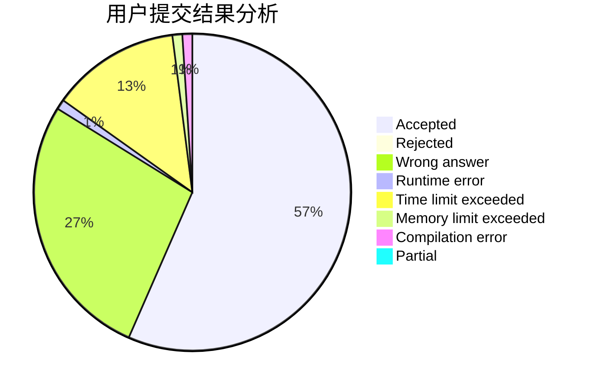
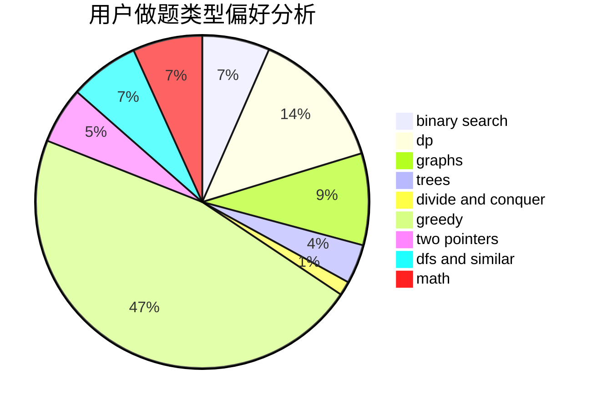

# Komeiji_Green

<!-- tabs:start -->

#### **用户提交结果分析**

#### **用户做题类型偏好分析**

<!-- tabs:end -->
# 推荐题目
[11962](https://codeforces.com/contest/1196/problem/2)
[789D](https://codeforces.com/contest/789/problem/D)
[962B](https://codeforces.com/contest/962/problem/B)
[939A](https://codeforces.com/contest/939/problem/A)
[594D](https://codeforces.com/contest/594/problem/D)
[1041F](https://codeforces.com/contest/1041/problem/F)
[418B](https://codeforces.com/contest/418/problem/B)
[876A](https://codeforces.com/contest/876/problem/A)
[100A](https://codeforces.com/contest/100/problem/A)
[770B](https://codeforces.com/contest/770/problem/B)
