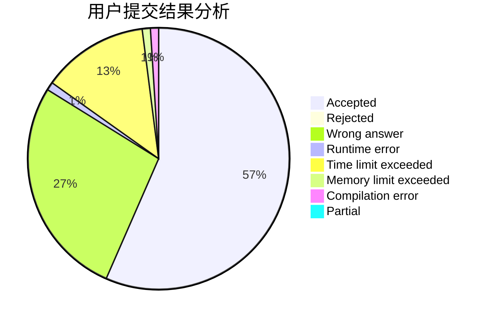
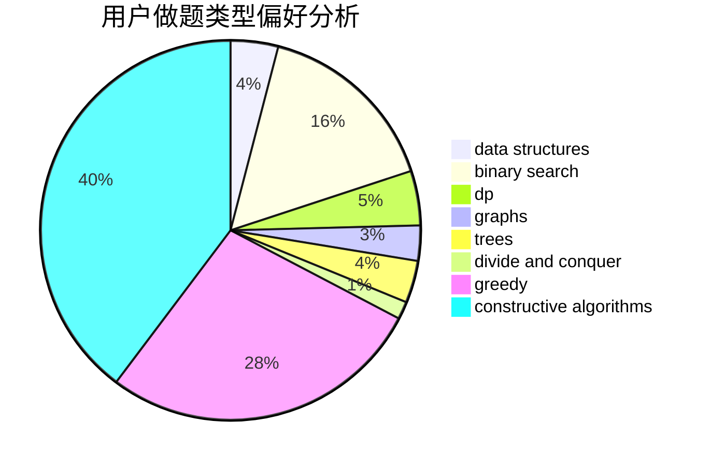
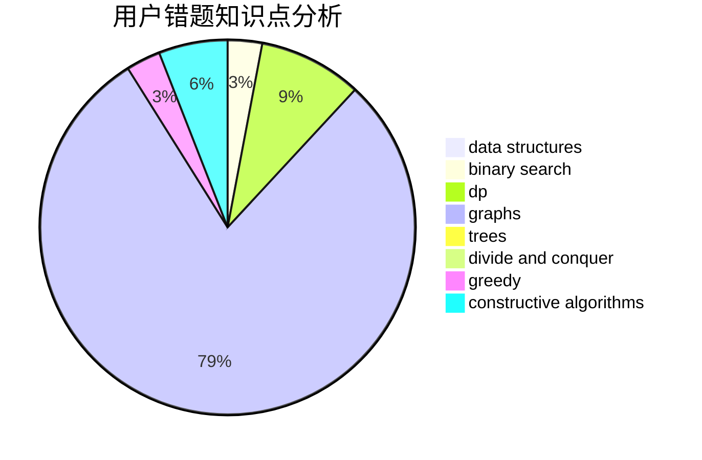

# Komeiji_Green
<!-- tabs:start -->
#### **用户提交结果分析**

#### **用户做题类型偏好分析**

#### **用户错题知识点分析**

<!-- tabs:end -->
# 推荐题目
[Present](http://codeforces.com/problemset/problem/1322/B)		binary search,
                        bitmasks,
                        constructive algorithms,
                        data structures,
                        math,
                        sortings		  
[Cubes Sorting](http://codeforces.com/problemset/problem/1420/A)		math,
                        sortings		  
[Swap Letters](http://codeforces.com/problemset/problem/1215/C)		constructive algorithms,
                        greedy		  
[Cashback](http://codeforces.com/problemset/problem/940/E)		data structures,
                        dp,
                        greedy,
                        math		  
[Shockers](http://codeforces.com/problemset/problem/906/A)		implementation,
                        strings		  
[Nikita and string](http://codeforces.com/problemset/problem/877/B)		brute force,
                        dp		  
[Mutation](http://codeforces.com/problemset/problem/76/C)		bitmasks,
                        dp,
                        math		  
[Balls and Pockets](http://codeforces.com/problemset/problem/1060/G)		data structures		  
[Tokitsukaze, CSL and Stone Game](http://codeforces.com/problemset/problem/1190/B)		games		  
[Pollywog](https://codeforces.com/contest/918/problem/E)		combinatorics,
                        dp,
                        matrices		  
<!-- tabs:start -->
#### **data structures**
[Present](http://codeforces.com/problemset/problem/1322/B)		binary search,
                        bitmasks,
                        constructive algorithms,
                        data structures,
                        math,
                        sortings		  
[Cubes Sorting](http://codeforces.com/problemset/problem/940/E)		data structures,
                        dp,
                        greedy,
                        math		  
[Swap Letters](http://codeforces.com/problemset/problem/1060/G)		data structures		  
[Cashback](http://codeforces.com/problemset/problem/750/E)		data structures,
                        divide and conquer,
                        dp,
                        matrices		  
[Shockers](http://codeforces.com/problemset/problem/761/F)		brute force,
                        data structures,
                        dp,
                        implementation		  
[Nikita and string](http://codeforces.com/problemset/problem/895/E)		data structures,
                        probabilities		  
[Mutation](http://codeforces.com/problemset/problem/727/E)		data structures,
                        hashing,
                        string suffix structures,
                        strings		  
[Balls and Pockets](http://codeforces.com/problemset/problem/620/E)		bitmasks,
                        data structures,
                        trees		  
[Tokitsukaze, CSL and Stone Game](http://codeforces.com/problemset/problem/1041/C)		binary search,
                        data structures,
                        greedy,
                        two pointers		  
[Pollywog](http://codeforces.com/problemset/problem/1472/E)		binary search,
                        data structures,
                        dp,
                        sortings,
                        two pointers		  
#### **binary search**
[Present](http://codeforces.com/problemset/problem/1322/B)		binary search,
                        bitmasks,
                        constructive algorithms,
                        data structures,
                        math,
                        sortings		  
[Cubes Sorting](http://codeforces.com/problemset/problem/620/D)		binary search,
                        two pointers		  
[Swap Letters](http://codeforces.com/problemset/problem/309/C)		binary search,
                        bitmasks,
                        greedy		  
[Cashback](http://codeforces.com/problemset/problem/1041/C)		binary search,
                        data structures,
                        greedy,
                        two pointers		  
[Shockers](http://codeforces.com/problemset/problem/1472/E)		binary search,
                        data structures,
                        dp,
                        sortings,
                        two pointers		  
[Nikita and string](http://codeforces.com/problemset/problem/1492/C)		binary search,
                        data structures,
                        dp,
                        greedy,
                        two pointers		  
[Mutation](http://codeforces.com/problemset/problem/1463/D)		binary search,
                        constructive algorithms,
                        greedy,
                        two pointers		  
[Balls and Pockets](http://codeforces.com/problemset/problem/1490/G)		binary search,
                        data structures,
                        math		  
[Tokitsukaze, CSL and Stone Game](http://codeforces.com/problemset/problem/1479/D)		binary search,
                        bitmasks,
                        brute force,
                        data structures,
                        probabilities,
                        trees		  
[Pollywog](http://codeforces.com/problemset/problem/1436/E)		binary search,
                        data structures,
                        two pointers		  
#### **dp**
[Present](http://codeforces.com/problemset/problem/940/E)		data structures,
                        dp,
                        greedy,
                        math		  
[Cubes Sorting](http://codeforces.com/problemset/problem/877/B)		brute force,
                        dp		  
[Swap Letters](http://codeforces.com/problemset/problem/76/C)		bitmasks,
                        dp,
                        math		  
[Cashback](https://codeforces.com/contest/918/problem/E)		combinatorics,
                        dp,
                        matrices		  
[Shockers](http://codeforces.com/problemset/problem/750/E)		data structures,
                        divide and conquer,
                        dp,
                        matrices		  
[Nikita and string](http://codeforces.com/problemset/problem/1188/C)		dp		  
[Mutation](http://codeforces.com/problemset/problem/761/F)		brute force,
                        data structures,
                        dp,
                        implementation		  
[Balls and Pockets](http://codeforces.com/problemset/problem/632/E)		divide and conquer,
                        dp,
                        fft,
                        math		  
[Tokitsukaze, CSL and Stone Game](http://codeforces.com/problemset/problem/375/E)		dp,
                        implementation,
                        math		  
[Pollywog](http://codeforces.com/problemset/problem/1472/E)		binary search,
                        data structures,
                        dp,
                        sortings,
                        two pointers		  
#### **graph**
[Present](https://codeforces.com/contest/403/problem/C)		graphs,
                        math		  
[Cubes Sorting](http://codeforces.com/problemset/problem/1176/E)		dfs and similar,
                        dsu,
                        graphs,
                        shortest paths,
                        trees		  
[Swap Letters](http://codeforces.com/problemset/problem/1487/C)		brute force,
                        constructive algorithms,
                        dfs and similar,
                        graphs,
                        greedy,
                        implementation,
                        math		  
[Cashback](http://codeforces.com/problemset/problem/1437/C)		dp,
                        flows,
                        graph matchings,
                        greedy,
                        math,
                        sortings		  
[Shockers](http://codeforces.com/problemset/problem/1470/D)		constructive algorithms,
                        dfs and similar,
                        graph matchings,
                        graphs,
                        greedy		  
[Nikita and string](http://codeforces.com/problemset/problem/1476/C)		dp,
                        graphs,
                        greedy		  
[Mutation](http://codeforces.com/problemset/problem/1304/D)		constructive algorithms,
                        graphs,
                        greedy,
                        two pointers		  
[Balls and Pockets](http://codeforces.com/problemset/problem/1475/C)		combinatorics,
                        graphs,
                        math		  
[Tokitsukaze, CSL and Stone Game](http://codeforces.com/problemset/problem/553/E)		dp,
                        fft,
                        graphs,
                        math,
                        probabilities		  
[Pollywog](http://codeforces.com/problemset/problem/1495/C)		constructive algorithms,
                        graphs		  
#### **trees**
[Present](http://codeforces.com/problemset/problem/1176/E)		dfs and similar,
                        dsu,
                        graphs,
                        shortest paths,
                        trees		  
[Cubes Sorting](http://codeforces.com/problemset/problem/620/E)		bitmasks,
                        data structures,
                        trees		  
[Swap Letters](http://codeforces.com/problemset/problem/1387/B1)		*special problem,
                        dp,
                        greedy,
                        trees		  
[Cashback](http://codeforces.com/problemset/problem/1479/D)		binary search,
                        bitmasks,
                        brute force,
                        data structures,
                        probabilities,
                        trees		  
[Shockers](http://codeforces.com/problemset/problem/1511/C)		brute force,
                        data structures,
                        implementation,
                        trees		  
[Nikita and string](http://codeforces.com/problemset/problem/1499/F)		combinatorics,
                        dfs and similar,
                        dp,
                        trees		  
[Mutation](http://codeforces.com/problemset/problem/1491/E)		brute force,
                        dfs and similar,
                        divide and conquer,
                        number theory,
                        trees		  
[Balls and Pockets](http://codeforces.com/problemset/problem/1466/D)		data structures,
                        greedy,
                        sortings,
                        trees		  
[Tokitsukaze, CSL and Stone Game](http://codeforces.com/problemset/problem/1495/D)		combinatorics,
                        dfs and similar,
                        graphs,
                        math,
                        shortest paths,
                        trees		  
[Pollywog](http://codeforces.com/problemset/problem/1303/G)		data structures,
                        divide and conquer,
                        geometry,
                        trees		  
#### **divide and conquer**
[Present](http://codeforces.com/problemset/problem/750/E)		data structures,
                        divide and conquer,
                        dp,
                        matrices		  
[Cubes Sorting](http://codeforces.com/problemset/problem/632/E)		divide and conquer,
                        dp,
                        fft,
                        math		  
[Swap Letters](http://codeforces.com/problemset/problem/1461/D)		binary search,
                        brute force,
                        data structures,
                        divide and conquer,
                        implementation,
                        sortings		  
[Cashback](http://codeforces.com/problemset/problem/1466/G)		combinatorics,
                        divide and conquer,
                        hashing,
                        math,
                        string suffix structures,
                        strings		  
[Shockers](http://codeforces.com/problemset/problem/1490/D)		dfs and similar,
                        divide and conquer,
                        implementation		  
[Nikita and string](https://codeforces.com/contest/1483/problem/C)		data structures,
                        divide and conquer,
                        dp		  
[Mutation](http://codeforces.com/problemset/problem/1491/E)		brute force,
                        dfs and similar,
                        divide and conquer,
                        number theory,
                        trees		  
[Balls and Pockets](http://codeforces.com/problemset/problem/1303/G)		data structures,
                        divide and conquer,
                        geometry,
                        trees		  
[Tokitsukaze, CSL and Stone Game](http://codeforces.com/problemset/problem/1494/D)		constructive algorithms,
                        data structures,
                        dfs and similar,
                        divide and conquer,
                        dsu,
                        greedy,
                        sortings,
                        trees		  
[Pollywog](http://codeforces.com/problemset/problem/1482/E)		data structures,
                        divide and conquer,
                        dp		  
#### **greedy**
[Present](http://codeforces.com/problemset/problem/1215/C)		constructive algorithms,
                        greedy		  
[Cubes Sorting](http://codeforces.com/problemset/problem/940/E)		data structures,
                        dp,
                        greedy,
                        math		  
[Swap Letters](http://codeforces.com/problemset/problem/898/E)		constructive algorithms,
                        greedy		  
[Cashback](http://codeforces.com/problemset/problem/309/C)		binary search,
                        bitmasks,
                        greedy		  
[Shockers](http://codeforces.com/problemset/problem/785/B)		greedy,
                        sortings		  
[Nikita and string](http://codeforces.com/problemset/problem/1380/D)		constructive algorithms,
                        greedy,
                        implementation,
                        math,
                        two pointers		  
[Mutation](http://codeforces.com/problemset/problem/1041/C)		binary search,
                        data structures,
                        greedy,
                        two pointers		  
[Balls and Pockets](http://codeforces.com/problemset/problem/1509/C)		dp,
                        greedy		  
[Tokitsukaze, CSL and Stone Game](http://codeforces.com/problemset/problem/1387/B1)		*special problem,
                        dp,
                        greedy,
                        trees		  
[Pollywog](https://codeforces.com/contest/1321/problem/B)		data structures,
                        dp,
                        greedy,
                        math,
                        sortings		  
#### **constructive algorithms**
[Present](http://codeforces.com/problemset/problem/1322/B)		binary search,
                        bitmasks,
                        constructive algorithms,
                        data structures,
                        math,
                        sortings		  
[Cubes Sorting](http://codeforces.com/problemset/problem/1215/C)		constructive algorithms,
                        greedy		  
[Swap Letters](http://codeforces.com/problemset/problem/898/E)		constructive algorithms,
                        greedy		  
[Cashback](http://codeforces.com/problemset/problem/798/D)		constructive algorithms,
                        sortings		  
[Shockers](http://codeforces.com/problemset/problem/1380/D)		constructive algorithms,
                        greedy,
                        implementation,
                        math,
                        two pointers		  
[Nikita and string](http://codeforces.com/problemset/problem/1493/A)		constructive algorithms,
                        greedy		  
[Mutation](http://codeforces.com/problemset/problem/1463/D)		binary search,
                        constructive algorithms,
                        greedy,
                        two pointers		  
[Balls and Pockets](https://codeforces.com/contest/1456/problem/B)		bitmasks,
                        brute force,
                        constructive algorithms		  
[Tokitsukaze, CSL and Stone Game](http://codeforces.com/problemset/problem/1492/D)		bitmasks,
                        constructive algorithms,
                        greedy,
                        math		  
[Pollywog](https://codeforces.com/contest/1504/problem/D)		constructive algorithms,
                        games,
                        interactive		  
#### **sortings**
[Present](http://codeforces.com/problemset/problem/1322/B)		binary search,
                        bitmasks,
                        constructive algorithms,
                        data structures,
                        math,
                        sortings		  
[Cubes Sorting](http://codeforces.com/problemset/problem/1420/A)		math,
                        sortings		  
[Swap Letters](http://codeforces.com/problemset/problem/798/D)		constructive algorithms,
                        sortings		  
[Cashback](http://codeforces.com/problemset/problem/785/B)		greedy,
                        sortings		  
[Shockers](http://codeforces.com/problemset/problem/1472/E)		binary search,
                        data structures,
                        dp,
                        sortings,
                        two pointers		  
[Nikita and string](https://codeforces.com/contest/1321/problem/B)		data structures,
                        dp,
                        greedy,
                        math,
                        sortings		  
[Mutation](https://codeforces.com/contest/1496/problem/C)		geometry,
                        greedy,
                        math,
                        sortings		  
[Balls and Pockets](http://codeforces.com/problemset/problem/1495/A)		geometry,
                        greedy,
                        math,
                        sortings		  
[Tokitsukaze, CSL and Stone Game](http://codeforces.com/problemset/problem/1497/A)		brute force,
                        data structures,
                        greedy,
                        sortings		  
[Pollywog](http://codeforces.com/problemset/problem/1427/A)		math,
                        sortings		  
<!-- tabs:end -->
