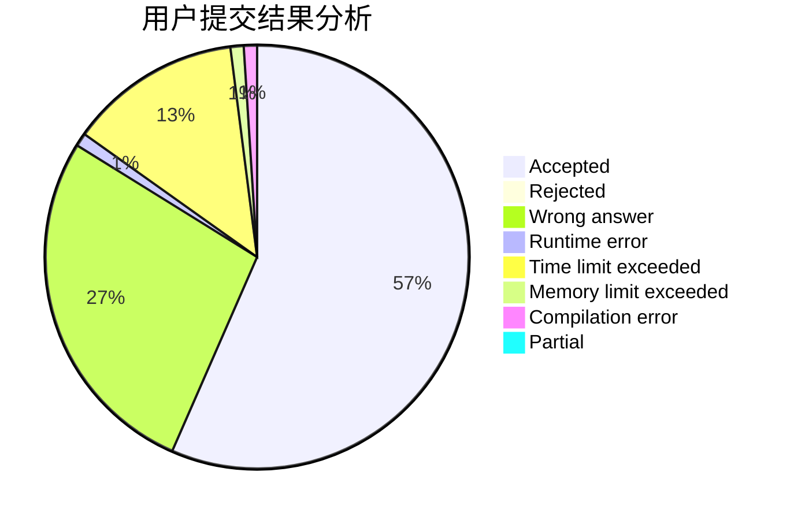
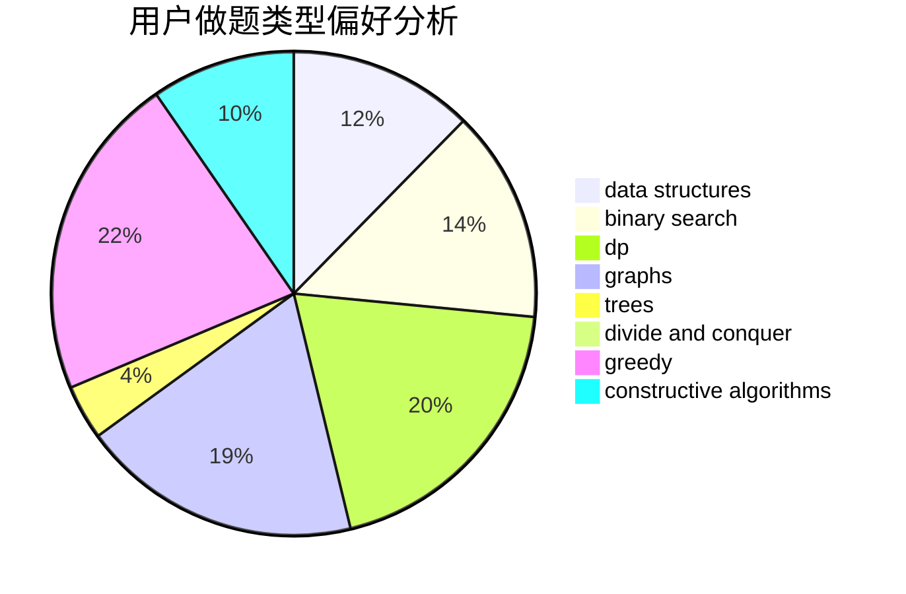
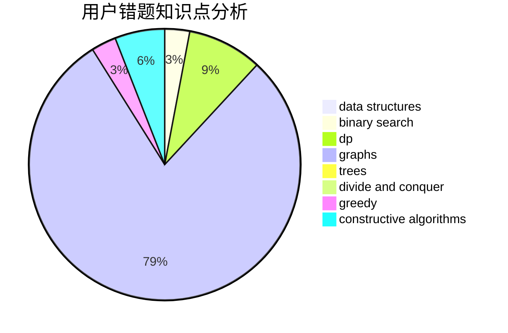

# Komeiji_Green

<!-- tabs:start -->

#### **用户提交结果分析**

#### **用户做题类型偏好分析**

#### **用户错题知识点分析**

<!-- tabs:end -->
# 推荐题目
[11962](https://codeforces.com/contest/1196/problem/2)		dsu,graphs,sortings,trees		  
[789D](https://codeforces.com/contest/789/problem/D)		dsu,graphs,sortings,trees		  
[962B](https://codeforces.com/contest/962/problem/B)		constructive algorithms,
                        greedy,
                        implementation		  
[939A](https://codeforces.com/contest/939/problem/A)		graphs		  
[594D](https://codeforces.com/contest/594/problem/D)		data structures,
                        number theory		  
[1041F](https://codeforces.com/contest/1041/problem/F)		data structures,
                        divide and conquer,
                        dp,
                        math		  
[418B](https://codeforces.com/contest/418/problem/B)		dsu,graphs,sortings,trees		  
[876A](https://codeforces.com/contest/876/problem/A)		math		  
[100A](https://codeforces.com/contest/100/problem/A)		*special problem,
                        implementation		  
[770B](https://codeforces.com/contest/770/problem/B)		*special problem,
                        implementation,
                        math		  
