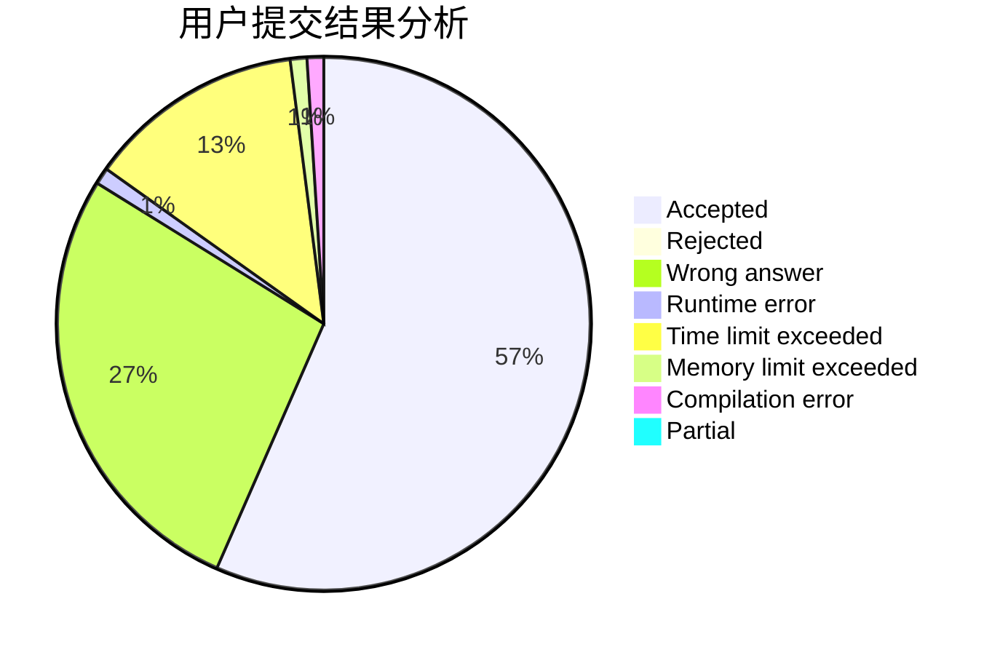
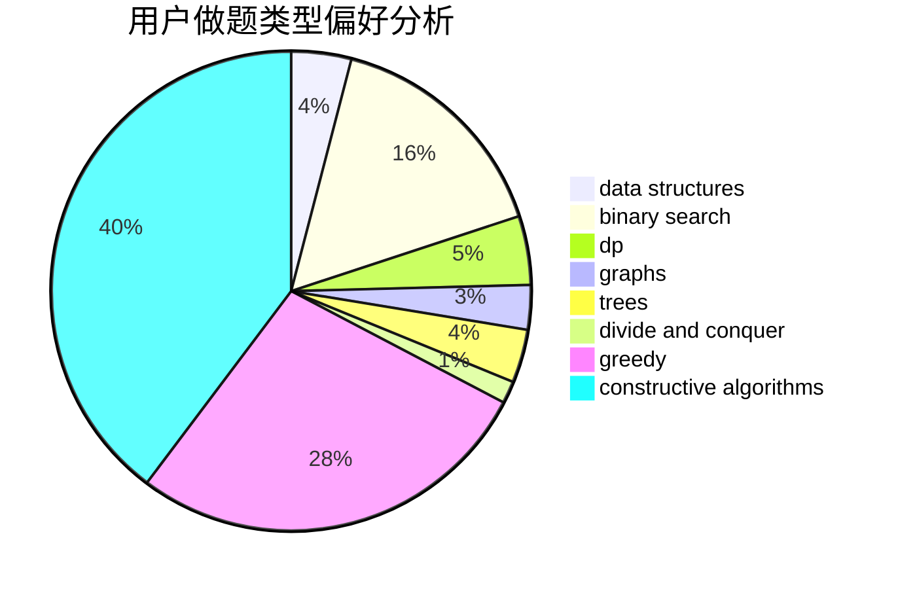
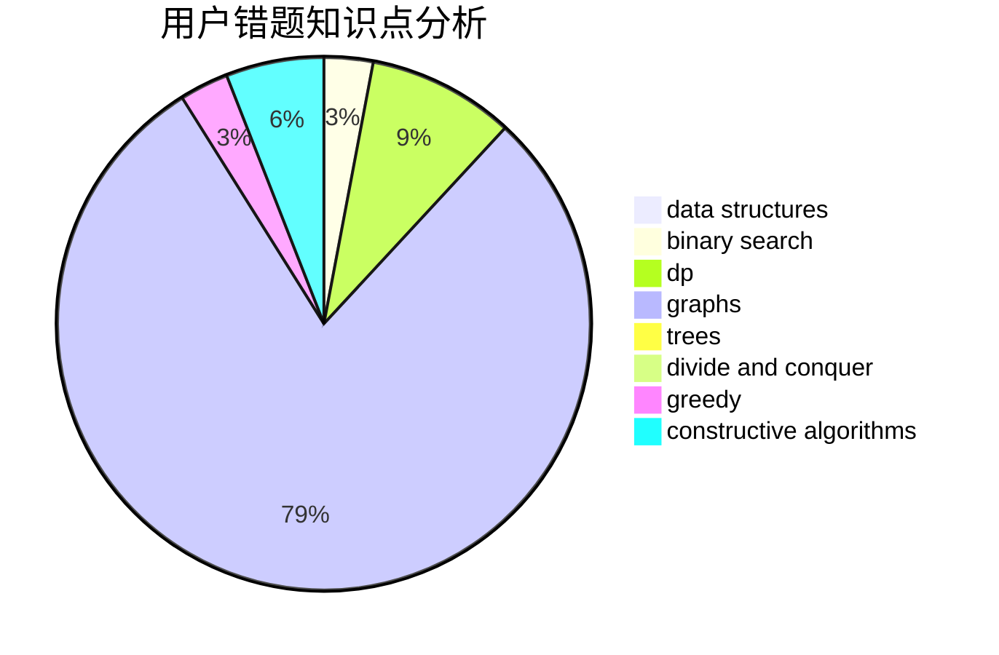

# Komeiji_Green

<!-- tabs:start -->

#### **用户提交结果分析**

#### **用户做题类型偏好分析**

#### **用户错题知识点分析**

<!-- tabs:end -->
# 推荐题目
[1190B](https://codeforces.com/contest/1190/problem/B)		games		  
[76C](https://codeforces.com/contest/76/problem/C)		bitmasks,
                        dp,
                        math		  
[940E](https://codeforces.com/contest/940/problem/E)		data structures,
                        dp,
                        greedy,
                        math		  
[918E](https://codeforces.com/contest/918/problem/E)		dsu,graphs,sortings,trees		  
[574C](https://codeforces.com/contest/574/problem/C)		dsu,graphs,sortings,trees		  
[1041C](https://codeforces.com/contest/1041/problem/C)		binary search,
                        data structures,
                        greedy,
                        two pointers		  
[388E](https://codeforces.com/contest/388/problem/E)		geometry		  
[858A](https://codeforces.com/contest/858/problem/A)		brute force,
                        math,
                        number theory		  
[1009E](https://codeforces.com/contest/1009/problem/E)		combinatorics,
                        math,
                        probabilities		  
[750E](https://codeforces.com/contest/750/problem/E)		data structures,
                        divide and conquer,
                        dp,
                        matrices		  
