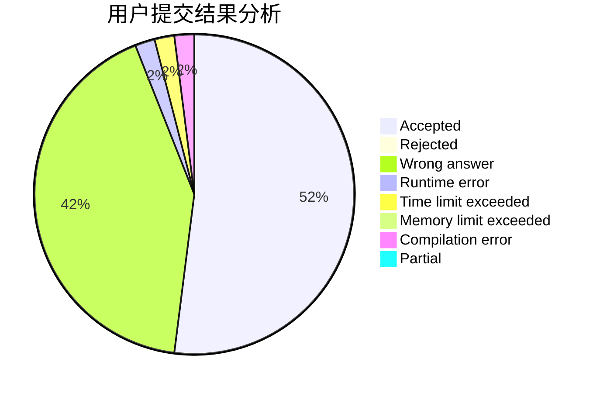
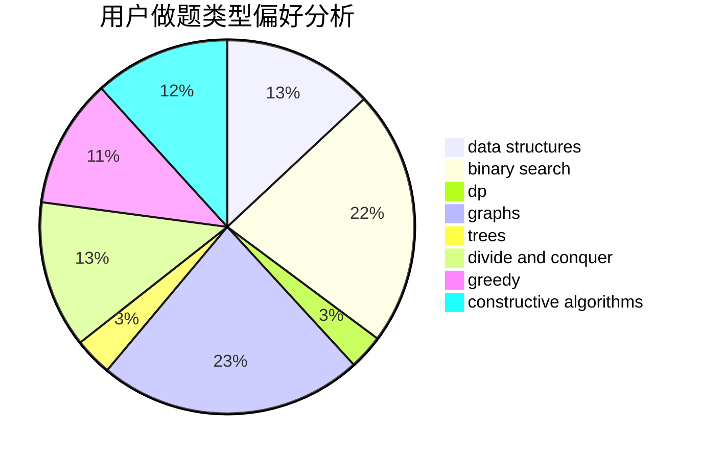

# Konnyaku233

<!-- tabs:start -->

#### **用户提交结果分析**

#### **用户做题类型偏好分析**

#### **用户错题知识点分析**

<!-- tabs:end -->
# 推荐题目
[849B](https://codeforces.com/contest/849/problem/B)		brute force,
                        geometry		  
[676D](https://codeforces.com/contest/676/problem/D)		graphs,
                        implementation,
                        shortest paths		  
[436B](https://codeforces.com/contest/436/problem/B)		implementation,
                        math		  
[535C](https://codeforces.com/contest/535/problem/C)		binary search,
                        greedy,
                        math		  
[1077F2](https://codeforces.com/contest/1077F/problem/2)		data structures,
                        dp		  
[680B](https://codeforces.com/contest/680/problem/B)		constructive algorithms,
                        implementation		  
[1223E](https://codeforces.com/contest/1223/problem/E)		dp,
                        sortings,
                        trees		  
[371E](https://codeforces.com/contest/371/problem/E)		greedy,
                        math,
                        two pointers		  
[1105C](https://codeforces.com/contest/1105/problem/C)		combinatorics,
                        dp,
                        math		  
[1304B](https://codeforces.com/contest/1304/problem/B)		brute force,
                        constructive algorithms,
                        greedy,
                        implementation,
                        strings		  
