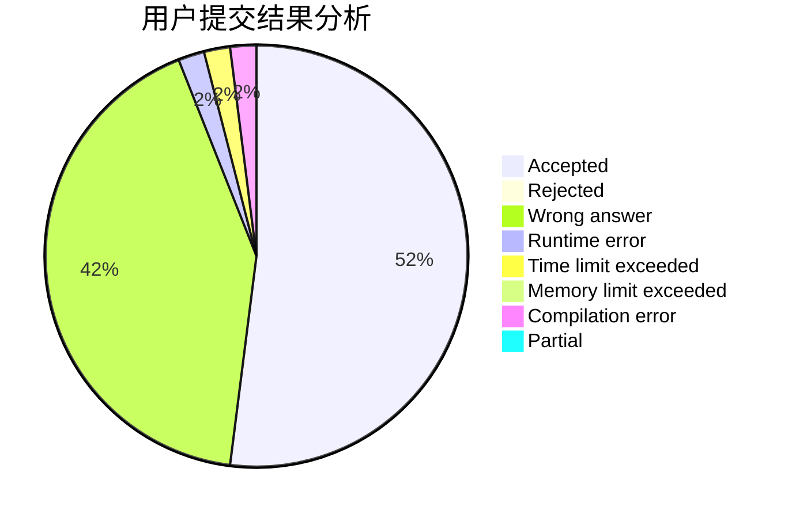
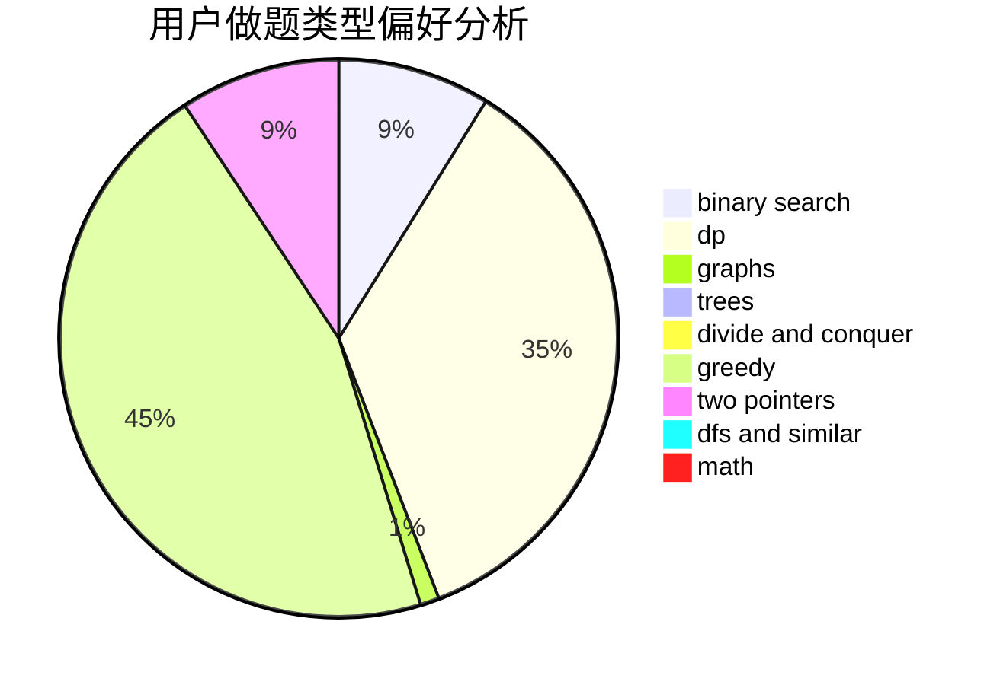

# Konnyaku233

<!-- tabs:start -->

#### **用户提交结果分析**

#### **用户做题类型偏好分析**

<!-- tabs:end -->
# 推荐题目
[868D](https://codeforces.com/contest/868/problem/D)
[700D](https://codeforces.com/contest/700/problem/D)
[456B](https://codeforces.com/contest/456/problem/B)
[558A](https://codeforces.com/contest/558/problem/A)
[1078C](https://codeforces.com/contest/1078/problem/C)
[704C](https://codeforces.com/contest/704/problem/C)
[1230D](https://codeforces.com/contest/1230/problem/D)
[401D](https://codeforces.com/contest/401/problem/D)
[1106A](https://codeforces.com/contest/1106/problem/A)
[1312G](https://codeforces.com/contest/1312/problem/G)
