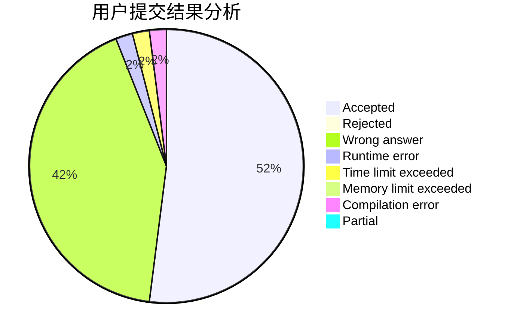
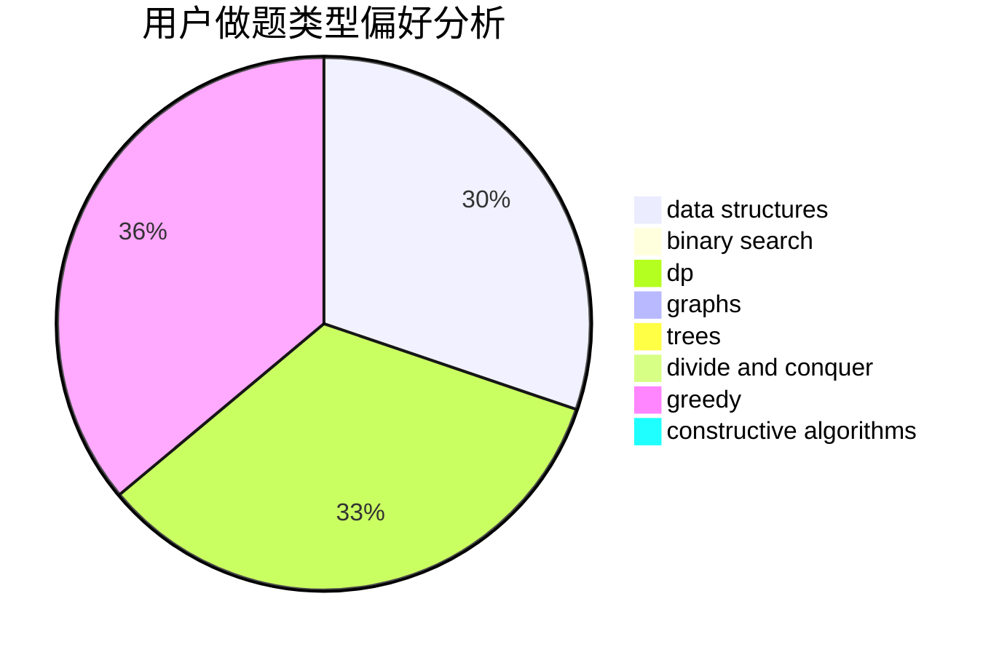

# Konnyaku233

<!-- tabs:start -->

#### **用户提交结果分析**

#### **用户做题类型偏好分析**

#### **用户错题知识点分析**

<!-- tabs:end -->
# 推荐题目
[868D](https://codeforces.com/contest/868/problem/D)		bitmasks,
                        brute force,
                        dp,
                        implementation,
                        strings		  
[700D](https://codeforces.com/contest/700/problem/D)		data structures,
                        greedy		  
[456B](https://codeforces.com/contest/456/problem/B)		math,
                        number theory		  
[558A](https://codeforces.com/contest/558/problem/A)		brute force,
                        implementation,
                        sortings		  
[1078C](https://codeforces.com/contest/1078/problem/C)		dsu,graphs,sortings,trees		  
[704C](https://codeforces.com/contest/704/problem/C)		dp,
                        graphs,
                        implementation,
                        math		  
[1230D](https://codeforces.com/contest/1230/problem/D)		dsu,graphs,sortings,trees		  
[401D](https://codeforces.com/contest/401/problem/D)		bitmasks,
                        brute force,
                        combinatorics,
                        dp,
                        number theory		  
[1106A](https://codeforces.com/contest/1106/problem/A)		implementation		  
[1312G](https://codeforces.com/contest/1312/problem/G)		data structures,
                        dfs and similar,
                        dp		  
