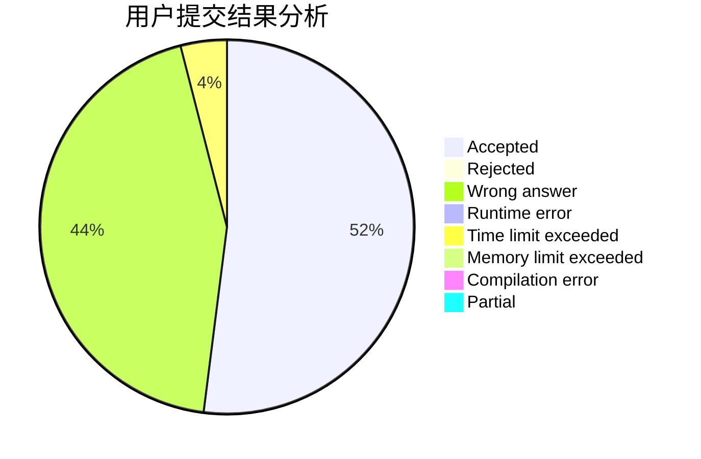
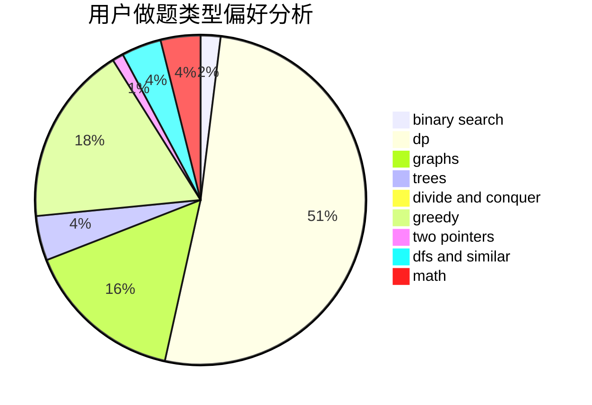

# Kotoriqaq

<!-- tabs:start -->

#### **用户提交结果分析**

#### **用户做题类型偏好分析**

<!-- tabs:end -->
# 推荐题目
[551B](https://codeforces.com/contest/551/problem/B)
[47B](https://codeforces.com/contest/47/problem/B)
[236D](https://codeforces.com/contest/236/problem/D)
[954I](https://codeforces.com/contest/954/problem/I)
[643E](https://codeforces.com/contest/643/problem/E)
[37D](https://codeforces.com/contest/37/problem/D)
[962D](https://codeforces.com/contest/962/problem/D)
[1039C](https://codeforces.com/contest/1039/problem/C)
[1418C](https://codeforces.com/contest/1418/problem/C)
[960D](https://codeforces.com/contest/960/problem/D)
