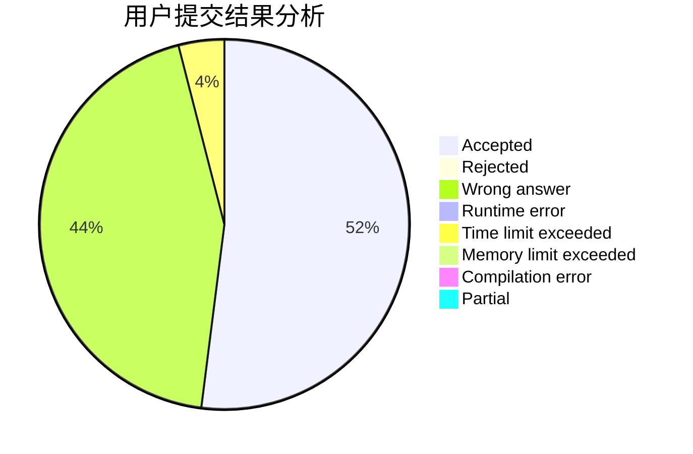
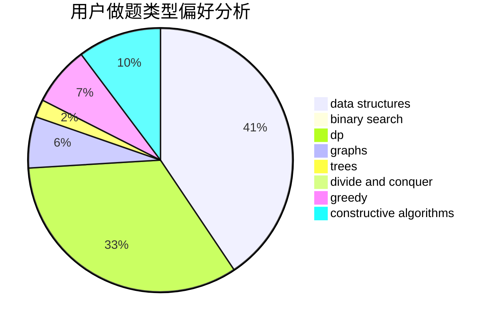
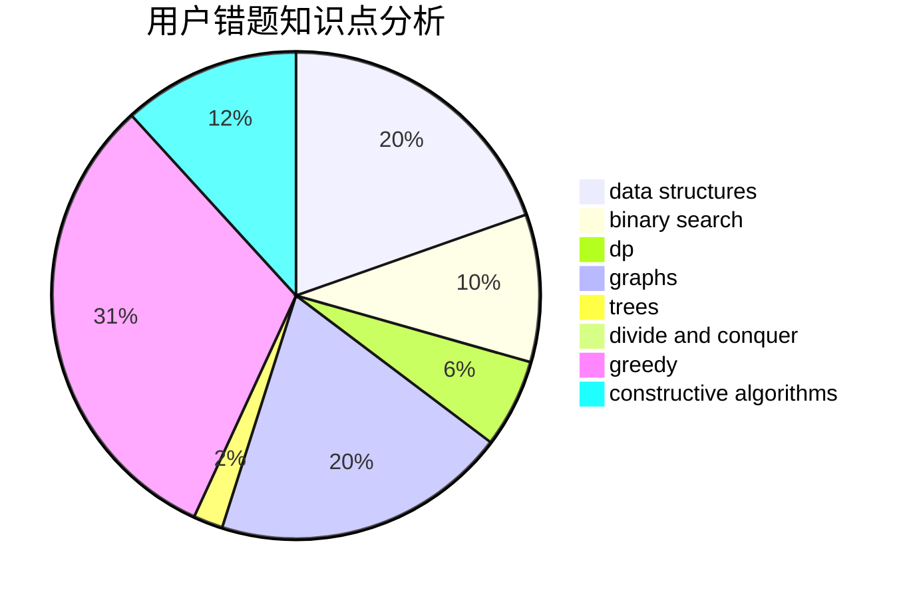

# Kotoriqaq

<!-- tabs:start -->

#### **用户提交结果分析**

#### **用户做题类型偏好分析**

#### **用户错题知识点分析**

<!-- tabs:end -->
# 推荐题目
[551B](https://codeforces.com/contest/551/problem/B)		brute force,
                        constructive algorithms,
                        implementation,
                        strings		  
[47B](https://codeforces.com/contest/47/problem/B)		implementation		  
[236D](https://codeforces.com/contest/236/problem/D)		dsu,graphs,sortings,trees		  
[954I](https://codeforces.com/contest/954/problem/I)		fft,
                        math		  
[643E](https://codeforces.com/contest/643/problem/E)		dp,
                        math,
                        probabilities,
                        trees		  
[37D](https://codeforces.com/contest/37/problem/D)		combinatorics,
                        dp,
                        math		  
[962D](https://codeforces.com/contest/962/problem/D)		data structures,
                        implementation		  
[1039C](https://codeforces.com/contest/1039/problem/C)		dfs and similar,
                        dsu,
                        graphs,
                        math,
                        sortings		  
[1418C](https://codeforces.com/contest/1418/problem/C)		dp,
                        graphs,
                        greedy,
                        shortest paths		  
[960D](https://codeforces.com/contest/960/problem/D)		brute force,
                        implementation,
                        trees		  
