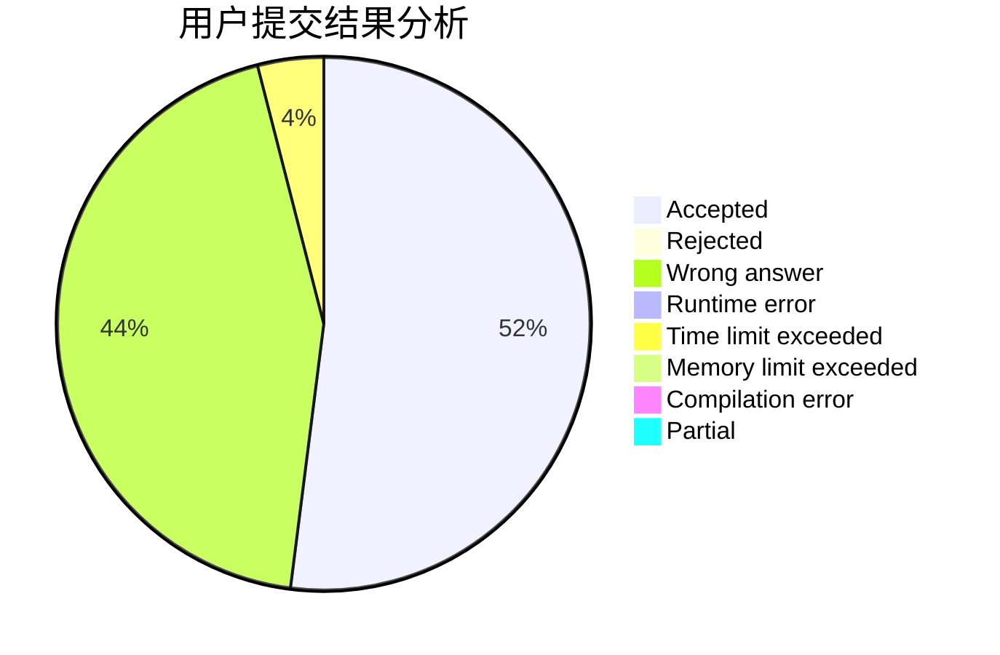
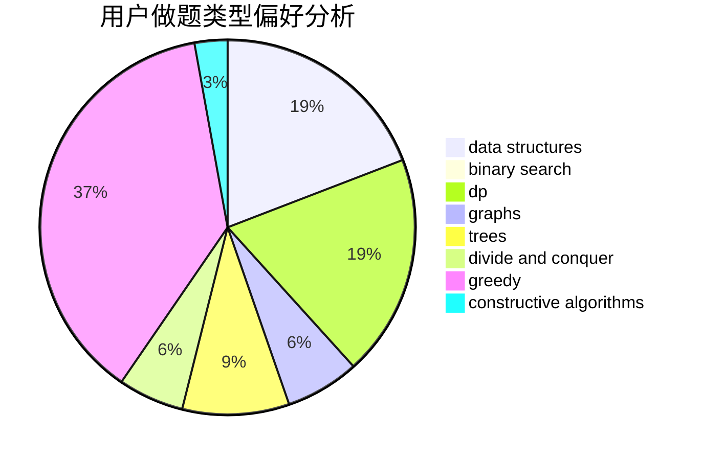
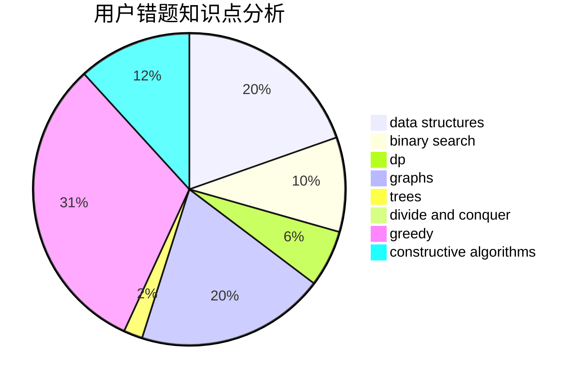

# Kotoriqaq

<!-- tabs:start -->

#### **用户提交结果分析**

#### **用户做题类型偏好分析**

#### **用户错题知识点分析**

<!-- tabs:end -->
# 推荐题目
[527B](https://codeforces.com/contest/527/problem/B)		greedy		  
[460D](https://codeforces.com/contest/460/problem/D)		brute force,
                        constructive algorithms,
                        math		  
[218A](https://codeforces.com/contest/218/problem/A)		brute force,
                        constructive algorithms,
                        implementation		  
[932G](https://codeforces.com/contest/932/problem/G)		dp,
                        string suffix structures,
                        strings		  
[620B](https://codeforces.com/contest/620/problem/B)		implementation		  
[354A](https://codeforces.com/contest/354/problem/A)		brute force,
                        greedy,
                        math		  
[946A](https://codeforces.com/contest/946/problem/A)		greedy		  
[1038E](https://codeforces.com/contest/1038/problem/E)		bitmasks,
                        brute force,
                        dfs and similar,
                        dp,
                        graphs		  
[1407D](https://codeforces.com/contest/1407/problem/D)		data structures,
                        dp,
                        graphs		  
[939A](https://codeforces.com/contest/939/problem/A)		graphs		  
