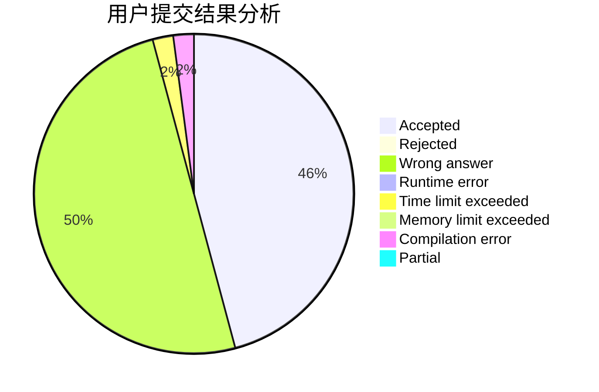
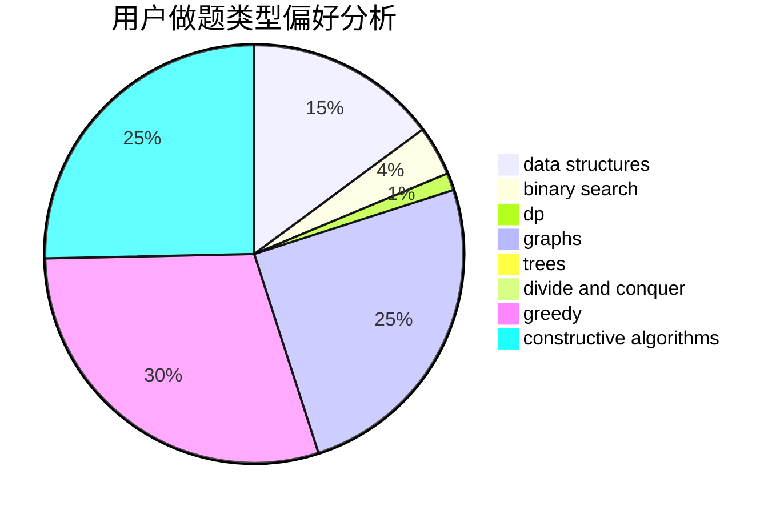
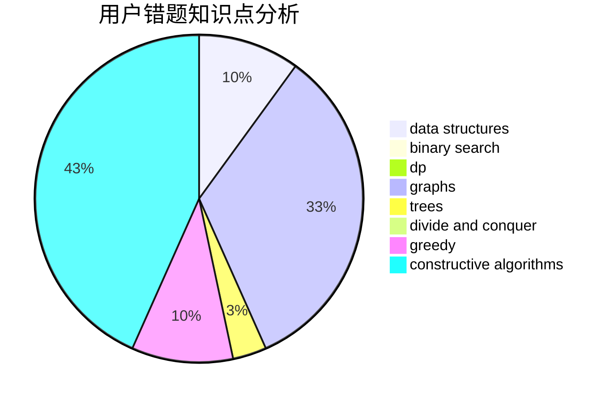

# Krain233

<!-- tabs:start -->

#### **用户提交结果分析**

#### **用户做题类型偏好分析**

#### **用户错题知识点分析**

<!-- tabs:end -->
# 推荐题目
[873A](https://codeforces.com/contest/873/problem/A)		implementation		  
[660C](https://codeforces.com/contest/660/problem/C)		binary search,
                        dp,
                        two pointers		  
[1084B](https://codeforces.com/contest/1084/problem/B)		greedy,
                        implementation		  
[656D](https://codeforces.com/contest/656/problem/D)		*special problem		  
[1339C](https://codeforces.com/contest/1339/problem/C)		dsu,graphs,sortings,trees		  
[629A](https://codeforces.com/contest/629/problem/A)		brute force,
                        combinatorics,
                        constructive algorithms,
                        implementation		  
[697C](https://codeforces.com/contest/697/problem/C)		dsu,graphs,sortings,trees		  
[946B](https://codeforces.com/contest/946/problem/B)		math,
                        number theory		  
[1291C](https://codeforces.com/contest/1291/problem/C)		dsu,graphs,sortings,trees		  
[514B](https://codeforces.com/contest/514/problem/B)		brute force,
                        data structures,
                        geometry,
                        implementation,
                        math		  
