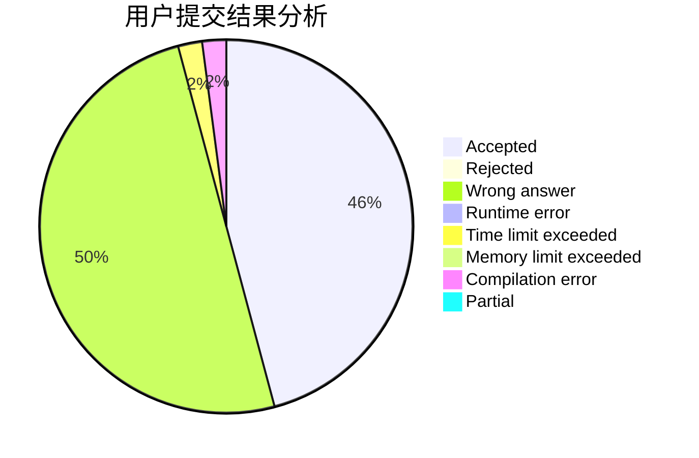
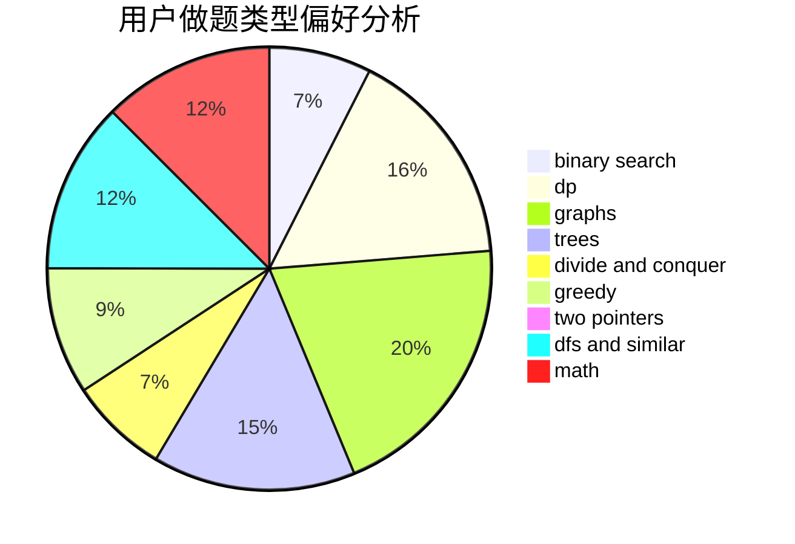

# Krain233

<!-- tabs:start -->

#### **用户提交结果分析**

#### **用户做题类型偏好分析**

<!-- tabs:end -->
# 推荐题目
[893F](https://codeforces.com/contest/893/problem/F)
[681A](https://codeforces.com/contest/681/problem/A)
[1085A](https://codeforces.com/contest/1085/problem/A)
[678D](https://codeforces.com/contest/678/problem/D)
[1346C](https://codeforces.com/contest/1346/problem/C)
[659A](https://codeforces.com/contest/659/problem/A)
[714A](https://codeforces.com/contest/714/problem/A)
[962F](https://codeforces.com/contest/962/problem/F)
[1298B](https://codeforces.com/contest/1298/problem/B)
[53E](https://codeforces.com/contest/53/problem/E)
