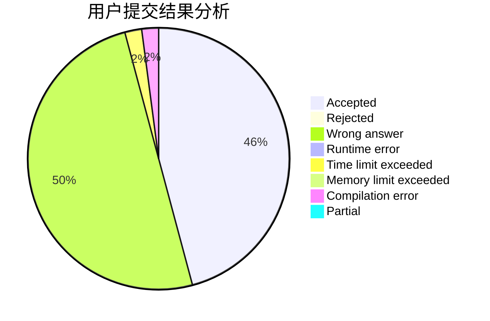
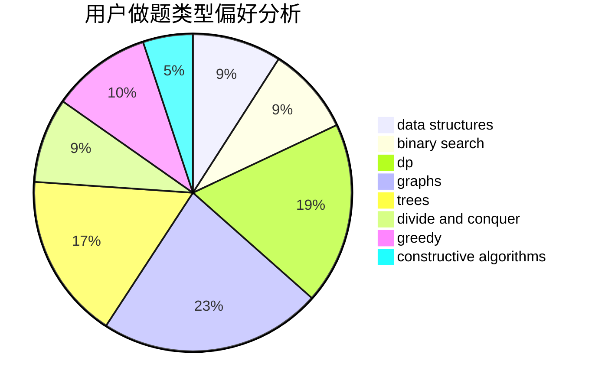
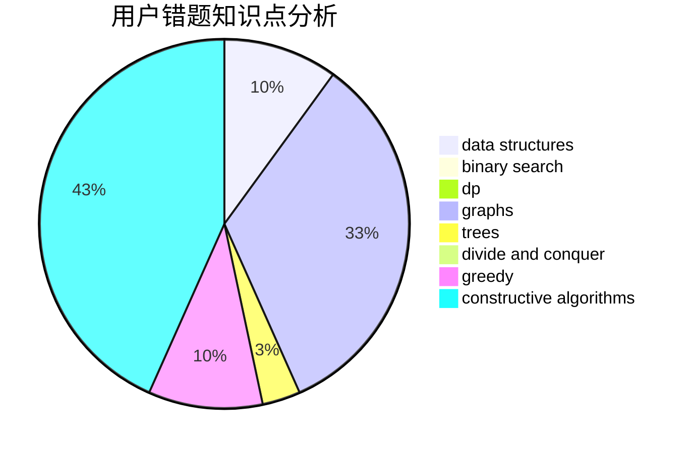

# Krain233

<!-- tabs:start -->

#### **用户提交结果分析**

#### **用户做题类型偏好分析**

#### **用户错题知识点分析**

<!-- tabs:end -->
# 推荐题目
[893F](https://codeforces.com/contest/893/problem/F)		data structures,
                        trees		  
[681A](https://codeforces.com/contest/681/problem/A)		implementation		  
[1085A](https://codeforces.com/contest/1085/problem/A)		implementation,
                        strings		  
[678D](https://codeforces.com/contest/678/problem/D)		math,
                        number theory		  
[1346C](https://codeforces.com/contest/1346/problem/C)		*special problem,
                        greedy,
                        sortings		  
[659A](https://codeforces.com/contest/659/problem/A)		implementation,
                        math		  
[714A](https://codeforces.com/contest/714/problem/A)		implementation,
                        math		  
[962F](https://codeforces.com/contest/962/problem/F)		dfs and similar,
                        graphs,
                        trees		  
[1298B](https://codeforces.com/contest/1298/problem/B)		dsu,graphs,sortings,trees		  
[53E](https://codeforces.com/contest/53/problem/E)		bitmasks,
                        dp		  
