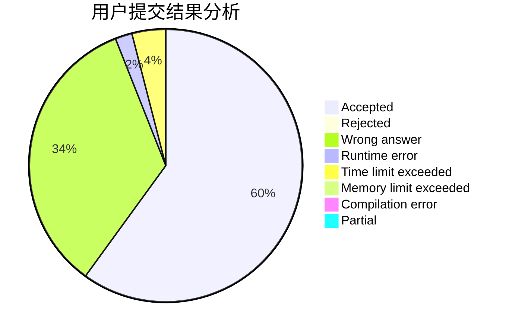
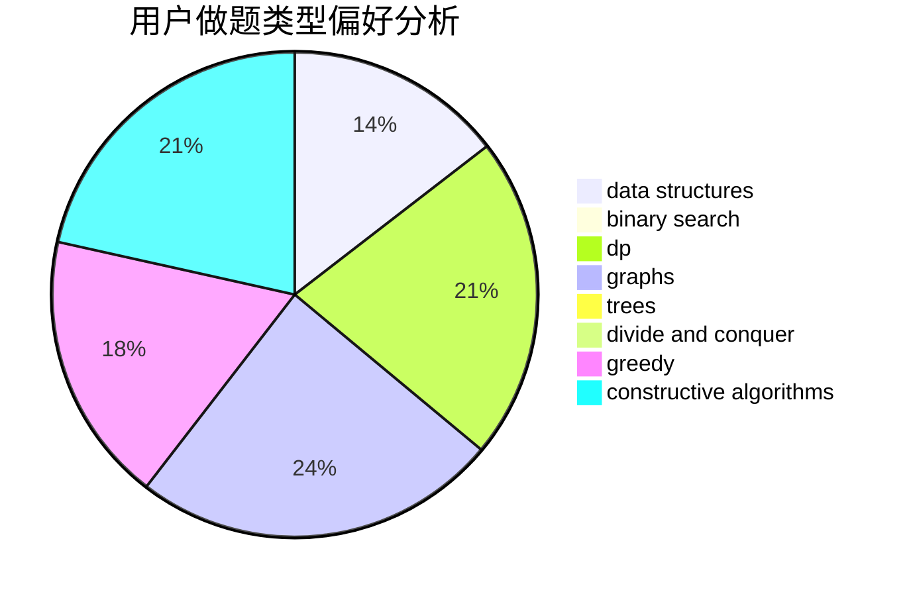
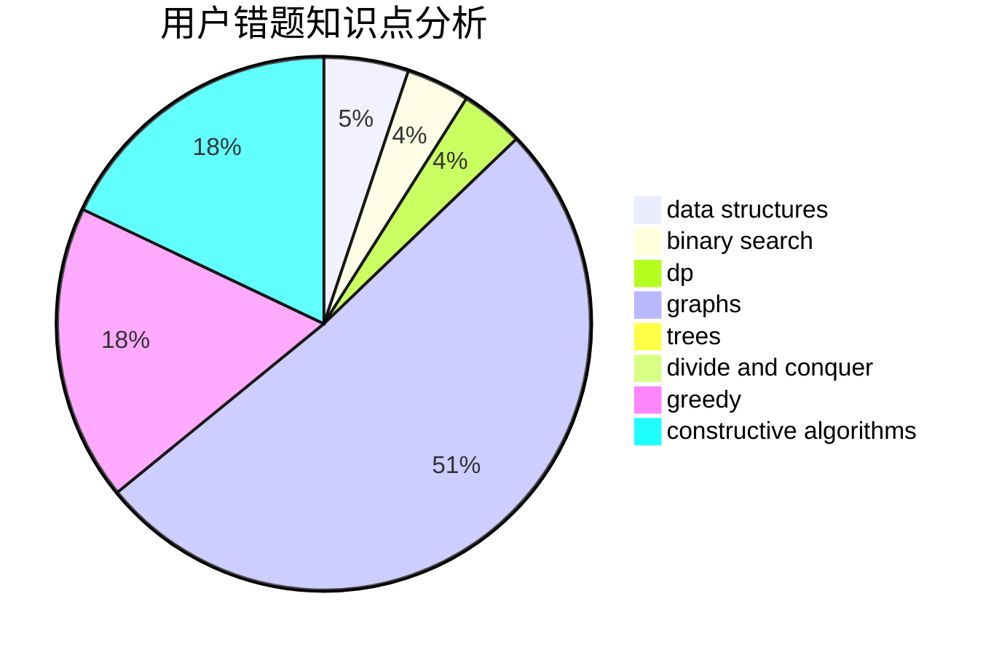

# Krypton12138

<!-- tabs:start -->

#### **用户提交结果分析**

#### **用户做题类型偏好分析**

#### **用户错题知识点分析**

<!-- tabs:end -->
# 推荐题目
[899F](https://codeforces.com/contest/899/problem/F)		data structures,
                        strings		  
[759B](https://codeforces.com/contest/759/problem/B)		dsu,graphs,sortings,trees		  
[1452F](https://codeforces.com/contest/1452/problem/F)		constructive algorithms,
                        greedy		  
[791C](https://codeforces.com/contest/791/problem/C)		dsu,graphs,sortings,trees		  
[1499G](https://codeforces.com/contest/1499/problem/G)		data structures,
                        graphs,
                        interactive		  
[1025E](https://codeforces.com/contest/1025/problem/E)		constructive algorithms,
                        implementation,
                        matrices		  
[682A](https://codeforces.com/contest/682/problem/A)		constructive algorithms,
                        math,
                        number theory		  
[622F](https://codeforces.com/contest/622/problem/F)		math		  
[231E](https://codeforces.com/contest/231/problem/E)		data structures,
                        dfs and similar,
                        dp,
                        graphs,
                        trees		  
[813D](https://codeforces.com/contest/813/problem/D)		dp,
                        flows		  
