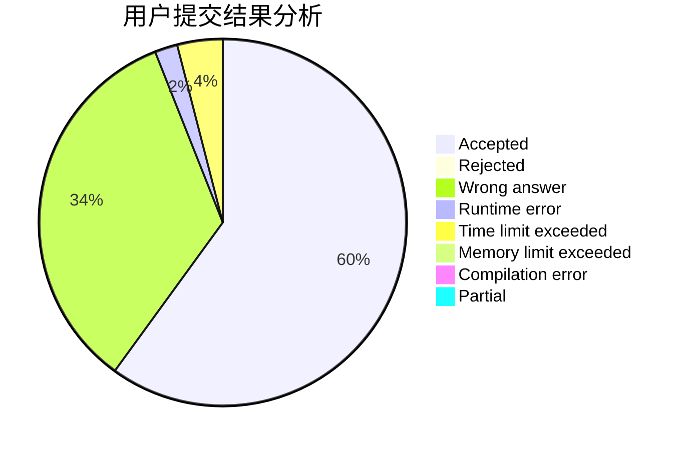
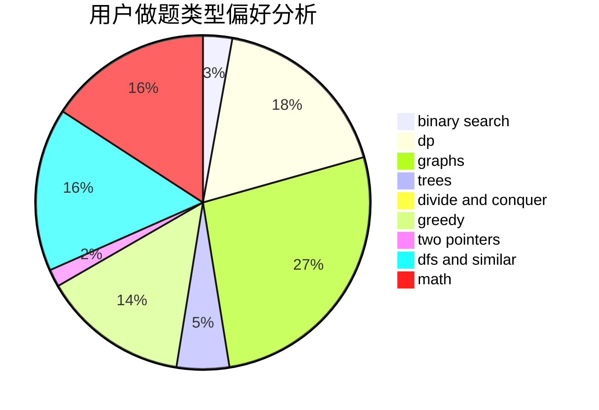

# Krypton12138

<!-- tabs:start -->

#### **用户提交结果分析**

#### **用户做题类型偏好分析**

<!-- tabs:end -->
# 推荐题目
[899F](https://codeforces.com/contest/899/problem/F)
[759B](https://codeforces.com/contest/759/problem/B)
[1452F](https://codeforces.com/contest/1452/problem/F)
[791C](https://codeforces.com/contest/791/problem/C)
[1499G](https://codeforces.com/contest/1499/problem/G)
[1025E](https://codeforces.com/contest/1025/problem/E)
[682A](https://codeforces.com/contest/682/problem/A)
[622F](https://codeforces.com/contest/622/problem/F)
[231E](https://codeforces.com/contest/231/problem/E)
[813D](https://codeforces.com/contest/813/problem/D)
