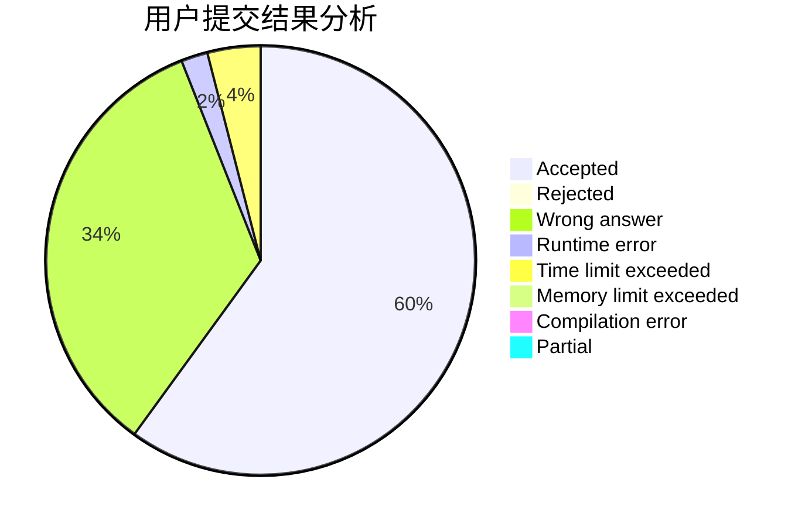
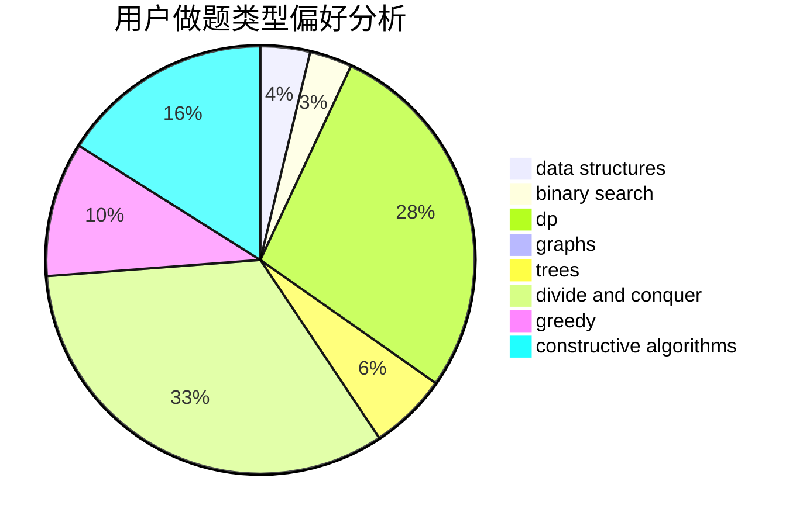
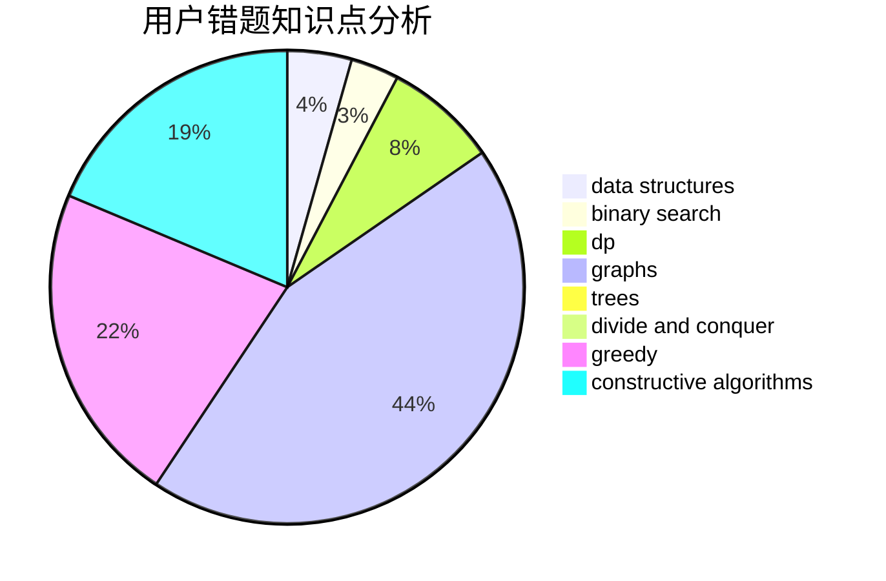

# Krypton12138

<!-- tabs:start -->

#### **用户提交结果分析**

#### **用户做题类型偏好分析**

#### **用户错题知识点分析**

<!-- tabs:end -->
# 推荐题目
[879B](https://codeforces.com/contest/879/problem/B)		data structures,
                        implementation		  
[737E](https://codeforces.com/contest/737/problem/E)		graph matchings,
                        graphs,
                        greedy,
                        schedules		  
[1443A](https://codeforces.com/contest/1443/problem/A)		constructive algorithms,
                        math		  
[771D](https://codeforces.com/contest/771/problem/D)		dp		  
[1491A](https://codeforces.com/contest/1491/problem/A)		brute force,
                        greedy,
                        implementation		  
[1025B](https://codeforces.com/contest/1025/problem/B)		brute force,
                        greedy,
                        number theory		  
[662A](https://codeforces.com/contest/662/problem/A)		bitmasks,
                        math,
                        matrices,
                        probabilities		  
[604C](https://codeforces.com/contest/604/problem/C)		dsu,graphs,sortings,trees		  
[20C](https://codeforces.com/contest/20/problem/C)		graphs,
                        shortest paths		  
[799D](https://codeforces.com/contest/799/problem/D)		brute force,
                        dp,
                        meet-in-the-middle		  
