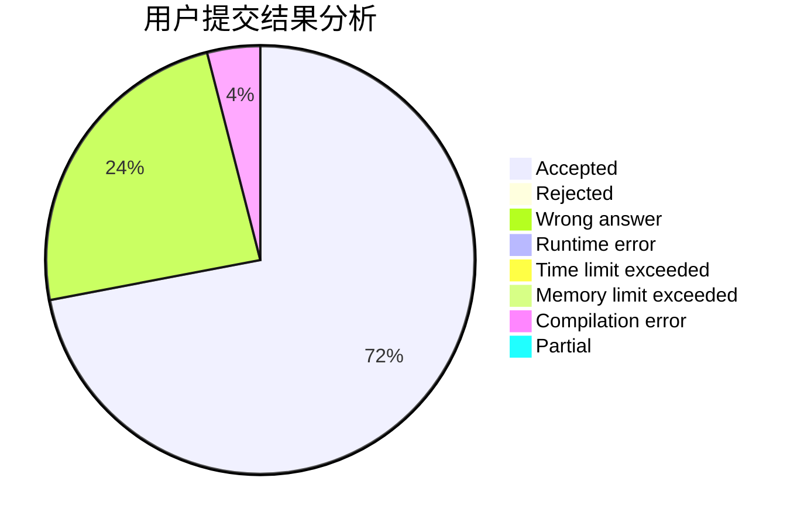
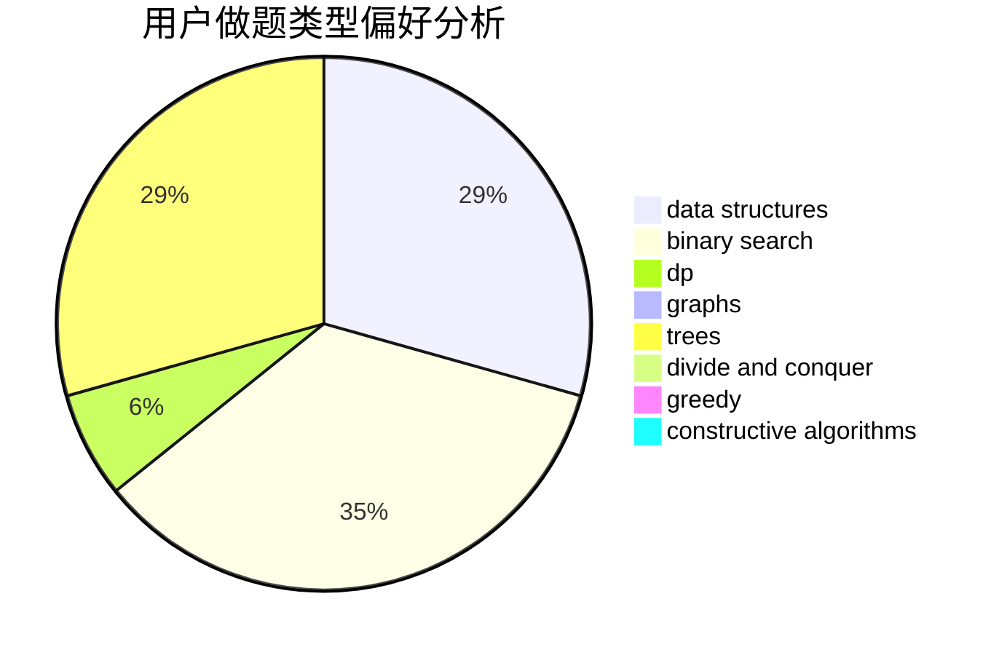

# 517Coding

<!-- tabs:start -->

#### **用户提交结果分析**

#### **用户做题类型偏好分析**

#### **用户错题知识点分析**

<!-- tabs:end -->
# 推荐题目
[1372A](https://codeforces.com/contest/1372/problem/A)		constructive algorithms,
                        implementation		  
[1372B](https://codeforces.com/contest/1372/problem/B)		greedy,
                        math,
                        number theory		  
[1107E](https://codeforces.com/contest/1107/problem/E)		dp		  
[1113F](https://codeforces.com/contest/1113/problem/F)		dsu,graphs,sortings,trees		  
[1371E2](https://codeforces.com/contest/1371E/problem/2)		binary search,
                        combinatorics,
                        dp,
                        math,
                        number theory,
                        sortings		  
[1007C](https://codeforces.com/contest/1007/problem/C)		binary search,
                        interactive		  
[1371F](https://codeforces.com/contest/1371/problem/F)		data structures,
                        divide and conquer,
                        implementation		  
[1121B](https://codeforces.com/contest/1121/problem/B)		brute force,
                        implementation		  
[1372C](https://codeforces.com/contest/1372/problem/C)		constructive algorithms,
                        math		  
[1372D](https://codeforces.com/contest/1372/problem/D)		brute force,
                        dp,
                        games,
                        greedy		  
