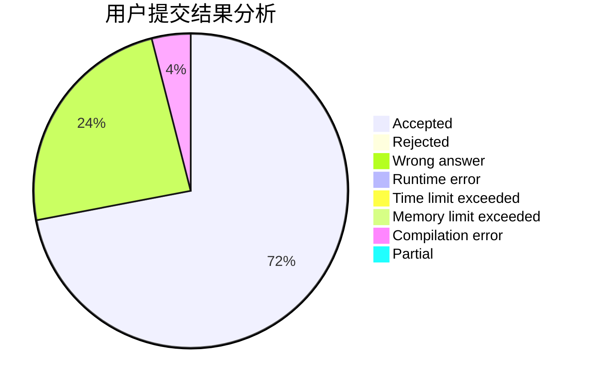
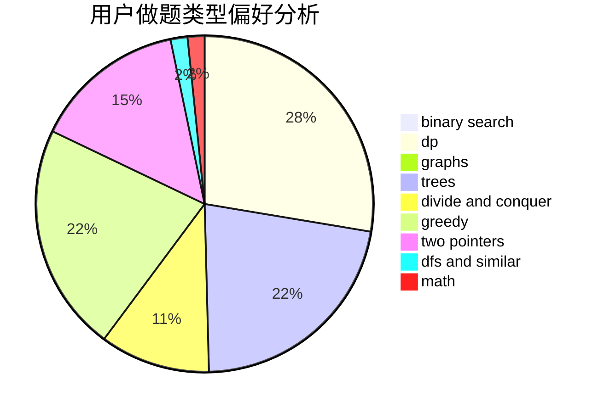

# 517Coding

<!-- tabs:start -->

#### **用户提交结果分析**

#### **用户做题类型偏好分析**

<!-- tabs:end -->
# 推荐题目
[1380F](https://codeforces.com/contest/1380/problem/F)
[1380G](https://codeforces.com/contest/1380/problem/G)
[11082](https://codeforces.com/contest/1108/problem/2)
[1114C](https://codeforces.com/contest/1114/problem/C)
[1380D](https://codeforces.com/contest/1380/problem/D)
[1008A](https://codeforces.com/contest/1008/problem/A)
[1380E](https://codeforces.com/contest/1380/problem/E)
[1130B](https://codeforces.com/contest/1130/problem/B)
[13811](https://codeforces.com/contest/1381/problem/1)
[13812](https://codeforces.com/contest/1381/problem/2)
