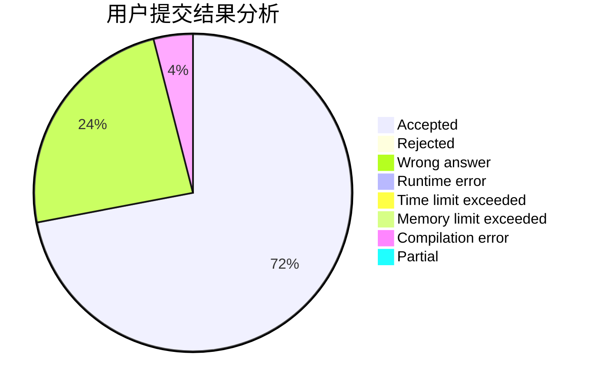
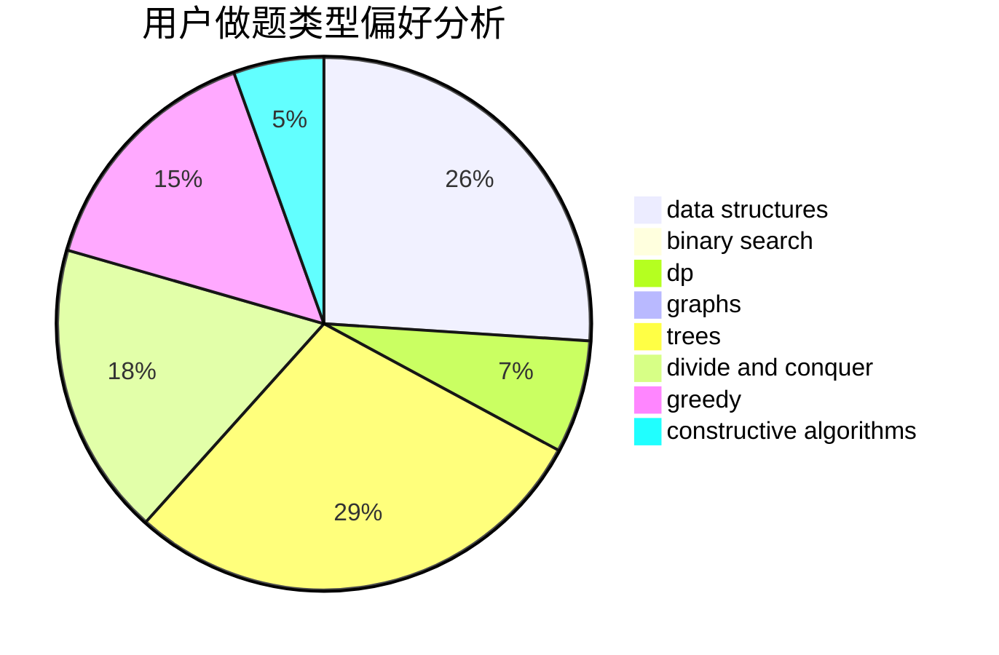

# 517Coding

<!-- tabs:start -->

#### **用户提交结果分析**

#### **用户做题类型偏好分析**

#### **用户错题知识点分析**

<!-- tabs:end -->
# 推荐题目
[1380F](https://codeforces.com/contest/1380/problem/F)		data structures,
                        dp,
                        matrices		  
[1380G](https://codeforces.com/contest/1380/problem/G)		greedy,
                        math,
                        probabilities		  
[11082](https://codeforces.com/contest/1108/problem/2)		dsu,graphs,sortings,trees		  
[1114C](https://codeforces.com/contest/1114/problem/C)		brute force,
                        implementation,
                        math,
                        number theory		  
[1380D](https://codeforces.com/contest/1380/problem/D)		constructive algorithms,
                        greedy,
                        implementation,
                        math,
                        two pointers		  
[1008A](https://codeforces.com/contest/1008/problem/A)		implementation,
                        strings		  
[1380E](https://codeforces.com/contest/1380/problem/E)		data structures,
                        dsu,
                        implementation,
                        trees		  
[1130B](https://codeforces.com/contest/1130/problem/B)		greedy		  
[13811](https://codeforces.com/contest/1381/problem/1)		dsu,graphs,sortings,trees		  
[13812](https://codeforces.com/contest/1381/problem/2)		dsu,graphs,sortings,trees		  
