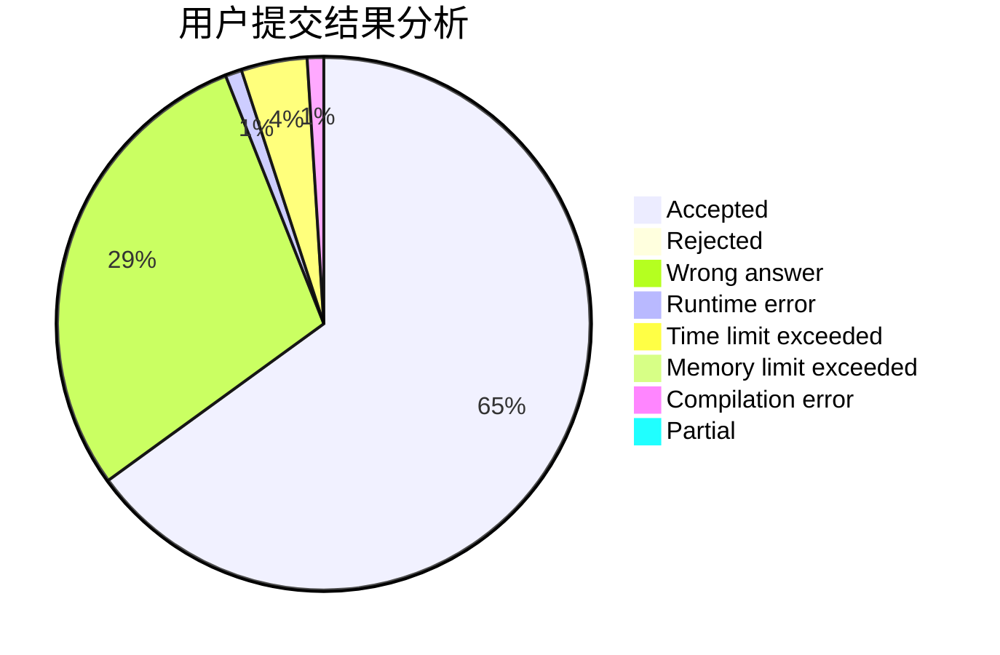
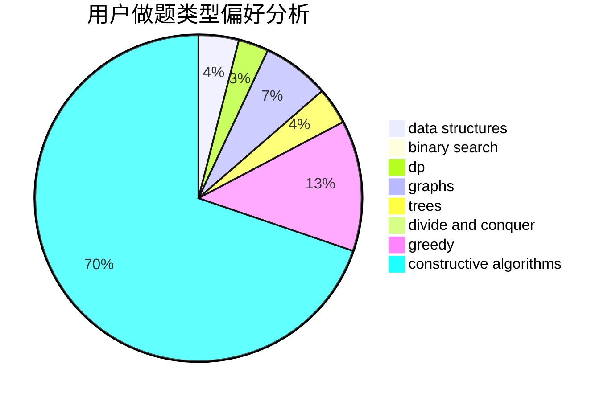
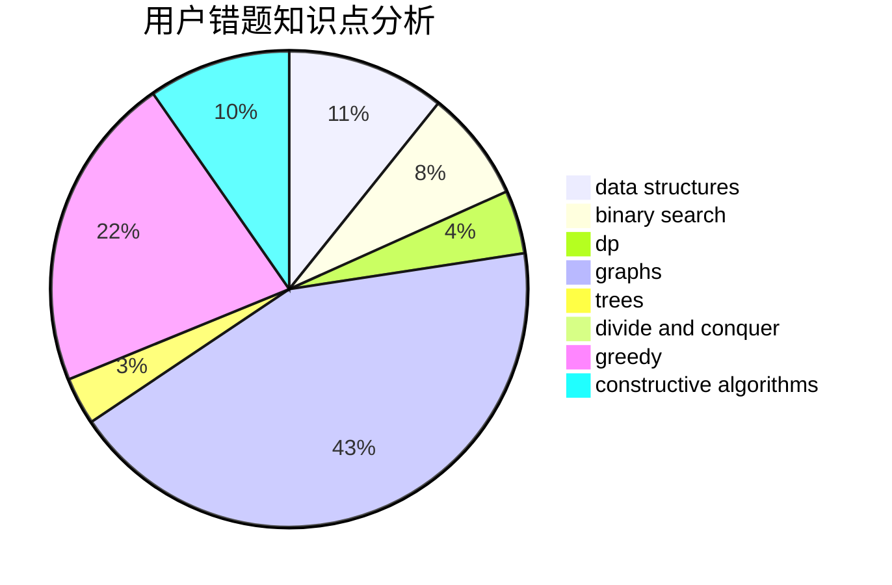

# Krystallos

<!-- tabs:start -->

#### **用户提交结果分析**

#### **用户做题类型偏好分析**

#### **用户错题知识点分析**

<!-- tabs:end -->
# 推荐题目
[1293D](https://codeforces.com/contest/1293/problem/D)		dsu,graphs,sortings,trees		  
[1140D](https://codeforces.com/contest/1140/problem/D)		dp,
                        greedy,
                        math		  
[1028G](https://codeforces.com/contest/1028/problem/G)		dp,
                        interactive		  
[962G](https://codeforces.com/contest/962/problem/G)		data structures,
                        dsu,
                        geometry,
                        trees		  
[1082F](https://codeforces.com/contest/1082/problem/F)		dp,
                        strings,
                        trees		  
[1198F](https://codeforces.com/contest/1198/problem/F)		greedy,
                        number theory,
                        probabilities		  
[35C](https://codeforces.com/contest/35/problem/C)		brute force,
                        dfs and similar,
                        shortest paths		  
[737C](https://codeforces.com/contest/737/problem/C)		dsu,graphs,sortings,trees		  
[1415F](https://codeforces.com/contest/1415/problem/F)		dp		  
[13782](https://codeforces.com/contest/1378/problem/2)		dsu,graphs,sortings,trees		  
