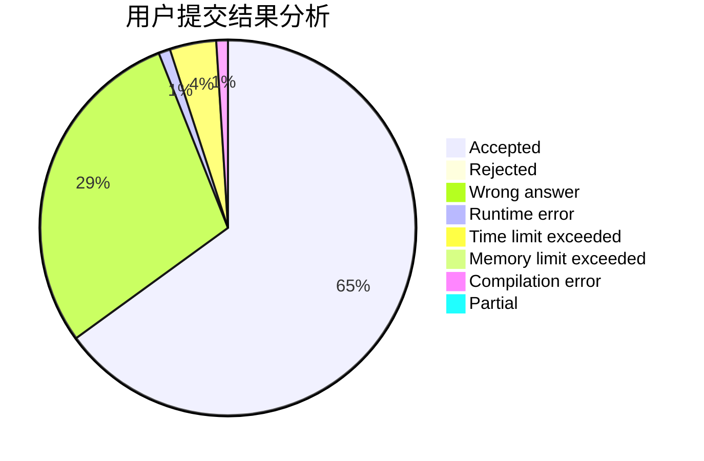
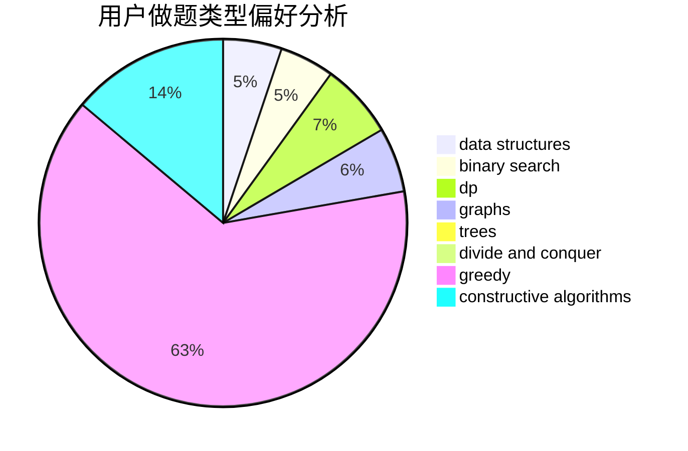
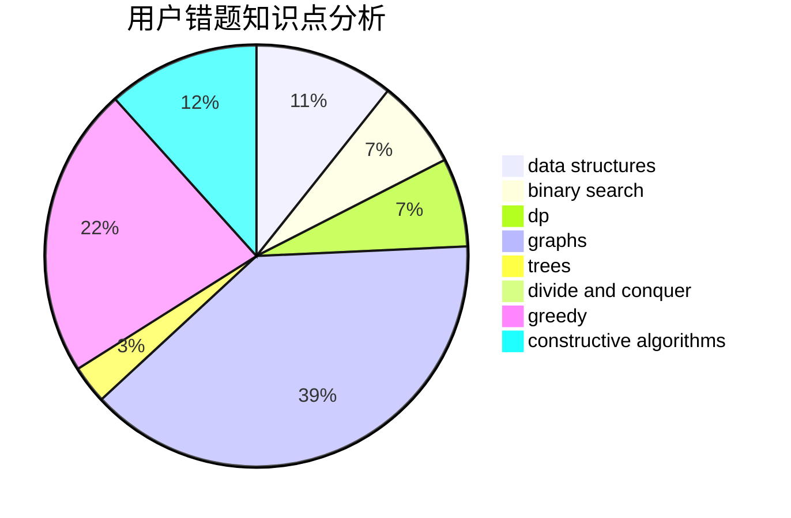

# Krystallos

<!-- tabs:start -->

#### **用户提交结果分析**

#### **用户做题类型偏好分析**

#### **用户错题知识点分析**

<!-- tabs:end -->
# 推荐题目
[1286C1](https://codeforces.com/contest/1286C/problem/1)		brute force,
                        constructive algorithms,
                        interactive,
                        math		  
[1138F](https://codeforces.com/contest/1138/problem/F)		dsu,graphs,sortings,trees		  
[1028C](https://codeforces.com/contest/1028/problem/C)		geometry,
                        implementation,
                        sortings		  
[946C](https://codeforces.com/contest/946/problem/C)		greedy,
                        strings		  
[1082C](https://codeforces.com/contest/1082/problem/C)		greedy,
                        sortings		  
[1194D](https://codeforces.com/contest/1194/problem/D)		games,
                        math		  
[331E2](https://codeforces.com/contest/331E/problem/2)		constructive algorithms,
                        dp		  
[720C](https://codeforces.com/contest/720/problem/C)		constructive algorithms		  
[1404D](https://codeforces.com/contest/1404/problem/D)		constructive algorithms,
                        dfs and similar,
                        interactive,
                        math,
                        number theory		  
[136D](https://codeforces.com/contest/136/problem/D)		dsu,graphs,sortings,trees		  
