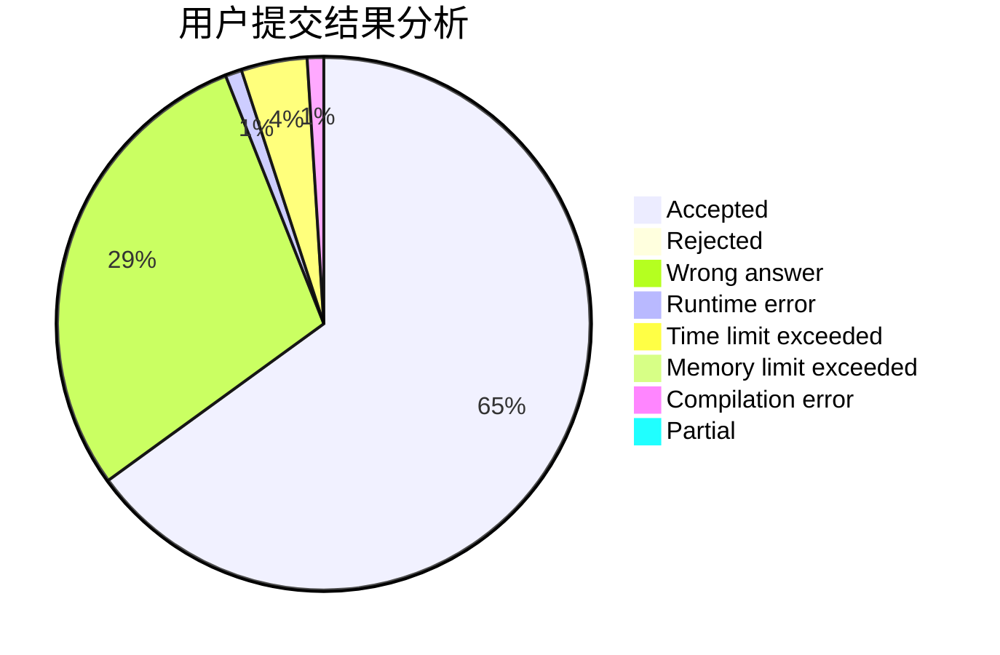
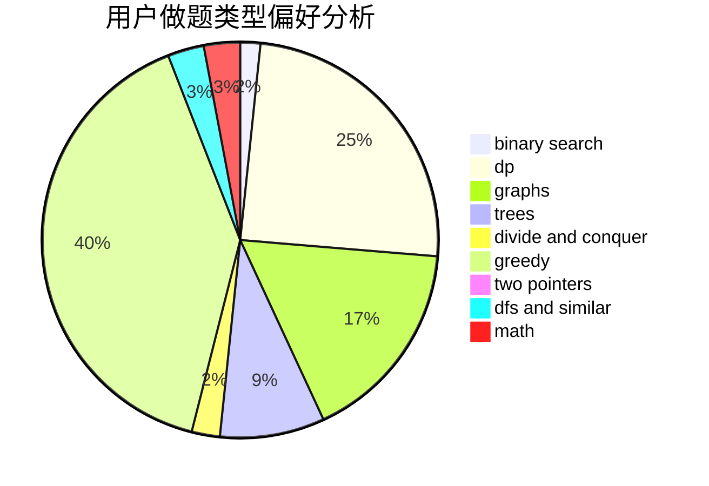

# Krystallos

<!-- tabs:start -->

#### **用户提交结果分析**

#### **用户做题类型偏好分析**

<!-- tabs:end -->
# 推荐题目
[1293D](https://codeforces.com/contest/1293/problem/D)
[1140D](https://codeforces.com/contest/1140/problem/D)
[1028G](https://codeforces.com/contest/1028/problem/G)
[962G](https://codeforces.com/contest/962/problem/G)
[1082F](https://codeforces.com/contest/1082/problem/F)
[1198F](https://codeforces.com/contest/1198/problem/F)
[35C](https://codeforces.com/contest/35/problem/C)
[737C](https://codeforces.com/contest/737/problem/C)
[1415F](https://codeforces.com/contest/1415/problem/F)
[13782](https://codeforces.com/contest/1378/problem/2)
