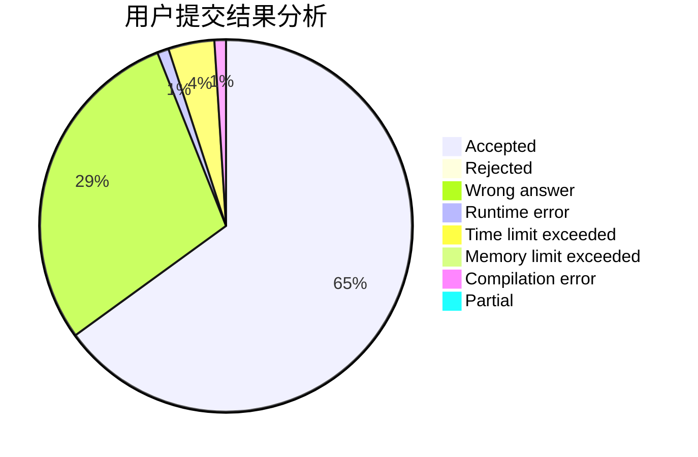
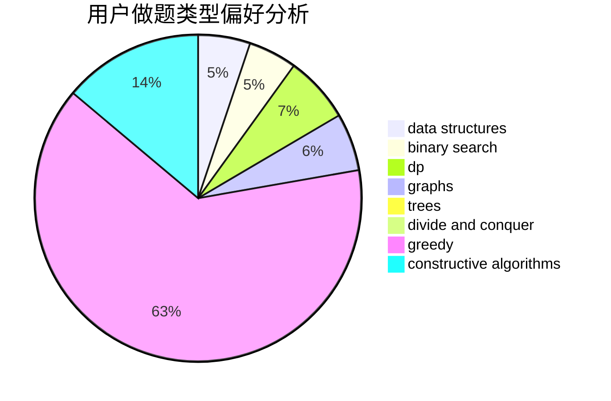
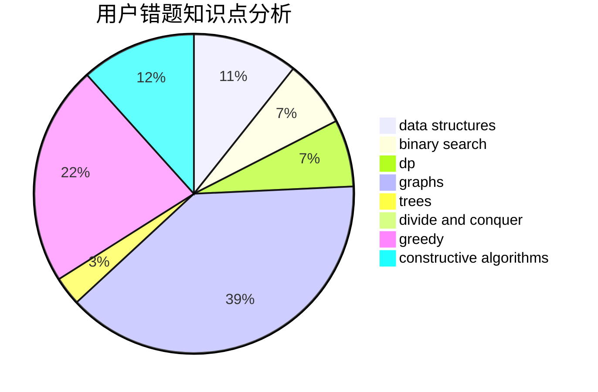

# Krystallos
<!-- tabs:start -->
#### **用户提交结果分析**

#### **用户做题类型偏好分析**

#### **用户错题知识点分析**

<!-- tabs:end -->
# 推荐题目
[Madhouse (Easy version)](http://codeforces.com/problemset/problem/1286/C1)		brute force,
                        constructive algorithms,
                        interactive,
                        math		  
[1-2-K Game](http://codeforces.com/problemset/problem/1194/D)		games,
                        math		  
[String Transformation](http://codeforces.com/problemset/problem/946/C)		greedy,
                        strings		  
[Deja Vu](http://codeforces.com/problemset/problem/331/E2)		constructive algorithms,
                        dp		  
[Rectangles](http://codeforces.com/problemset/problem/1028/C)		geometry,
                        implementation,
                        sortings		  
[Cooperative Game](https://codeforces.com/contest/1138/problem/F)		constructive algorithms,
                        interactive,
                        number theory		  
[Multi-Subject Competition](http://codeforces.com/problemset/problem/1082/C)		greedy,
                        sortings		  
[Rectangle and Square](https://codeforces.com/contest/136/problem/D)		brute force,
                        geometry,
                        math		  
[Ratings and Reality Shows](http://codeforces.com/problemset/problem/887/D)		data structures,
                        two pointers		  
[Interactive LowerBound](http://codeforces.com/problemset/problem/843/B)		brute force,
                        interactive,
                        probabilities		  
<!-- tabs:start -->
#### **data structures**
[Madhouse (Easy version)](http://codeforces.com/problemset/problem/887/D)		data structures,
                        two pointers		  
[1-2-K Game](http://codeforces.com/problemset/problem/383/C)		data structures,
                        dfs and similar,
                        trees		  
[String Transformation](http://codeforces.com/problemset/problem/1041/E)		constructive algorithms,
                        data structures,
                        graphs,
                        greedy		  
[Deja Vu](http://codeforces.com/problemset/problem/765/F)		data structures		  
[Rectangles](http://codeforces.com/problemset/problem/1217/F)		data structures,
                        divide and conquer,
                        dsu,
                        graphs,
                        trees		  
[Cooperative Game](http://codeforces.com/problemset/problem/896/C)		data structures,
                        probabilities		  
[Multi-Subject Competition](http://codeforces.com/problemset/problem/1408/E)		data structures,
                        dsu,
                        graphs,
                        greedy,
                        sortings,
                        trees		  
[Rectangle and Square](http://codeforces.com/problemset/problem/1492/C)		binary search,
                        data structures,
                        dp,
                        greedy,
                        two pointers		  
[Ratings and Reality Shows](http://codeforces.com/problemset/problem/1490/G)		binary search,
                        data structures,
                        math		  
[Interactive LowerBound](http://codeforces.com/problemset/problem/1479/D)		binary search,
                        bitmasks,
                        brute force,
                        data structures,
                        probabilities,
                        trees		  
#### **binary search**
[Madhouse (Easy version)](http://codeforces.com/problemset/problem/1492/C)		binary search,
                        data structures,
                        dp,
                        greedy,
                        two pointers		  
[1-2-K Game](http://codeforces.com/problemset/problem/1463/D)		binary search,
                        constructive algorithms,
                        greedy,
                        two pointers		  
[String Transformation](http://codeforces.com/problemset/problem/1490/G)		binary search,
                        data structures,
                        math		  
[Deja Vu](http://codeforces.com/problemset/problem/1479/D)		binary search,
                        bitmasks,
                        brute force,
                        data structures,
                        probabilities,
                        trees		  
[Rectangles](http://codeforces.com/problemset/problem/1436/E)		binary search,
                        data structures,
                        two pointers		  
[Cooperative Game](http://codeforces.com/problemset/problem/1461/D)		binary search,
                        brute force,
                        data structures,
                        divide and conquer,
                        implementation,
                        sortings		  
[Multi-Subject Competition](http://codeforces.com/problemset/problem/1493/C)		binary search,
                        brute force,
                        constructive algorithms,
                        greedy,
                        strings		  
[Rectangle and Square](http://codeforces.com/problemset/problem/1487/D)		binary search,
                        brute force,
                        math,
                        number theory		  
[Ratings and Reality Shows](http://codeforces.com/problemset/problem/1486/B)		binary search,
                        geometry,
                        shortest paths,
                        sortings		  
[Interactive LowerBound](http://codeforces.com/problemset/problem/1486/C1)		binary search,
                        interactive		  
#### **dp**
[Madhouse (Easy version)](http://codeforces.com/problemset/problem/331/E2)		constructive algorithms,
                        dp		  
[1-2-K Game](http://codeforces.com/problemset/problem/464/D)		dp,
                        probabilities		  
[String Transformation](http://codeforces.com/problemset/problem/14/D)		dfs and similar,
                        dp,
                        graphs,
                        shortest paths,
                        trees,
                        two pointers		  
[Deja Vu](http://codeforces.com/problemset/problem/41/D)		dp		  
[Rectangles](http://codeforces.com/problemset/problem/1492/C)		binary search,
                        data structures,
                        dp,
                        greedy,
                        two pointers		  
[Cooperative Game](https://codeforces.com/contest/1457/problem/C)		brute force,
                        dp,
                        implementation		  
[Multi-Subject Competition](http://codeforces.com/problemset/problem/1491/C)		brute force,
                        data structures,
                        dp,
                        greedy,
                        implementation		  
[Rectangle and Square](http://codeforces.com/problemset/problem/1437/C)		dp,
                        flows,
                        graph matchings,
                        greedy,
                        math,
                        sortings		  
[Ratings and Reality Shows](http://codeforces.com/problemset/problem/1499/B)		brute force,
                        dp,
                        greedy,
                        implementation		  
[Interactive LowerBound](http://codeforces.com/problemset/problem/1491/D)		bitmasks,
                        constructive algorithms,
                        dp,
                        greedy,
                        math		  
#### **graph**
[Madhouse (Easy version)](http://codeforces.com/problemset/problem/1041/E)		constructive algorithms,
                        data structures,
                        graphs,
                        greedy		  
[1-2-K Game](http://codeforces.com/problemset/problem/1217/F)		data structures,
                        divide and conquer,
                        dsu,
                        graphs,
                        trees		  
[String Transformation](http://codeforces.com/problemset/problem/14/D)		dfs and similar,
                        dp,
                        graphs,
                        shortest paths,
                        trees,
                        two pointers		  
[Deja Vu](http://codeforces.com/problemset/problem/1408/E)		data structures,
                        dsu,
                        graphs,
                        greedy,
                        sortings,
                        trees		  
[Rectangles](http://codeforces.com/problemset/problem/1487/C)		brute force,
                        constructive algorithms,
                        dfs and similar,
                        graphs,
                        greedy,
                        implementation,
                        math		  
[Cooperative Game](http://codeforces.com/problemset/problem/1437/C)		dp,
                        flows,
                        graph matchings,
                        greedy,
                        math,
                        sortings		  
[Multi-Subject Competition](http://codeforces.com/problemset/problem/1470/D)		constructive algorithms,
                        dfs and similar,
                        graph matchings,
                        graphs,
                        greedy		  
[Rectangle and Square](http://codeforces.com/problemset/problem/1476/C)		dp,
                        graphs,
                        greedy		  
[Ratings and Reality Shows](http://codeforces.com/problemset/problem/1304/D)		constructive algorithms,
                        graphs,
                        greedy,
                        two pointers		  
[Interactive LowerBound](http://codeforces.com/problemset/problem/1475/C)		combinatorics,
                        graphs,
                        math		  
#### **trees**
[Madhouse (Easy version)](http://codeforces.com/problemset/problem/452/B)		brute force,
                        constructive algorithms,
                        geometry,
                        trees		  
[1-2-K Game](http://codeforces.com/problemset/problem/383/C)		data structures,
                        dfs and similar,
                        trees		  
[String Transformation](http://codeforces.com/problemset/problem/1217/F)		data structures,
                        divide and conquer,
                        dsu,
                        graphs,
                        trees		  
[Deja Vu](http://codeforces.com/problemset/problem/14/D)		dfs and similar,
                        dp,
                        graphs,
                        shortest paths,
                        trees,
                        two pointers		  
[Rectangles](http://codeforces.com/problemset/problem/1408/E)		data structures,
                        dsu,
                        graphs,
                        greedy,
                        sortings,
                        trees		  
[Cooperative Game](http://codeforces.com/problemset/problem/1479/D)		binary search,
                        bitmasks,
                        brute force,
                        data structures,
                        probabilities,
                        trees		  
[Multi-Subject Competition](http://codeforces.com/problemset/problem/1511/C)		brute force,
                        data structures,
                        implementation,
                        trees		  
[Rectangle and Square](http://codeforces.com/problemset/problem/1499/F)		combinatorics,
                        dfs and similar,
                        dp,
                        trees		  
[Ratings and Reality Shows](http://codeforces.com/problemset/problem/1491/E)		brute force,
                        dfs and similar,
                        divide and conquer,
                        number theory,
                        trees		  
[Interactive LowerBound](http://codeforces.com/problemset/problem/1466/D)		data structures,
                        greedy,
                        sortings,
                        trees		  
#### **divide and conquer**
[Madhouse (Easy version)](http://codeforces.com/problemset/problem/1217/F)		data structures,
                        divide and conquer,
                        dsu,
                        graphs,
                        trees		  
[1-2-K Game](http://codeforces.com/problemset/problem/1461/D)		binary search,
                        brute force,
                        data structures,
                        divide and conquer,
                        implementation,
                        sortings		  
[String Transformation](http://codeforces.com/problemset/problem/1466/G)		combinatorics,
                        divide and conquer,
                        hashing,
                        math,
                        string suffix structures,
                        strings		  
[Deja Vu](http://codeforces.com/problemset/problem/1490/D)		dfs and similar,
                        divide and conquer,
                        implementation		  
[Rectangles](https://codeforces.com/contest/1483/problem/C)		data structures,
                        divide and conquer,
                        dp		  
[Cooperative Game](http://codeforces.com/problemset/problem/1491/E)		brute force,
                        dfs and similar,
                        divide and conquer,
                        number theory,
                        trees		  
[Multi-Subject Competition](http://codeforces.com/problemset/problem/1303/G)		data structures,
                        divide and conquer,
                        geometry,
                        trees		  
[Rectangle and Square](http://codeforces.com/problemset/problem/1494/D)		constructive algorithms,
                        data structures,
                        dfs and similar,
                        divide and conquer,
                        dsu,
                        greedy,
                        sortings,
                        trees		  
[Ratings and Reality Shows](http://codeforces.com/problemset/problem/1482/E)		data structures,
                        divide and conquer,
                        dp		  
[Interactive LowerBound](http://codeforces.com/problemset/problem/566/C)		dfs and similar,
                        divide and conquer,
                        trees		  
#### **greedy**
[Madhouse (Easy version)](http://codeforces.com/problemset/problem/946/C)		greedy,
                        strings		  
[1-2-K Game](http://codeforces.com/problemset/problem/1082/C)		greedy,
                        sortings		  
[String Transformation](http://codeforces.com/problemset/problem/1041/E)		constructive algorithms,
                        data structures,
                        graphs,
                        greedy		  
[Deja Vu](http://codeforces.com/problemset/problem/1408/E)		data structures,
                        dsu,
                        graphs,
                        greedy,
                        sortings,
                        trees		  
[Rectangles](http://codeforces.com/problemset/problem/1492/C)		binary search,
                        data structures,
                        dp,
                        greedy,
                        two pointers		  
[Cooperative Game](https://codeforces.com/contest/1496/problem/C)		geometry,
                        greedy,
                        math,
                        sortings		  
[Multi-Subject Competition](http://codeforces.com/problemset/problem/1493/A)		constructive algorithms,
                        greedy		  
[Rectangle and Square](http://codeforces.com/problemset/problem/1463/D)		binary search,
                        constructive algorithms,
                        greedy,
                        two pointers		  
[Ratings and Reality Shows](http://codeforces.com/problemset/problem/1462/C)		brute force,
                        greedy,
                        math		  
[Interactive LowerBound](http://codeforces.com/problemset/problem/1494/B)		bitmasks,
                        brute force,
                        greedy,
                        implementation		  
#### **constructive algorithms**
[Madhouse (Easy version)](http://codeforces.com/problemset/problem/1286/C1)		brute force,
                        constructive algorithms,
                        interactive,
                        math		  
[1-2-K Game](http://codeforces.com/problemset/problem/331/E2)		constructive algorithms,
                        dp		  
[String Transformation](https://codeforces.com/contest/1138/problem/F)		constructive algorithms,
                        interactive,
                        number theory		  
[Deja Vu](http://codeforces.com/problemset/problem/452/B)		brute force,
                        constructive algorithms,
                        geometry,
                        trees		  
[Rectangles](http://codeforces.com/problemset/problem/720/C)		constructive algorithms		  
[Cooperative Game](http://codeforces.com/problemset/problem/1041/E)		constructive algorithms,
                        data structures,
                        graphs,
                        greedy		  
[Multi-Subject Competition](http://codeforces.com/problemset/problem/1404/D)		constructive algorithms,
                        dfs and similar,
                        interactive,
                        math,
                        number theory		  
[Rectangle and Square](http://codeforces.com/problemset/problem/1493/A)		constructive algorithms,
                        greedy		  
[Ratings and Reality Shows](http://codeforces.com/problemset/problem/1463/D)		binary search,
                        constructive algorithms,
                        greedy,
                        two pointers		  
[Interactive LowerBound](https://codeforces.com/contest/1456/problem/B)		bitmasks,
                        brute force,
                        constructive algorithms		  
#### **sortings**
[Madhouse (Easy version)](http://codeforces.com/problemset/problem/1028/C)		geometry,
                        implementation,
                        sortings		  
[1-2-K Game](http://codeforces.com/problemset/problem/1082/C)		greedy,
                        sortings		  
[String Transformation](http://codeforces.com/problemset/problem/1408/E)		data structures,
                        dsu,
                        graphs,
                        greedy,
                        sortings,
                        trees		  
[Deja Vu](https://codeforces.com/contest/1496/problem/C)		geometry,
                        greedy,
                        math,
                        sortings		  
[Rectangles](http://codeforces.com/problemset/problem/1495/A)		geometry,
                        greedy,
                        math,
                        sortings		  
[Cooperative Game](http://codeforces.com/problemset/problem/1497/A)		brute force,
                        data structures,
                        greedy,
                        sortings		  
[Multi-Subject Competition](http://codeforces.com/problemset/problem/1427/A)		math,
                        sortings		  
[Rectangle and Square](http://codeforces.com/problemset/problem/1461/D)		binary search,
                        brute force,
                        data structures,
                        divide and conquer,
                        implementation,
                        sortings		  
[Ratings and Reality Shows](http://codeforces.com/problemset/problem/1437/C)		dp,
                        flows,
                        graph matchings,
                        greedy,
                        math,
                        sortings		  
[Interactive LowerBound](http://codeforces.com/problemset/problem/1473/A)		greedy,
                        implementation,
                        math,
                        sortings		  
<!-- tabs:end -->
