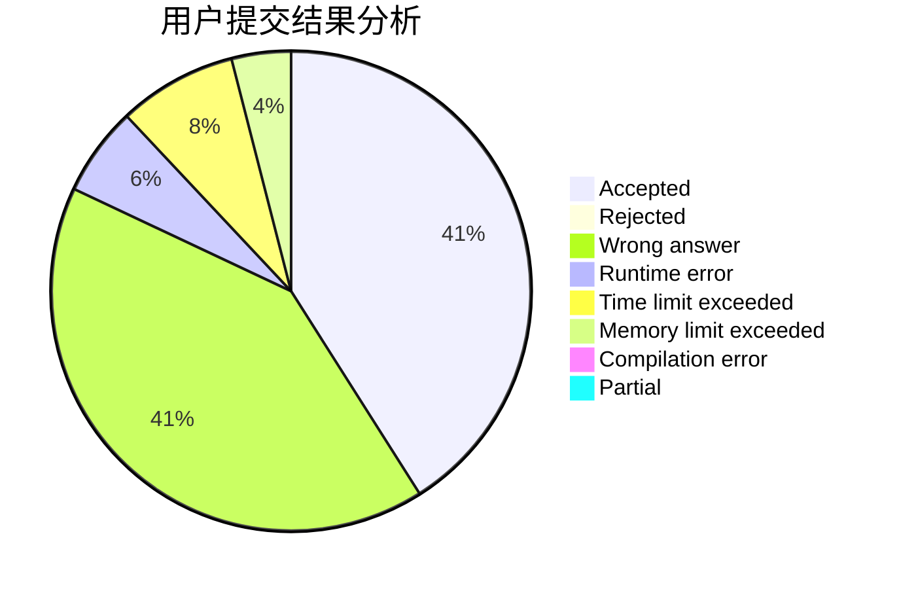
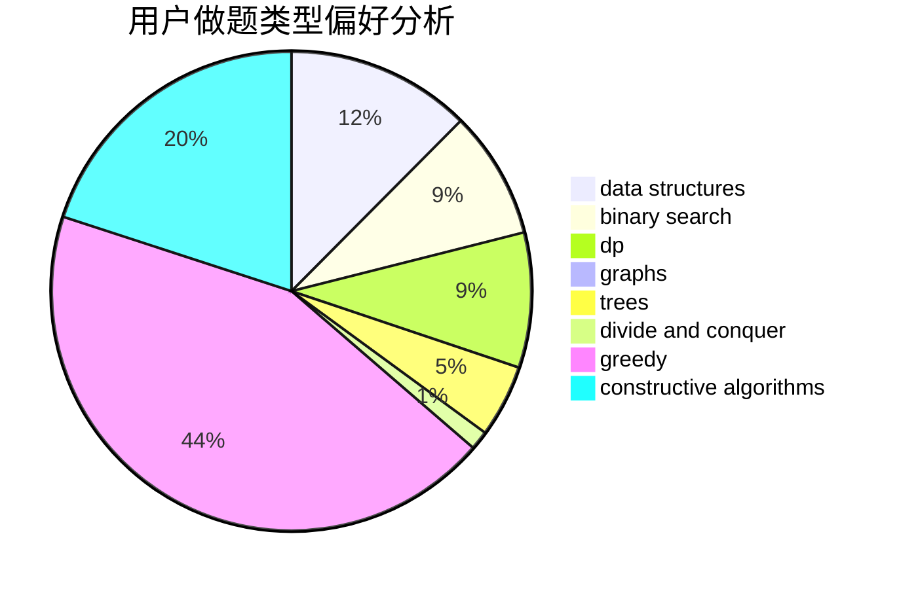
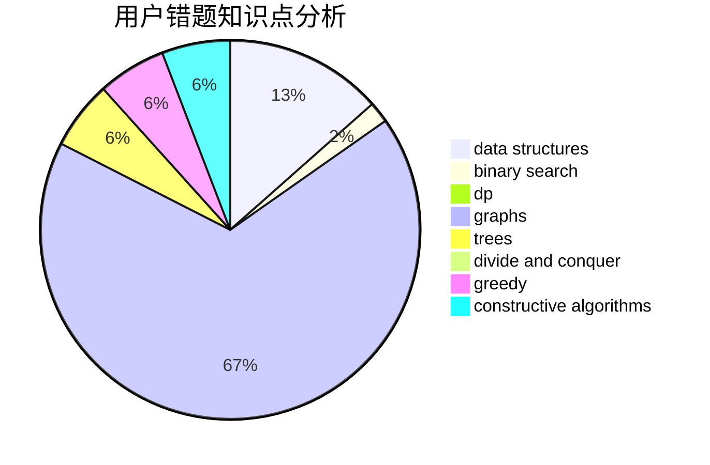

# KunKunZi
<!-- tabs:start -->
#### **用户提交结果分析**

#### **用户做题类型偏好分析**

#### **用户错题知识点分析**

<!-- tabs:end -->
# 推荐题目
[Permutation](http://codeforces.com/problemset/problem/359/B)		constructive algorithms,
                        dp,
                        math		  
[Find a Number](http://codeforces.com/problemset/problem/1070/A)		dp,
                        graphs,
                        number theory,
                        shortest paths		  
[Multi-Subject Competition](http://codeforces.com/problemset/problem/1082/C)		greedy,
                        sortings		  
[Cellular Network](http://codeforces.com/problemset/problem/702/C)		binary search,
                        implementation,
                        two pointers		  
[Johnny and Contribution](https://codeforces.com/contest/1362/problem/D)		constructive algorithms,
                        graphs,
                        greedy,
                        sortings		  
[Error Correct System](http://codeforces.com/problemset/problem/527/B)		greedy		  
[Interesting Game](http://codeforces.com/problemset/problem/87/C)		dp,
                        games,
                        math		  
[Misha and Palindrome Degree](https://codeforces.com/contest/504/problem/C)		binary search,
                        combinatorics,
                        implementation		  
[Diverse Substring](http://codeforces.com/problemset/problem/1073/A)		implementation,
                        strings		  
[Perfect Pair](http://codeforces.com/problemset/problem/317/A)		brute force		  
<!-- tabs:start -->
#### **data structures**
[Duff as a Queen](http://codeforces.com/problemset/problem/587/E)		data structures		  
[Buses](http://codeforces.com/problemset/problem/101/B)		binary search,
                        data structures,
                        dp		  
[Text Editor](http://codeforces.com/problemset/problem/253/C)		data structures,
                        dfs and similar,
                        graphs,
                        greedy,
                        shortest paths		  
[Camping Groups](http://codeforces.com/problemset/problem/173/E)		data structures,
                        sortings		  
[Numbers on Tree](https://codeforces.com/contest/1287/problem/D)		constructive algorithms,
                        data structures,
                        dfs and similar,
                        graphs,
                        greedy,
                        trees		  
[Maximum width](http://codeforces.com/problemset/problem/1492/C)		binary search,
                        data structures,
                        dp,
                        greedy,
                        two pointers		  
[Old Floppy Drive](http://codeforces.com/problemset/problem/1490/G)		binary search,
                        data structures,
                        math		  
[Odd Mineral Resource](http://codeforces.com/problemset/problem/1479/D)		binary search,
                        bitmasks,
                        brute force,
                        data structures,
                        probabilities,
                        trees		  
[Meximization](http://codeforces.com/problemset/problem/1497/A)		brute force,
                        data structures,
                        greedy,
                        sortings		  
[Pekora and Trampoline](http://codeforces.com/problemset/problem/1491/C)		brute force,
                        data structures,
                        dp,
                        greedy,
                        implementation		  
#### **binary search**
[Cellular Network](http://codeforces.com/problemset/problem/702/C)		binary search,
                        implementation,
                        two pointers		  
[Misha and Palindrome Degree](https://codeforces.com/contest/504/problem/C)		binary search,
                        combinatorics,
                        implementation		  
[Buses](http://codeforces.com/problemset/problem/101/B)		binary search,
                        data structures,
                        dp		  
[Vanya and Lanterns](http://codeforces.com/problemset/problem/492/B)		binary search,
                        implementation,
                        math,
                        sortings		  
[Professor GukiZ and Two Arrays](http://codeforces.com/problemset/problem/620/D)		binary search,
                        two pointers		  
[Mr. Bender and Square](http://codeforces.com/problemset/problem/255/D)		binary search,
                        implementation,
                        math		  
[1D Sokoban](http://codeforces.com/problemset/problem/1494/C)		binary search,
                        dp,
                        greedy,
                        implementation,
                        two pointers		  
[Maximum width](http://codeforces.com/problemset/problem/1492/C)		binary search,
                        data structures,
                        dp,
                        greedy,
                        two pointers		  
[Pairs](http://codeforces.com/problemset/problem/1463/D)		binary search,
                        constructive algorithms,
                        greedy,
                        two pointers		  
[Old Floppy Drive](http://codeforces.com/problemset/problem/1490/G)		binary search,
                        data structures,
                        math		  
#### **dp**
[Permutation](http://codeforces.com/problemset/problem/359/B)		constructive algorithms,
                        dp,
                        math		  
[Find a Number](http://codeforces.com/problemset/problem/1070/A)		dp,
                        graphs,
                        number theory,
                        shortest paths		  
[Interesting Game](http://codeforces.com/problemset/problem/87/C)		dp,
                        games,
                        math		  
[Kaavi and Magic Spell](http://codeforces.com/problemset/problem/1336/C)		dp,
                        strings		  
[Buses](http://codeforces.com/problemset/problem/101/B)		binary search,
                        data structures,
                        dp		  
[Chaotic Merge](http://codeforces.com/problemset/problem/1499/E)		combinatorics,
                        dp,
                        math,
                        strings		  
[Symmetric and Transitive](http://codeforces.com/problemset/problem/568/B)		combinatorics,
                        dp,
                        math		  
[1D Sokoban](http://codeforces.com/problemset/problem/1494/C)		binary search,
                        dp,
                        greedy,
                        implementation,
                        two pointers		  
[Sleeping Schedule](http://codeforces.com/problemset/problem/1324/E)		dp,
                        implementation		  
[Maximum width](http://codeforces.com/problemset/problem/1492/C)		binary search,
                        data structures,
                        dp,
                        greedy,
                        two pointers		  
#### **graph**
[Find a Number](http://codeforces.com/problemset/problem/1070/A)		dp,
                        graphs,
                        number theory,
                        shortest paths		  
[Johnny and Contribution](https://codeforces.com/contest/1362/problem/D)		constructive algorithms,
                        graphs,
                        greedy,
                        sortings		  
[Text Editor](http://codeforces.com/problemset/problem/253/C)		data structures,
                        dfs and similar,
                        graphs,
                        greedy,
                        shortest paths		  
[Gang Up](http://codeforces.com/problemset/problem/1187/G)		flows,
                        graphs		  
[Numbers on Tree](https://codeforces.com/contest/1287/problem/D)		constructive algorithms,
                        data structures,
                        dfs and similar,
                        graphs,
                        greedy,
                        trees		  
[Matvey's Birthday](http://codeforces.com/problemset/problem/718/E)		bitmasks,
                        graphs		  
[Minimum Ties](http://codeforces.com/problemset/problem/1487/C)		brute force,
                        constructive algorithms,
                        dfs and similar,
                        graphs,
                        greedy,
                        implementation,
                        math		  
[Chef Monocarp](http://codeforces.com/problemset/problem/1437/C)		dp,
                        flows,
                        graph matchings,
                        greedy,
                        math,
                        sortings		  
[Strange Housing](http://codeforces.com/problemset/problem/1470/D)		constructive algorithms,
                        dfs and similar,
                        graph matchings,
                        graphs,
                        greedy		  
[Longest Simple Cycle](http://codeforces.com/problemset/problem/1476/C)		dp,
                        graphs,
                        greedy		  
#### **trees**
[Minimum Diameter Tree](https://codeforces.com/contest/1087/problem/D)		constructive algorithms,
                        implementation,
                        trees		  
[Numbers on Tree](https://codeforces.com/contest/1287/problem/D)		constructive algorithms,
                        data structures,
                        dfs and similar,
                        graphs,
                        greedy,
                        trees		  
[Odd Mineral Resource](http://codeforces.com/problemset/problem/1479/D)		binary search,
                        bitmasks,
                        brute force,
                        data structures,
                        probabilities,
                        trees		  
[Yet Another Card Deck](http://codeforces.com/problemset/problem/1511/C)		brute force,
                        data structures,
                        implementation,
                        trees		  
[Diameter Cuts](http://codeforces.com/problemset/problem/1499/F)		combinatorics,
                        dfs and similar,
                        dp,
                        trees		  
[Fib-tree](http://codeforces.com/problemset/problem/1491/E)		brute force,
                        dfs and similar,
                        divide and conquer,
                        number theory,
                        trees		  
[13th Labour of Heracles](http://codeforces.com/problemset/problem/1466/D)		data structures,
                        greedy,
                        sortings,
                        trees		  
[BFS Trees](http://codeforces.com/problemset/problem/1495/D)		combinatorics,
                        dfs and similar,
                        graphs,
                        math,
                        shortest paths,
                        trees		  
[Sum of Prefix Sums](http://codeforces.com/problemset/problem/1303/G)		data structures,
                        divide and conquer,
                        geometry,
                        trees		  
[Number of Simple Paths](http://codeforces.com/problemset/problem/1454/E)		combinatorics,
                        dfs and similar,
                        graphs,
                        trees		  
#### **divide and conquer**
[Divide and Summarize](http://codeforces.com/problemset/problem/1461/D)		binary search,
                        brute force,
                        data structures,
                        divide and conquer,
                        implementation,
                        sortings		  
[Song of the Sirens](http://codeforces.com/problemset/problem/1466/G)		combinatorics,
                        divide and conquer,
                        hashing,
                        math,
                        string suffix structures,
                        strings		  
[Permutation Transformation](http://codeforces.com/problemset/problem/1490/D)		dfs and similar,
                        divide and conquer,
                        implementation		  
[Skyline Photo](https://codeforces.com/contest/1483/problem/C)		data structures,
                        divide and conquer,
                        dp		  
[Fib-tree](http://codeforces.com/problemset/problem/1491/E)		brute force,
                        dfs and similar,
                        divide and conquer,
                        number theory,
                        trees		  
[Sum of Prefix Sums](http://codeforces.com/problemset/problem/1303/G)		data structures,
                        divide and conquer,
                        geometry,
                        trees		  
[Dogeforces](http://codeforces.com/problemset/problem/1494/D)		constructive algorithms,
                        data structures,
                        dfs and similar,
                        divide and conquer,
                        dsu,
                        greedy,
                        sortings,
                        trees		  
[Logistical Questions](http://codeforces.com/problemset/problem/566/C)		dfs and similar,
                        divide and conquer,
                        trees		  
[Fruit Sequences](http://codeforces.com/problemset/problem/1428/F)		binary search,
                        data structures,
                        divide and conquer,
                        dp,
                        two pointers		  
[Dr. Evil Underscores](http://codeforces.com/problemset/problem/1285/D)		bitmasks,
                        brute force,
                        dfs and similar,
                        divide and conquer,
                        dp,
                        greedy,
                        strings,
                        trees		  
#### **greedy**
[Multi-Subject Competition](http://codeforces.com/problemset/problem/1082/C)		greedy,
                        sortings		  
[Johnny and Contribution](https://codeforces.com/contest/1362/problem/D)		constructive algorithms,
                        graphs,
                        greedy,
                        sortings		  
[Error Correct System](http://codeforces.com/problemset/problem/527/B)		greedy		  
[Knights](https://codeforces.com/contest/1068/problem/F)		constructive algorithms,
                        greedy		  
[Elections](http://codeforces.com/problemset/problem/1019/A)		brute force,
                        greedy		  
[Mister B and Boring Game](https://codeforces.com/contest/820/problem/C)		games,
                        greedy		  
[Text Editor](http://codeforces.com/problemset/problem/253/C)		data structures,
                        dfs and similar,
                        graphs,
                        greedy,
                        shortest paths		  
[Minimize The Integer](http://codeforces.com/problemset/problem/1251/C)		greedy,
                        two pointers		  
[Numbers on Tree](https://codeforces.com/contest/1287/problem/D)		constructive algorithms,
                        data structures,
                        dfs and similar,
                        graphs,
                        greedy,
                        trees		  
[1D Sokoban](http://codeforces.com/problemset/problem/1494/C)		binary search,
                        dp,
                        greedy,
                        implementation,
                        two pointers		  
#### **constructive algorithms**
[Permutation](http://codeforces.com/problemset/problem/359/B)		constructive algorithms,
                        dp,
                        math		  
[Johnny and Contribution](https://codeforces.com/contest/1362/problem/D)		constructive algorithms,
                        graphs,
                        greedy,
                        sortings		  
[Knights](https://codeforces.com/contest/1068/problem/F)		constructive algorithms,
                        greedy		  
[Minimum Diameter Tree](https://codeforces.com/contest/1087/problem/D)		constructive algorithms,
                        implementation,
                        trees		  
[Numbers on Tree](https://codeforces.com/contest/1287/problem/D)		constructive algorithms,
                        data structures,
                        dfs and similar,
                        graphs,
                        greedy,
                        trees		  
[Anti-knapsack](http://codeforces.com/problemset/problem/1493/A)		constructive algorithms,
                        greedy		  
[Pairs](http://codeforces.com/problemset/problem/1463/D)		binary search,
                        constructive algorithms,
                        greedy,
                        two pointers		  
[XOR-gun](https://codeforces.com/contest/1456/problem/B)		bitmasks,
                        brute force,
                        constructive algorithms		  
[Genius's Gambit](http://codeforces.com/problemset/problem/1492/D)		bitmasks,
                        constructive algorithms,
                        greedy,
                        math		  
[3-Coloring](https://codeforces.com/contest/1504/problem/D)		constructive algorithms,
                        games,
                        interactive		  
#### **sortings**
[Multi-Subject Competition](http://codeforces.com/problemset/problem/1082/C)		greedy,
                        sortings		  
[Johnny and Contribution](https://codeforces.com/contest/1362/problem/D)		constructive algorithms,
                        graphs,
                        greedy,
                        sortings		  
[Vanya and Lanterns](http://codeforces.com/problemset/problem/492/B)		binary search,
                        implementation,
                        math,
                        sortings		  
[Camping Groups](http://codeforces.com/problemset/problem/173/E)		data structures,
                        sortings		  
[Equalizing by Division (hard version)](http://codeforces.com/problemset/problem/1213/D2)		brute force,
                        math,
                        sortings		  
[Diamond Miner](https://codeforces.com/contest/1496/problem/C)		geometry,
                        greedy,
                        math,
                        sortings		  
[Meximization](http://codeforces.com/problemset/problem/1497/A)		brute force,
                        data structures,
                        greedy,
                        sortings		  
[Avoiding Zero](http://codeforces.com/problemset/problem/1427/A)		math,
                        sortings		  
[Divide and Summarize](http://codeforces.com/problemset/problem/1461/D)		binary search,
                        brute force,
                        data structures,
                        divide and conquer,
                        implementation,
                        sortings		  
[Chef Monocarp](http://codeforces.com/problemset/problem/1437/C)		dp,
                        flows,
                        graph matchings,
                        greedy,
                        math,
                        sortings		  
<!-- tabs:end -->
