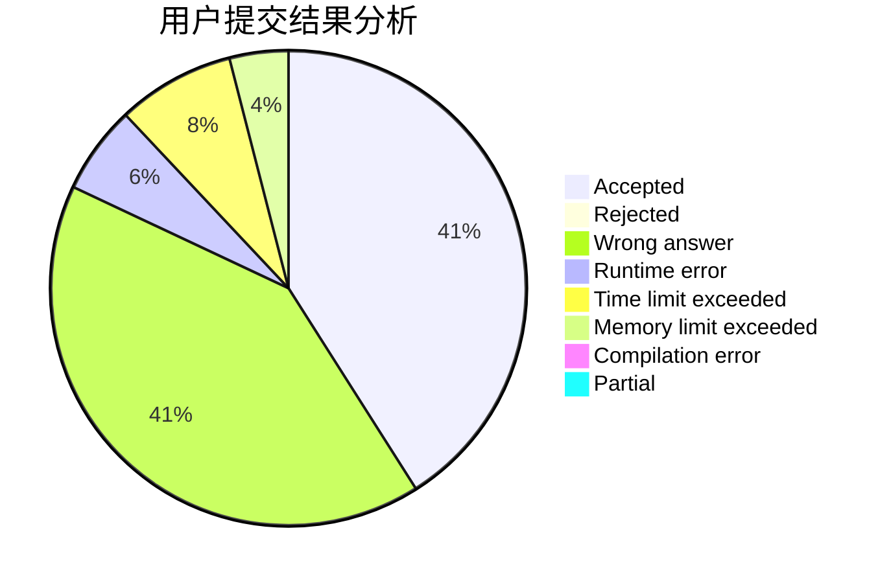
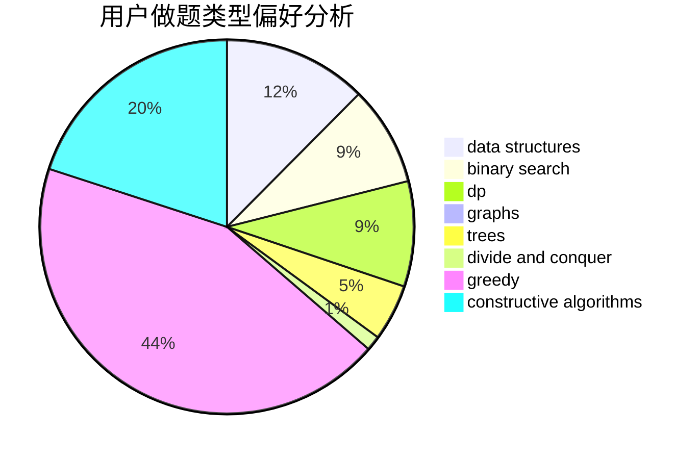
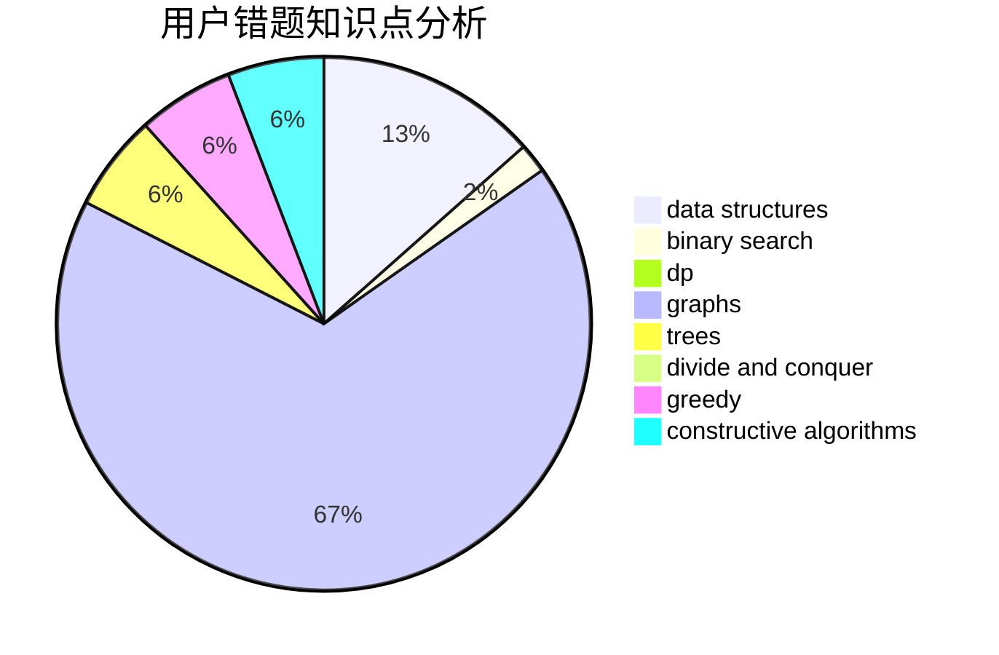

# KunKunZi

<!-- tabs:start -->

#### **用户提交结果分析**

#### **用户做题类型偏好分析**

#### **用户错题知识点分析**

<!-- tabs:end -->
# 推荐题目
[1374B](https://codeforces.com/contest/1374/problem/B)		math		  
[1336C](https://codeforces.com/contest/1336/problem/C)		dp,
                        strings		  
[1070A](https://codeforces.com/contest/1070/problem/A)		dp,
                        graphs,
                        number theory,
                        shortest paths		  
[527B](https://codeforces.com/contest/527/problem/B)		greedy		  
[1082C](https://codeforces.com/contest/1082/problem/C)		greedy,
                        sortings		  
[359B](https://codeforces.com/contest/359/problem/B)		constructive algorithms,
                        dp,
                        math		  
[1362D](https://codeforces.com/contest/1362/problem/D)		dsu,graphs,sortings,trees		  
[317A](https://codeforces.com/contest/317/problem/A)		brute force		  
[87C](https://codeforces.com/contest/87/problem/C)		dp,
                        games,
                        math		  
[255D](https://codeforces.com/contest/255/problem/D)		binary search,
                        implementation,
                        math		  
