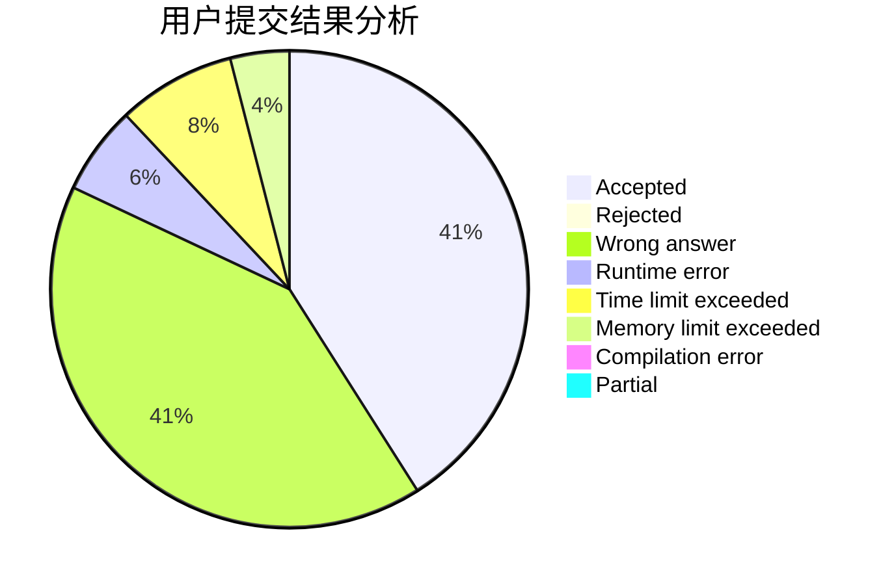
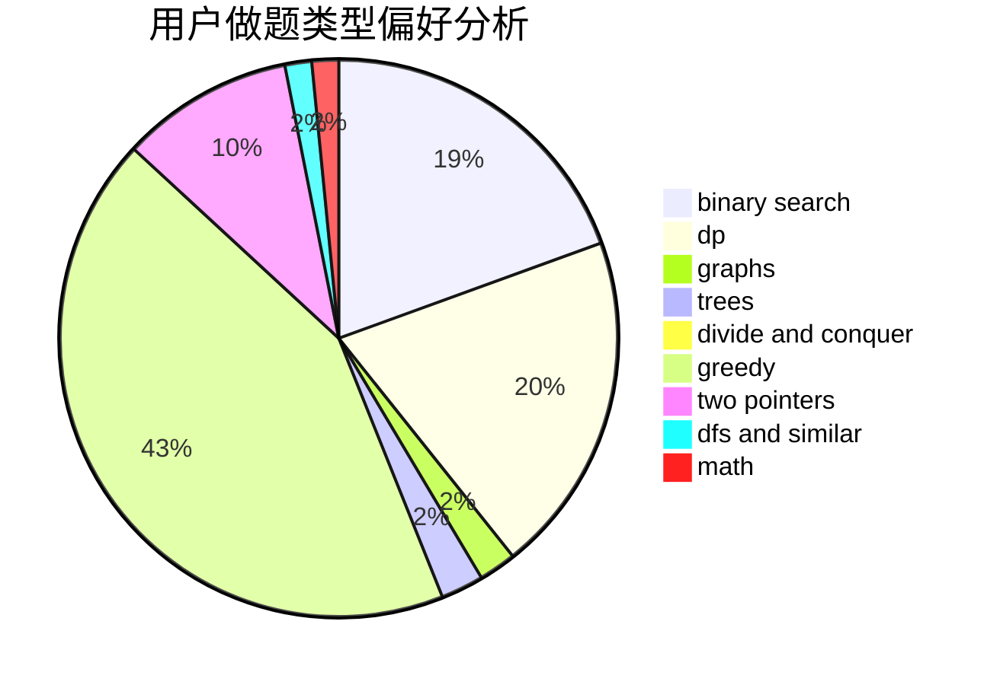

# KunKunZi

<!-- tabs:start -->

#### **用户提交结果分析**

#### **用户做题类型偏好分析**

<!-- tabs:end -->
# 推荐题目
[1383A](https://codeforces.com/contest/1383/problem/A)
[1343D](https://codeforces.com/contest/1343/problem/D)
[1070D](https://codeforces.com/contest/1070/problem/D)
[551B](https://codeforces.com/contest/551/problem/B)
[1082F](https://codeforces.com/contest/1082/problem/F)
[385E](https://codeforces.com/contest/385/problem/E)
[136C](https://codeforces.com/contest/136/problem/C)
[346B](https://codeforces.com/contest/346/problem/B)
[8D](https://codeforces.com/contest/8/problem/D)
[274A](https://codeforces.com/contest/274/problem/A)
