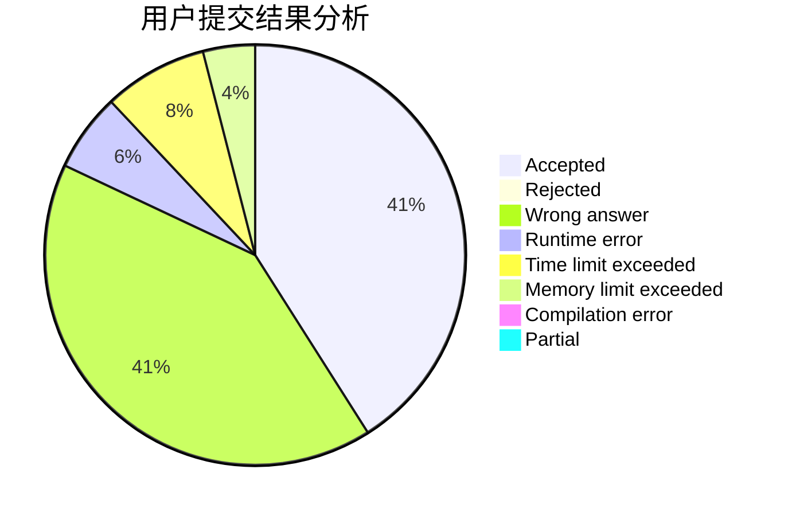
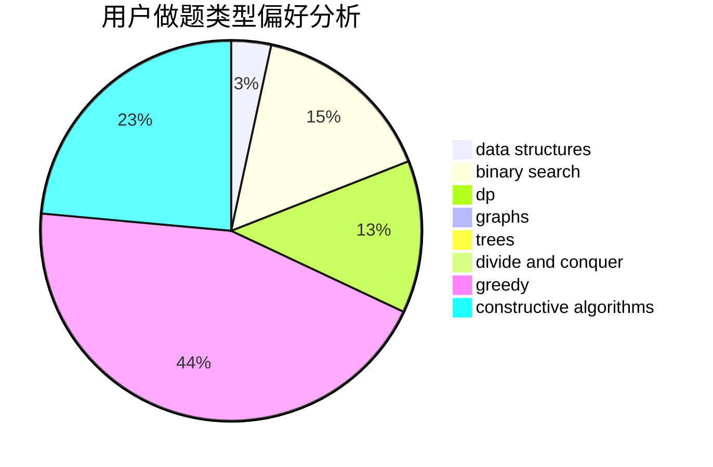
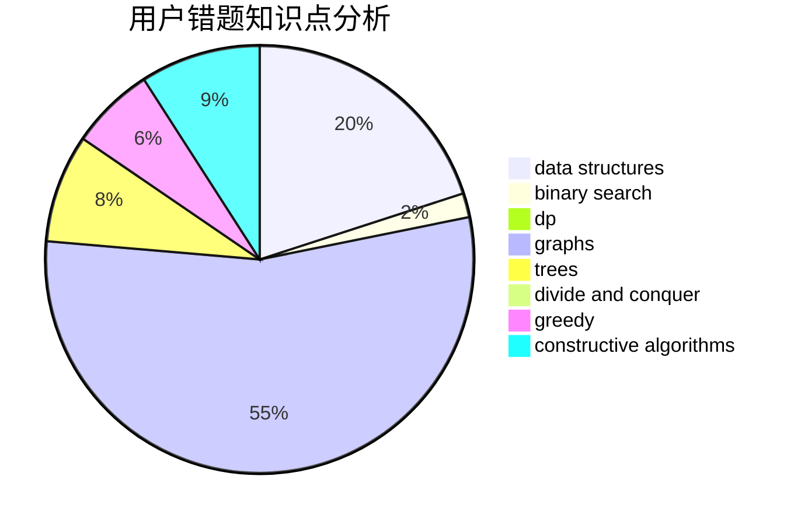

# KunKunZi

<!-- tabs:start -->

#### **用户提交结果分析**

#### **用户做题类型偏好分析**

#### **用户错题知识点分析**

<!-- tabs:end -->
# 推荐题目
[1383A](https://codeforces.com/contest/1383/problem/A)		dsu,
                        graphs,
                        greedy,
                        sortings,
                        strings,
                        trees,
                        two pointers		  
[1343D](https://codeforces.com/contest/1343/problem/D)		brute force,
                        data structures,
                        greedy,
                        two pointers		  
[1070D](https://codeforces.com/contest/1070/problem/D)		greedy		  
[551B](https://codeforces.com/contest/551/problem/B)		brute force,
                        constructive algorithms,
                        implementation,
                        strings		  
[1082F](https://codeforces.com/contest/1082/problem/F)		dp,
                        strings,
                        trees		  
[385E](https://codeforces.com/contest/385/problem/E)		math,
                        matrices		  
[136C](https://codeforces.com/contest/136/problem/C)		dsu,graphs,sortings,trees		  
[346B](https://codeforces.com/contest/346/problem/B)		dp,
                        strings		  
[8D](https://codeforces.com/contest/8/problem/D)		binary search,
                        geometry		  
[274A](https://codeforces.com/contest/274/problem/A)		binary search,
                        greedy,
                        sortings		  
