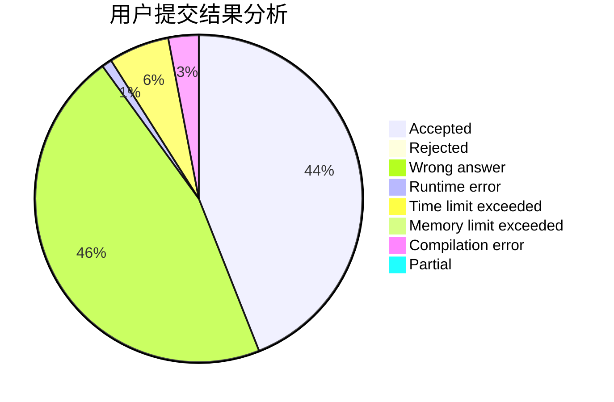
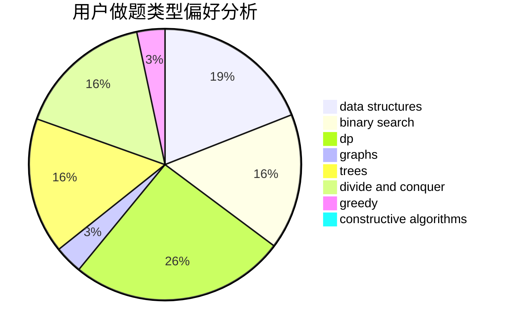
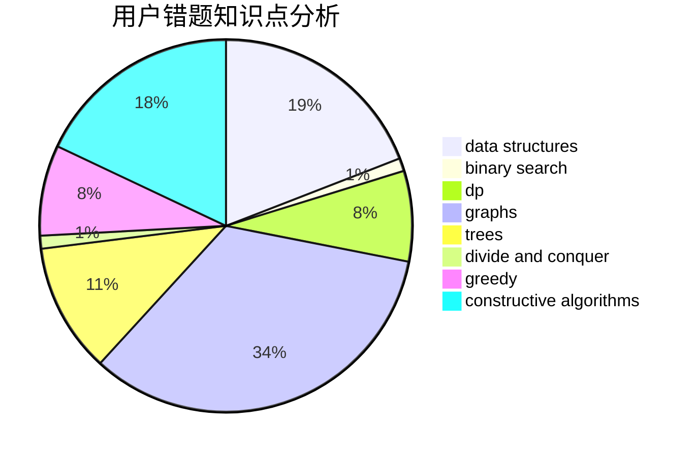

# KurisuMakise

<!-- tabs:start -->

#### **用户提交结果分析**

#### **用户做题类型偏好分析**

#### **用户错题知识点分析**

<!-- tabs:end -->
# 推荐题目
[739D](https://codeforces.com/contest/739/problem/D)		graph matchings		  
[448D](https://codeforces.com/contest/448/problem/D)		binary search,
                        brute force		  
[1181B](https://codeforces.com/contest/1181/problem/B)		greedy,
                        implementation,
                        strings		  
[732A](https://codeforces.com/contest/732/problem/A)		brute force,
                        constructive algorithms,
                        implementation,
                        math		  
[1163E](https://codeforces.com/contest/1163/problem/E)		bitmasks,
                        brute force,
                        constructive algorithms,
                        data structures,
                        graphs,
                        math		  
[225D](https://codeforces.com/contest/225/problem/D)		bitmasks,
                        dfs and similar,
                        graphs,
                        implementation		  
[822A](https://codeforces.com/contest/822/problem/A)		implementation,
                        math,
                        number theory		  
[13351](https://codeforces.com/contest/1335/problem/1)		dsu,graphs,sortings,trees		  
[124A](https://codeforces.com/contest/124/problem/A)		math		  
[1245D](https://codeforces.com/contest/1245/problem/D)		dsu,
                        graphs,
                        greedy,
                        shortest paths,
                        trees		  
