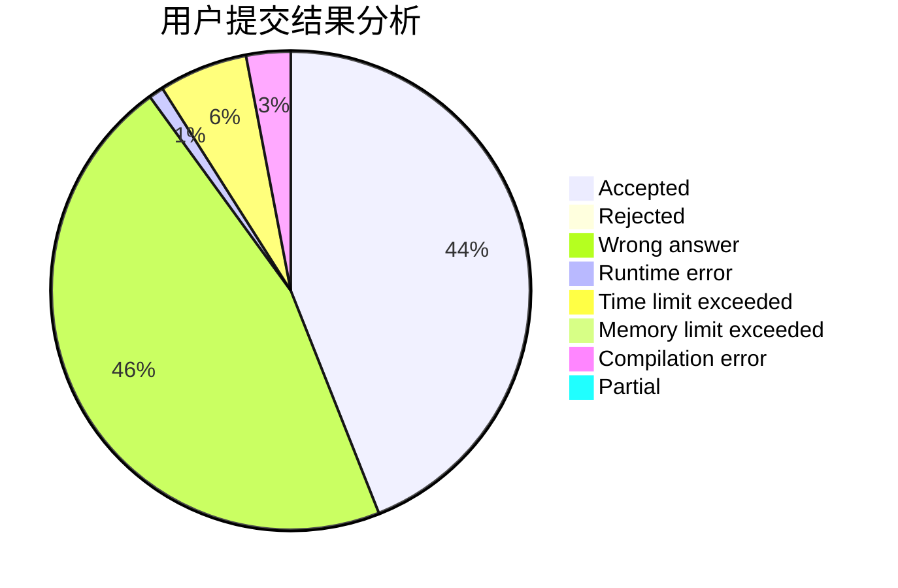
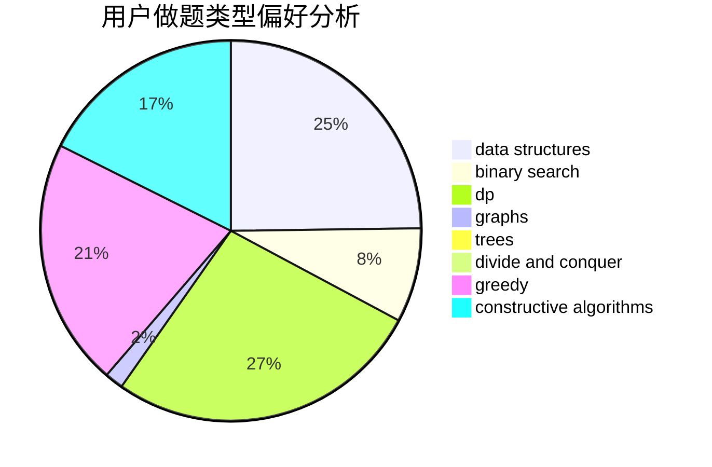
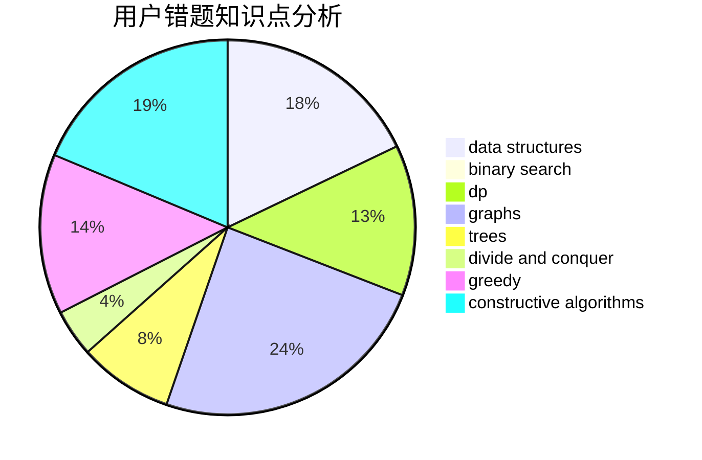

# KurisuMakise

<!-- tabs:start -->

#### **用户提交结果分析**

#### **用户做题类型偏好分析**

#### **用户错题知识点分析**

<!-- tabs:end -->
# 推荐题目
[722C](https://codeforces.com/contest/722/problem/C)		data structures,
                        dsu		  
[425B](https://codeforces.com/contest/425/problem/B)		bitmasks,
                        greedy		  
[1178F2](https://codeforces.com/contest/1178F/problem/2)		dp		  
[712E](https://codeforces.com/contest/712/problem/E)		data structures,
                        math,
                        probabilities		  
[1161B](https://codeforces.com/contest/1161/problem/B)		dsu,graphs,sortings,trees		  
[200B](https://codeforces.com/contest/200/problem/B)		implementation,
                        math		  
[805D](https://codeforces.com/contest/805/problem/D)		dsu,graphs,sortings,trees		  
[1328E](https://codeforces.com/contest/1328/problem/E)		dfs and similar,
                        graphs,
                        trees		  
[1244E](https://codeforces.com/contest/1244/problem/E)		binary search,
                        constructive algorithms,
                        greedy,
                        sortings,
                        ternary search,
                        two pointers		  
[1240A](https://codeforces.com/contest/1240/problem/A)		dsu,graphs,sortings,trees		  
