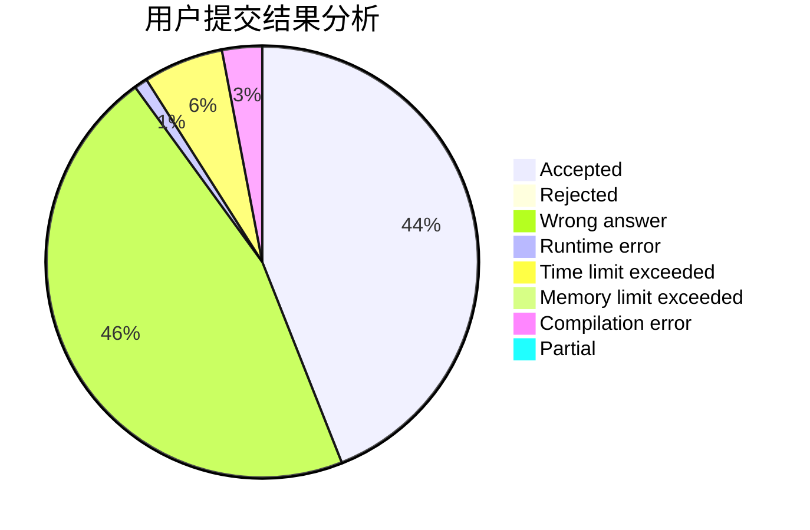
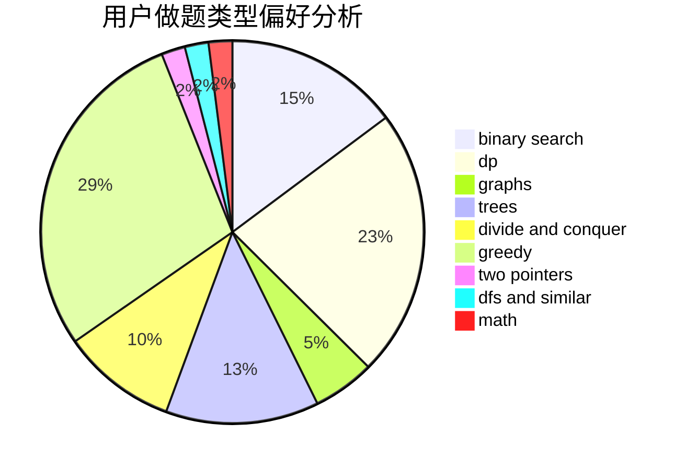

# KurisuMakise

<!-- tabs:start -->

#### **用户提交结果分析**

#### **用户做题类型偏好分析**

<!-- tabs:end -->
# 推荐题目
[739D](https://codeforces.com/contest/739/problem/D)
[448D](https://codeforces.com/contest/448/problem/D)
[1181B](https://codeforces.com/contest/1181/problem/B)
[732A](https://codeforces.com/contest/732/problem/A)
[1163E](https://codeforces.com/contest/1163/problem/E)
[225D](https://codeforces.com/contest/225/problem/D)
[822A](https://codeforces.com/contest/822/problem/A)
[13351](https://codeforces.com/contest/1335/problem/1)
[124A](https://codeforces.com/contest/124/problem/A)
[1245D](https://codeforces.com/contest/1245/problem/D)
