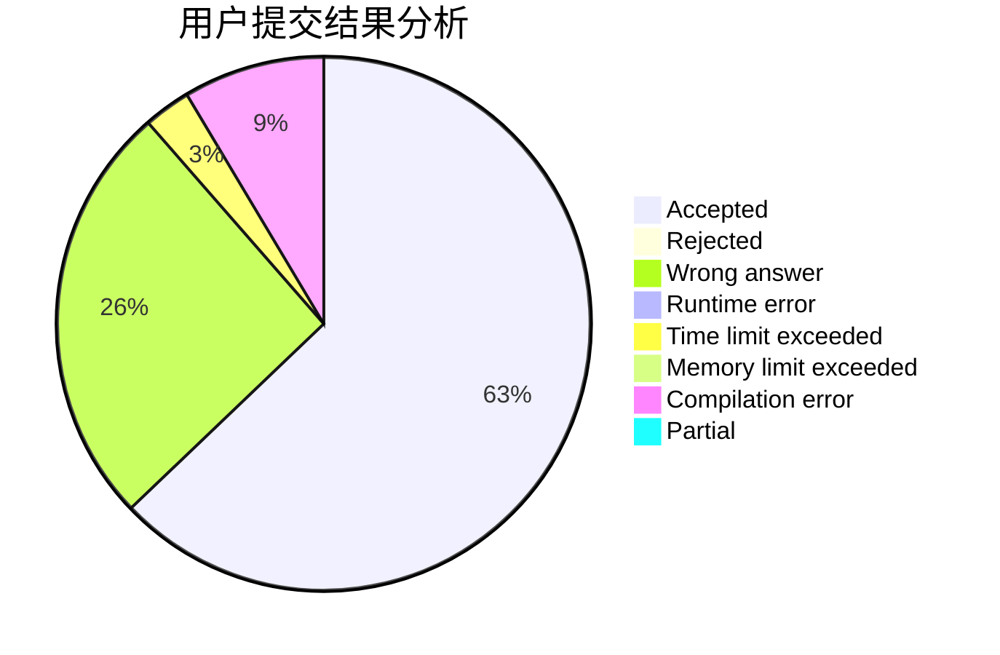
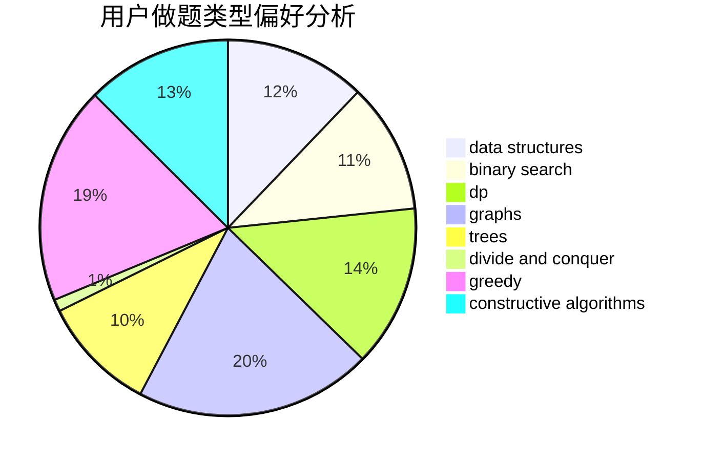
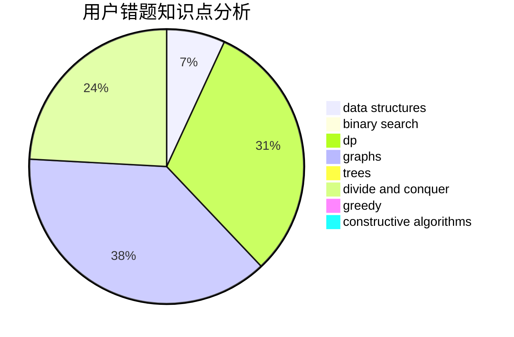

# Kuuki_rikigaku
<!-- tabs:start -->
#### **用户提交结果分析**

#### **用户做题类型偏好分析**

#### **用户错题知识点分析**

<!-- tabs:end -->
# 推荐题目
[OR in Matrix](http://codeforces.com/problemset/problem/486/B)		greedy,
                        hashing,
                        implementation		  
[Holy Diver](http://codeforces.com/problemset/problem/1148/H)		data structures		  
[Tree Queries](http://codeforces.com/problemset/problem/1328/E)		dfs and similar,
                        graphs,
                        trees		  
[Festival Organization](http://codeforces.com/problemset/problem/717/A)		math,
                        number theory		  
[Generate Login](http://codeforces.com/problemset/problem/909/A)		brute force,
                        greedy,
                        sortings		  
[Restore a Number](http://codeforces.com/problemset/problem/670/F)		brute force,
                        constructive algorithms,
                        strings		  
[Orientation of Edges](http://codeforces.com/problemset/problem/883/G)		dfs and similar,
                        graphs		  
[Teams Forming](http://codeforces.com/problemset/problem/1092/B)		sortings		  
[Michael and Charging Stations](http://codeforces.com/problemset/problem/853/D)		binary search,
                        dp,
                        greedy		  
[Four Divisors](http://codeforces.com/problemset/problem/665/F)		data structures,
                        dp,
                        math,
                        number theory,
                        sortings,
                        two pointers		  
<!-- tabs:start -->
#### **data structures**
[Holy Diver](http://codeforces.com/problemset/problem/1148/H)		data structures		  
[Four Divisors](http://codeforces.com/problemset/problem/665/F)		data structures,
                        dp,
                        math,
                        number theory,
                        sortings,
                        two pointers		  
[Blog Post Rating](http://codeforces.com/problemset/problem/773/E)		data structures,
                        sortings		  
[Preparing for the Contest](http://codeforces.com/problemset/problem/377/B)		binary search,
                        data structures,
                        greedy,
                        sortings		  
[Forced Online Queries Problem](http://codeforces.com/problemset/problem/1217/F)		data structures,
                        divide and conquer,
                        dsu,
                        graphs,
                        trees		  
[Tiles for Bathroom](http://codeforces.com/problemset/problem/1500/D)		data structures,
                        sortings,
                        two pointers		  
[Water Balance](http://codeforces.com/problemset/problem/1299/C)		data structures,
                        geometry,
                        greedy		  
[Maximum width](http://codeforces.com/problemset/problem/1492/C)		binary search,
                        data structures,
                        dp,
                        greedy,
                        two pointers		  
[Old Floppy Drive](http://codeforces.com/problemset/problem/1490/G)		binary search,
                        data structures,
                        math		  
[Odd Mineral Resource](http://codeforces.com/problemset/problem/1479/D)		binary search,
                        bitmasks,
                        brute force,
                        data structures,
                        probabilities,
                        trees		  
#### **binary search**
[Michael and Charging Stations](http://codeforces.com/problemset/problem/853/D)		binary search,
                        dp,
                        greedy		  
[Rock Is Push](https://codeforces.com/contest/1246/problem/C)		binary search,
                        dp		  
[Two Friends](http://codeforces.com/problemset/problem/8/D)		binary search,
                        geometry		  
[Preparing for the Contest](http://codeforces.com/problemset/problem/377/B)		binary search,
                        data structures,
                        greedy,
                        sortings		  
[Peter and Snow Blower](http://codeforces.com/problemset/problem/613/A)		binary search,
                        geometry,
                        ternary search		  
[Summer Earnings](http://codeforces.com/problemset/problem/333/E)		binary search,
                        bitmasks,
                        brute force,
                        geometry,
                        sortings		  
[Prefix-Suffix Palindrome (Hard version)](http://codeforces.com/problemset/problem/1326/D2)		binary search,
                        greedy,
                        hashing,
                        string suffix structures,
                        strings		  
[Maximum width](http://codeforces.com/problemset/problem/1492/C)		binary search,
                        data structures,
                        dp,
                        greedy,
                        two pointers		  
[Pairs](http://codeforces.com/problemset/problem/1463/D)		binary search,
                        constructive algorithms,
                        greedy,
                        two pointers		  
[Old Floppy Drive](http://codeforces.com/problemset/problem/1490/G)		binary search,
                        data structures,
                        math		  
#### **dp**
[Michael and Charging Stations](http://codeforces.com/problemset/problem/853/D)		binary search,
                        dp,
                        greedy		  
[Four Divisors](http://codeforces.com/problemset/problem/665/F)		data structures,
                        dp,
                        math,
                        number theory,
                        sortings,
                        two pointers		  
[Rock Is Push](https://codeforces.com/contest/1246/problem/C)		binary search,
                        dp		  
[Polo the Penguin and Matrix](http://codeforces.com/problemset/problem/289/B)		brute force,
                        dp,
                        implementation,
                        sortings,
                        ternary search		  
[Strongly Connected Tournament](http://codeforces.com/problemset/problem/913/F)		dp,
                        graphs,
                        math,
                        probabilities		  
[Dreamoon and Strings](http://codeforces.com/problemset/problem/476/E)		dp,
                        strings		  
[The Monster](https://codeforces.com/contest/918/problem/C)		dp,
                        greedy,
                        implementation,
                        math		  
[Zookeeper and The Infinite Zoo](http://codeforces.com/problemset/problem/1491/D)		bitmasks,
                        constructive algorithms,
                        dp,
                        greedy,
                        math		  
[Fox And Travelling](http://codeforces.com/problemset/problem/512/D)		dp,
                        trees		  
[Sleeping Schedule](http://codeforces.com/problemset/problem/1324/E)		dp,
                        implementation		  
#### **graph**
[Tree Queries](http://codeforces.com/problemset/problem/1328/E)		dfs and similar,
                        graphs,
                        trees		  
[Orientation of Edges](http://codeforces.com/problemset/problem/883/G)		dfs and similar,
                        graphs		  
[Lovely Matrix](http://codeforces.com/problemset/problem/274/D)		dfs and similar,
                        graphs,
                        greedy,
                        sortings		  
[Forced Online Queries Problem](http://codeforces.com/problemset/problem/1217/F)		data structures,
                        divide and conquer,
                        dsu,
                        graphs,
                        trees		  
[Strongly Connected Tournament](http://codeforces.com/problemset/problem/913/F)		dp,
                        graphs,
                        math,
                        probabilities		  
[Binary Table (Hard Version)](http://codeforces.com/problemset/problem/1439/A2)		constructive algorithms,
                        graphs,
                        greedy,
                        implementation		  
[Minimum Ties](http://codeforces.com/problemset/problem/1487/C)		brute force,
                        constructive algorithms,
                        dfs and similar,
                        graphs,
                        greedy,
                        implementation,
                        math		  
[Chef Monocarp](http://codeforces.com/problemset/problem/1437/C)		dp,
                        flows,
                        graph matchings,
                        greedy,
                        math,
                        sortings		  
[Strange Housing](http://codeforces.com/problemset/problem/1470/D)		constructive algorithms,
                        dfs and similar,
                        graph matchings,
                        graphs,
                        greedy		  
[Longest Simple Cycle](http://codeforces.com/problemset/problem/1476/C)		dp,
                        graphs,
                        greedy		  
#### **trees**
[Tree Queries](http://codeforces.com/problemset/problem/1328/E)		dfs and similar,
                        graphs,
                        trees		  
[Forced Online Queries Problem](http://codeforces.com/problemset/problem/1217/F)		data structures,
                        divide and conquer,
                        dsu,
                        graphs,
                        trees		  
[Fox And Travelling](http://codeforces.com/problemset/problem/512/D)		dp,
                        trees		  
[Odd Mineral Resource](http://codeforces.com/problemset/problem/1479/D)		binary search,
                        bitmasks,
                        brute force,
                        data structures,
                        probabilities,
                        trees		  
[Yet Another Card Deck](http://codeforces.com/problemset/problem/1511/C)		brute force,
                        data structures,
                        implementation,
                        trees		  
[Diameter Cuts](http://codeforces.com/problemset/problem/1499/F)		combinatorics,
                        dfs and similar,
                        dp,
                        trees		  
[Fib-tree](http://codeforces.com/problemset/problem/1491/E)		brute force,
                        dfs and similar,
                        divide and conquer,
                        number theory,
                        trees		  
[13th Labour of Heracles](http://codeforces.com/problemset/problem/1466/D)		data structures,
                        greedy,
                        sortings,
                        trees		  
[BFS Trees](http://codeforces.com/problemset/problem/1495/D)		combinatorics,
                        dfs and similar,
                        graphs,
                        math,
                        shortest paths,
                        trees		  
[Sum of Prefix Sums](http://codeforces.com/problemset/problem/1303/G)		data structures,
                        divide and conquer,
                        geometry,
                        trees		  
#### **divide and conquer**
[Forced Online Queries Problem](http://codeforces.com/problemset/problem/1217/F)		data structures,
                        divide and conquer,
                        dsu,
                        graphs,
                        trees		  
[Divide and Summarize](http://codeforces.com/problemset/problem/1461/D)		binary search,
                        brute force,
                        data structures,
                        divide and conquer,
                        implementation,
                        sortings		  
[Song of the Sirens](http://codeforces.com/problemset/problem/1466/G)		combinatorics,
                        divide and conquer,
                        hashing,
                        math,
                        string suffix structures,
                        strings		  
[Permutation Transformation](http://codeforces.com/problemset/problem/1490/D)		dfs and similar,
                        divide and conquer,
                        implementation		  
[Skyline Photo](https://codeforces.com/contest/1483/problem/C)		data structures,
                        divide and conquer,
                        dp		  
[Fib-tree](http://codeforces.com/problemset/problem/1491/E)		brute force,
                        dfs and similar,
                        divide and conquer,
                        number theory,
                        trees		  
[Sum of Prefix Sums](http://codeforces.com/problemset/problem/1303/G)		data structures,
                        divide and conquer,
                        geometry,
                        trees		  
[Dogeforces](http://codeforces.com/problemset/problem/1494/D)		constructive algorithms,
                        data structures,
                        dfs and similar,
                        divide and conquer,
                        dsu,
                        greedy,
                        sortings,
                        trees		  
[Logistical Questions](http://codeforces.com/problemset/problem/566/C)		dfs and similar,
                        divide and conquer,
                        trees		  
[Fruit Sequences](http://codeforces.com/problemset/problem/1428/F)		binary search,
                        data structures,
                        divide and conquer,
                        dp,
                        two pointers		  
#### **greedy**
[OR in Matrix](http://codeforces.com/problemset/problem/486/B)		greedy,
                        hashing,
                        implementation		  
[Generate Login](http://codeforces.com/problemset/problem/909/A)		brute force,
                        greedy,
                        sortings		  
[Michael and Charging Stations](http://codeforces.com/problemset/problem/853/D)		binary search,
                        dp,
                        greedy		  
[Appleman and Toastman](https://codeforces.com/contest/462/problem/C)		greedy,
                        sortings		  
[Obtain a Permutation](http://codeforces.com/problemset/problem/1294/E)		greedy,
                        implementation,
                        math		  
[Preparing for the Contest](http://codeforces.com/problemset/problem/377/B)		binary search,
                        data structures,
                        greedy,
                        sortings		  
[Lovely Matrix](http://codeforces.com/problemset/problem/274/D)		dfs and similar,
                        graphs,
                        greedy,
                        sortings		  
[Sereja and Dima](http://codeforces.com/problemset/problem/381/A)		greedy,
                        implementation,
                        two pointers		  
[Even Array](http://codeforces.com/problemset/problem/1367/B)		greedy,
                        math		  
[Binary Table (Hard Version)](http://codeforces.com/problemset/problem/1439/A2)		constructive algorithms,
                        graphs,
                        greedy,
                        implementation		  
#### **constructive algorithms**
[Restore a Number](http://codeforces.com/problemset/problem/670/F)		brute force,
                        constructive algorithms,
                        strings		  
[Two Shuffled Sequences](http://codeforces.com/problemset/problem/1144/C)		constructive algorithms,
                        sortings		  
[Shovel Sale](http://codeforces.com/problemset/problem/899/D)		constructive algorithms,
                        math		  
[Asya And Kittens](http://codeforces.com/problemset/problem/1131/F)		constructive algorithms,
                        dsu		  
[Binary Table (Hard Version)](http://codeforces.com/problemset/problem/1439/A2)		constructive algorithms,
                        graphs,
                        greedy,
                        implementation		  
[Aroma's Search](https://codeforces.com/contest/1293/problem/D)		brute force,
                        constructive algorithms,
                        geometry,
                        greedy,
                        implementation		  
[Zookeeper and The Infinite Zoo](http://codeforces.com/problemset/problem/1491/D)		bitmasks,
                        constructive algorithms,
                        dp,
                        greedy,
                        math		  
[Magic Stones](http://codeforces.com/problemset/problem/1110/E)		constructive algorithms,
                        math,
                        sortings		  
[Fence Painting](http://codeforces.com/problemset/problem/1481/C)		brute force,
                        constructive algorithms,
                        greedy		  
[Grid-00100](http://codeforces.com/problemset/problem/1371/D)		constructive algorithms,
                        greedy,
                        implementation		  
#### **sortings**
[Generate Login](http://codeforces.com/problemset/problem/909/A)		brute force,
                        greedy,
                        sortings		  
[Teams Forming](http://codeforces.com/problemset/problem/1092/B)		sortings		  
[Four Divisors](http://codeforces.com/problemset/problem/665/F)		data structures,
                        dp,
                        math,
                        number theory,
                        sortings,
                        two pointers		  
[Appleman and Toastman](https://codeforces.com/contest/462/problem/C)		greedy,
                        sortings		  
[Polo the Penguin and Matrix](http://codeforces.com/problemset/problem/289/B)		brute force,
                        dp,
                        implementation,
                        sortings,
                        ternary search		  
[Blog Post Rating](http://codeforces.com/problemset/problem/773/E)		data structures,
                        sortings		  
[Two Shuffled Sequences](http://codeforces.com/problemset/problem/1144/C)		constructive algorithms,
                        sortings		  
[Preparing for the Contest](http://codeforces.com/problemset/problem/377/B)		binary search,
                        data structures,
                        greedy,
                        sortings		  
[Lovely Matrix](http://codeforces.com/problemset/problem/274/D)		dfs and similar,
                        graphs,
                        greedy,
                        sortings		  
[Summer Earnings](http://codeforces.com/problemset/problem/333/E)		binary search,
                        bitmasks,
                        brute force,
                        geometry,
                        sortings		  
<!-- tabs:end -->
